# Chapter 20. Case Studies

This final chapter applies the statistical tools from earlier
chapters—hypothesis testing, means comparisons, regression, ANOVA,
transformations, chi-square tests, and nonparametric tests—to real-world
examples. Each example loads data directly from URL or built-in
packages.

------------------------------------------------------------------------

# *20.1 Auto MPG*

Dataset: **Auto MPG** (UCI Machine Learning Repository)  
URL:
<https://archive.ics.uci.edu/ml/machine-learning-databases/auto-mpg/auto-mpg.data>

------------------------------------------------------------------------

# 20.1.1 Load, Clean, and Prepare the Data

``` r
library(tidyverse)
```

    ## ── Attaching core tidyverse packages ──────────────────────── tidyverse 2.0.0 ──
    ## ✔ dplyr     1.1.4     ✔ readr     2.1.6
    ## ✔ forcats   1.0.1     ✔ stringr   1.6.0
    ## ✔ ggplot2   4.0.1     ✔ tibble    3.3.1
    ## ✔ lubridate 1.9.4     ✔ tidyr     1.3.2
    ## ✔ purrr     1.2.1     
    ## ── Conflicts ────────────────────────────────────────── tidyverse_conflicts() ──
    ## ✖ dplyr::filter() masks stats::filter()
    ## ✖ dplyr::lag()    masks stats::lag()
    ## ℹ Use the conflicted package (<http://conflicted.r-lib.org/>) to force all conflicts to become errors

``` r
url  <- "https://archive.ics.uci.edu/ml/machine-learning-databases/auto-mpg/auto-mpg.data"
cols <- c("mpg","cyl","disp","hp","weight","accel","yr","origin","car")

df <- read.table(url, col.names=cols, stringsAsFactors=FALSE)
df <- df[df$hp != "?", ]
df$hp <- as.numeric(df$hp)

summary(df)
```

    ##       mpg             cyl             disp             hp            weight    
    ##  Min.   : 9.00   Min.   :3.000   Min.   : 68.0   Min.   : 46.0   Min.   :1613  
    ##  1st Qu.:17.00   1st Qu.:4.000   1st Qu.:105.0   1st Qu.: 75.0   1st Qu.:2225  
    ##  Median :22.75   Median :4.000   Median :151.0   Median : 93.5   Median :2804  
    ##  Mean   :23.45   Mean   :5.472   Mean   :194.4   Mean   :104.5   Mean   :2978  
    ##  3rd Qu.:29.00   3rd Qu.:8.000   3rd Qu.:275.8   3rd Qu.:126.0   3rd Qu.:3615  
    ##  Max.   :46.60   Max.   :8.000   Max.   :455.0   Max.   :230.0   Max.   :5140  
    ##      accel             yr            origin          car           
    ##  Min.   : 8.00   Min.   :70.00   Min.   :1.000   Length:392        
    ##  1st Qu.:13.78   1st Qu.:73.00   1st Qu.:1.000   Class :character  
    ##  Median :15.50   Median :76.00   Median :1.000   Mode  :character  
    ##  Mean   :15.54   Mean   :75.98   Mean   :1.577                     
    ##  3rd Qu.:17.02   3rd Qu.:79.00   3rd Qu.:2.000                     
    ##  Max.   :24.80   Max.   :82.00   Max.   :3.000

------------------------------------------------------------------------

# 20.1.2 Exploratory Visualizations

## Distribution of MPG

``` r
hist(df$mpg, breaks=20, col="skyblue", main="Distribution of MPG")
```

<!-- -->

## Pairwise Scatterplot Matrix

``` r
pairs(df[,c("mpg","weight","hp","disp")], col="darkgreen")
```

<!-- -->

## Correlation Heatmap

``` r
library(corrplot)
```

    ## corrplot 0.95 loaded

``` r
corrplot(cor(df[,c("mpg","cyl","disp","hp","weight","accel")]),
         method="color")
```

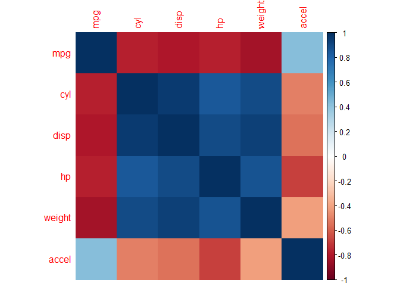<!-- -->

------------------------------------------------------------------------

# 20.1.3 Classical Statistical Analyses

## Simple Linear Regression: mpg ~ weight

``` r
m1 <- lm(mpg ~ weight, data=df)
summary(m1)
```

    ## 
    ## Call:
    ## lm(formula = mpg ~ weight, data = df)
    ## 
    ## Residuals:
    ##      Min       1Q   Median       3Q      Max 
    ## -11.9736  -2.7556  -0.3358   2.1379  16.5194 
    ## 
    ## Coefficients:
    ##              Estimate Std. Error t value Pr(>|t|)    
    ## (Intercept) 46.216524   0.798673   57.87   <2e-16 ***
    ## weight      -0.007647   0.000258  -29.64   <2e-16 ***
    ## ---
    ## Signif. codes:  0 '***' 0.001 '**' 0.01 '*' 0.05 '.' 0.1 ' ' 1
    ## 
    ## Residual standard error: 4.333 on 390 degrees of freedom
    ## Multiple R-squared:  0.6926, Adjusted R-squared:  0.6918 
    ## F-statistic: 878.8 on 1 and 390 DF,  p-value: < 2.2e-16

### Visual

``` r
plot(df$weight, df$mpg, pch=19, col="blue")
abline(m1, col="red", lwd=3)
```

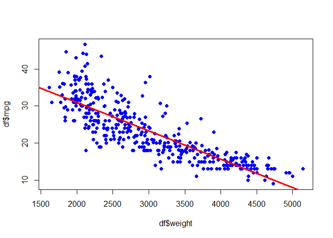<!-- -->

------------------------------------------------------------------------

## Multiple Regression

``` r
m2 <- lm(mpg ~ weight + hp + cyl + disp, data=df)
summary(m2)
```

    ## 
    ## Call:
    ## lm(formula = mpg ~ weight + hp + cyl + disp, data = df)
    ## 
    ## Residuals:
    ##      Min       1Q   Median       3Q      Max 
    ## -11.5248  -2.7964  -0.3568   2.2577  16.3221 
    ## 
    ## Coefficients:
    ##               Estimate Std. Error t value Pr(>|t|)    
    ## (Intercept) 45.7567705  1.5200437  30.102  < 2e-16 ***
    ## weight      -0.0052772  0.0007166  -7.364 1.08e-12 ***
    ## hp          -0.0428125  0.0128699  -3.327 0.000963 ***
    ## cyl         -0.3932854  0.4095522  -0.960 0.337513    
    ## disp         0.0001389  0.0090099   0.015 0.987709    
    ## ---
    ## Signif. codes:  0 '***' 0.001 '**' 0.01 '*' 0.05 '.' 0.1 ' ' 1
    ## 
    ## Residual standard error: 4.242 on 387 degrees of freedom
    ## Multiple R-squared:  0.7077, Adjusted R-squared:  0.7046 
    ## F-statistic: 234.2 on 4 and 387 DF,  p-value: < 2.2e-16

------------------------------------------------------------------------

## Polynomial Regression

``` r
m3 <- lm(mpg ~ poly(weight,2), data=df)
summary(m3)
```

    ## 
    ## Call:
    ## lm(formula = mpg ~ poly(weight, 2), data = df)
    ## 
    ## Residuals:
    ##      Min       1Q   Median       3Q      Max 
    ## -12.6246  -2.7134  -0.3485   1.8267  16.0866 
    ## 
    ## Coefficients:
    ##                   Estimate Std. Error t value Pr(>|t|)    
    ## (Intercept)        23.4459     0.2109 111.151  < 2e-16 ***
    ## poly(weight, 2)1 -128.4436     4.1763 -30.755  < 2e-16 ***
    ## poly(weight, 2)2   23.1589     4.1763   5.545 5.43e-08 ***
    ## ---
    ## Signif. codes:  0 '***' 0.001 '**' 0.01 '*' 0.05 '.' 0.1 ' ' 1
    ## 
    ## Residual standard error: 4.176 on 389 degrees of freedom
    ## Multiple R-squared:  0.7151, Adjusted R-squared:  0.7137 
    ## F-statistic: 488.3 on 2 and 389 DF,  p-value: < 2.2e-16

------------------------------------------------------------------------

## ANOVA: mpg by cylinders

``` r
a1 <- aov(mpg ~ as.factor(cyl), data=df)
summary(a1)
```

    ##                 Df Sum Sq Mean Sq F value Pr(>F)    
    ## as.factor(cyl)   4  15275    3819     173 <2e-16 ***
    ## Residuals      387   8544      22                   
    ## ---
    ## Signif. codes:  0 '***' 0.001 '**' 0.01 '*' 0.05 '.' 0.1 ' ' 1

``` r
boxplot(mpg ~ as.factor(cyl), data=df, main="MPG by Cylinders")
```

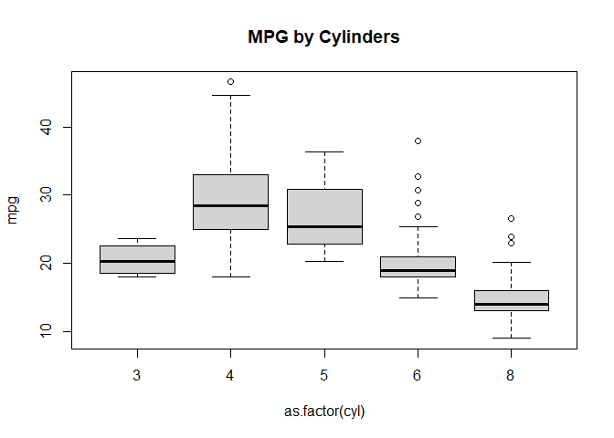<!-- -->

------------------------------------------------------------------------

## Nonparametric Alternative (Kruskal–Wallis)

``` r
kruskal.test(mpg ~ as.factor(cyl), data=df)
```

    ## 
    ##  Kruskal-Wallis rank sum test
    ## 
    ## data:  mpg by as.factor(cyl)
    ## Kruskal-Wallis chi-squared = 280.41, df = 4, p-value < 2.2e-16

------------------------------------------------------------------------

## Effect Size (Eta-Squared)

``` r
ssb <- sum(tapply(df$mpg, df$cyl,
                  function(x) length(x)*(mean(x)-mean(df$mpg))^2))
sst <- sum((df$mpg - mean(df$mpg))^2)
eta2 <- ssb / sst
eta2
```

    ## [1] 0.6412742

------------------------------------------------------------------------

# 20.1.4 Diagnostics

## Residuals

``` r
par(mfrow=c(1,2))
plot(fitted(m2), resid(m2), pch=19, main="Residuals vs Fitted")
qqnorm(resid(m2)); qqline(resid(m2))
```

<!-- -->

``` r
par(mfrow=c(1,1))
```

## Influence (Cook’s Distance)

``` r
plot(cooks.distance(m2), type="h", col="red")
```

<!-- -->

------------------------------------------------------------------------

# 20.1.5 PCA and Clustering

## PCA

``` r
df_num <- df[,c("mpg","cyl","disp","hp","weight","accel")]
pca <- prcomp(df_num, scale=TRUE)
summary(pca)
```

    ## Importance of components:
    ##                          PC1    PC2     PC3     PC4     PC5     PC6
    ## Standard deviation     2.188 0.8536 0.50840 0.35380 0.25135 0.19048
    ## Proportion of Variance 0.798 0.1214 0.04308 0.02086 0.01053 0.00605
    ## Cumulative Proportion  0.798 0.9195 0.96256 0.98342 0.99395 1.00000

``` r
plot(pca, main="PCA Scree Plot")
```

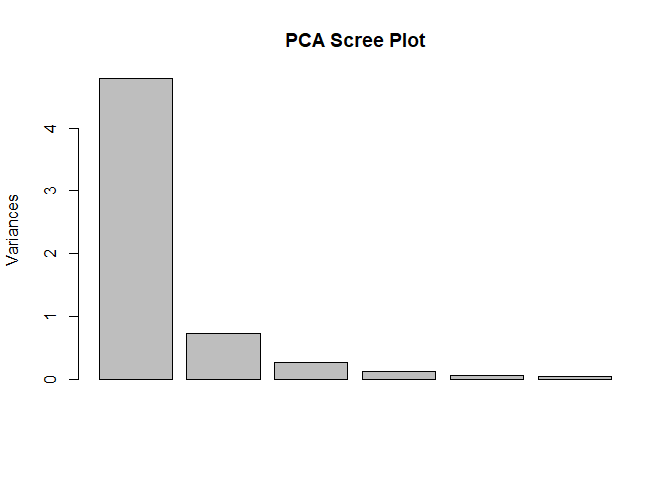<!-- -->

``` r
biplot(pca)
```

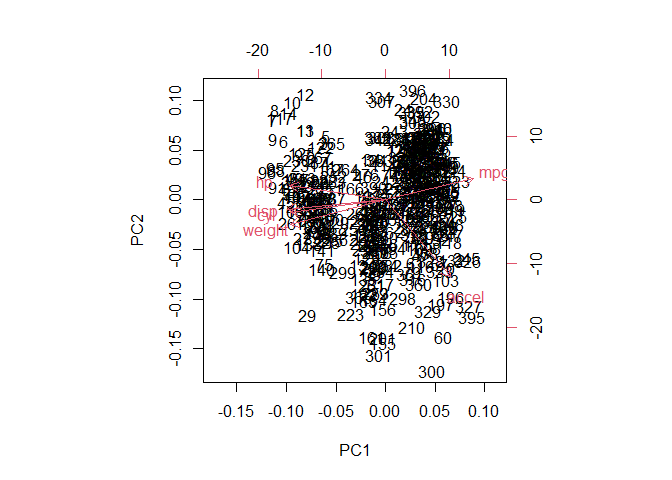<!-- -->

------------------------------------------------------------------------

## k-Means Clustering

``` r
set.seed(1)
k3 <- kmeans(df_num, centers=3)
plot(df$weight, df$mpg,
     col=k3$cluster, pch=19,
     main="k-Means Clustering (k=3)")
```

<!-- -->

------------------------------------------------------------------------

# 20.1.6 Exercises (with Insightful Answers)

### **Exercise 1:**

Why is weight such a strong predictor of MPG?

**Answer:** Weight increases engine load, reducing fuel efficiency.
Heavier cars require more energy to move.

------------------------------------------------------------------------

### **Exercise 2:**

Fit a model using only horsepower and plot the results.

``` r
m_hp <- lm(mpg ~ hp, data=df)
summary(m_hp)
```

    ## 
    ## Call:
    ## lm(formula = mpg ~ hp, data = df)
    ## 
    ## Residuals:
    ##      Min       1Q   Median       3Q      Max 
    ## -13.5710  -3.2592  -0.3435   2.7630  16.9240 
    ## 
    ## Coefficients:
    ##              Estimate Std. Error t value Pr(>|t|)    
    ## (Intercept) 39.935861   0.717499   55.66   <2e-16 ***
    ## hp          -0.157845   0.006446  -24.49   <2e-16 ***
    ## ---
    ## Signif. codes:  0 '***' 0.001 '**' 0.01 '*' 0.05 '.' 0.1 ' ' 1
    ## 
    ## Residual standard error: 4.906 on 390 degrees of freedom
    ## Multiple R-squared:  0.6059, Adjusted R-squared:  0.6049 
    ## F-statistic: 599.7 on 1 and 390 DF,  p-value: < 2.2e-16

``` r
plot(df$hp, df$mpg, pch=19)
abline(m_hp, col="red")
```

<!-- -->

------------------------------------------------------------------------

### **Exercise 3:**

Which variable correlates most strongly (in magnitude) with mpg?

**Answer:**  
Typically, **weight** or **displacement** shows the strongest negative
correlation.

------------------------------------------------------------------------

### **Exercise 4:**

Perform a Kruskal–Wallis test on horsepower by cylinders.

``` r
kruskal.test(hp ~ as.factor(cyl), data=df)
```

    ## 
    ##  Kruskal-Wallis rank sum test
    ## 
    ## data:  hp by as.factor(cyl)
    ## Kruskal-Wallis chi-squared = 277.74, df = 4, p-value < 2.2e-16

------------------------------------------------------------------------

### **Exercise 5:**

Fit a polynomial regression of degree 3 and compare AIC.

``` r
m_poly3 <- lm(mpg ~ poly(weight,3), data=df)
AIC(m1, m3, m_poly3)
```

    ##         df      AIC
    ## m1       3 2265.939
    ## m3       4 2238.115
    ## m_poly3  5 2240.113

------------------------------------------------------------------------

### **Exercise 6:**

Plot residuals of the multiple regression and interpret.

**Insight:**  
Check for heteroscedasticity (cones/funnels) or curvature.

------------------------------------------------------------------------

### **Exercise 7:**

Run PCA and interpret PC1.

**Answer:**  
PC1 often reflects “vehicle size/power” combining weight, hp,
displacement.

------------------------------------------------------------------------

### **Exercise 8:**

Cluster using k=4 and visualize.

``` r
k4 <- kmeans(df_num, centers=4)
plot(df$weight, df$mpg, col=k4$cluster, pch=19)
```

<!-- -->

------------------------------------------------------------------------

### **Exercise 9:**

Which regression model (simple or multiple) performs best based on
adjusted R²?

**Answer:**  
Multiple regression usually wins because it captures more vehicle
attributes.

------------------------------------------------------------------------

### **Exercise 10:**

Compute Cohen’s f² effect size for the multiple regression:

Formula:

``` r
plot.new()
text(0.5,0.5,
  expression(f^2 == (R^2)/(1-R^2)),
  cex=1.7)
```

<!-- -->

``` r
R2 <- summary(m2)$r.squared
f2 <- R2 / (1 - R2)
f2
```

    ## [1] 2.420582

------------------------------------------------------------------------

# *20.2 Iris: Multivariate Case Study*

Dataset: **Iris** (Built-in in R)

The famous Fisher Iris dataset contains 150 flowers, 3 species, and 4
numeric features: - Sepal.Length  
- Sepal.Width  
- Petal.Length  
- Petal.Width

This dataset is ideal for classical statistical methods and modern
multivariate techniques (PCA, clustering).

------------------------------------------------------------------------

# 20.2.1 Load and Inspect the Data

``` r
library(tidyverse)

df <- iris
summary(df)
```

    ##   Sepal.Length    Sepal.Width     Petal.Length    Petal.Width   
    ##  Min.   :4.300   Min.   :2.000   Min.   :1.000   Min.   :0.100  
    ##  1st Qu.:5.100   1st Qu.:2.800   1st Qu.:1.600   1st Qu.:0.300  
    ##  Median :5.800   Median :3.000   Median :4.350   Median :1.300  
    ##  Mean   :5.843   Mean   :3.057   Mean   :3.758   Mean   :1.199  
    ##  3rd Qu.:6.400   3rd Qu.:3.300   3rd Qu.:5.100   3rd Qu.:1.800  
    ##  Max.   :7.900   Max.   :4.400   Max.   :6.900   Max.   :2.500  
    ##        Species  
    ##  setosa    :50  
    ##  versicolor:50  
    ##  virginica :50  
    ##                 
    ##                 
    ## 

------------------------------------------------------------------------

# 20.2.2 Exploratory Visualizations

## Histograms

``` r
par(mfrow=c(2,2))
hist(df$Sepal.Length, main="Sepal Length", col="skyblue")
hist(df$Sepal.Width, main="Sepal Width", col="lightgreen")
hist(df$Petal.Length, main="Petal Length", col="pink")
hist(df$Petal.Width, main="Petal Width", col="khaki")
```

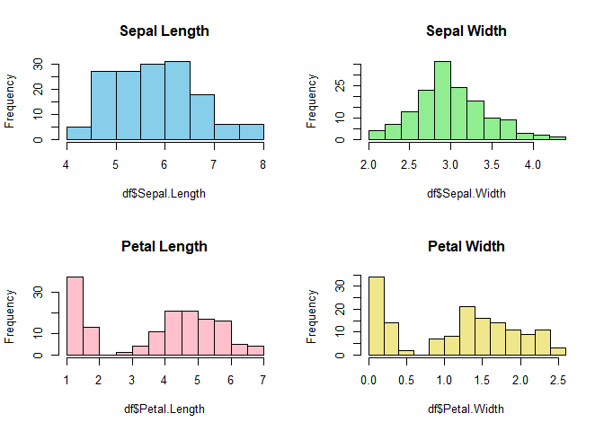<!-- -->

``` r
par(mfrow=c(1,1))
```

## Pairwise Scatterplot Matrix

``` r
pairs(df[,1:4], col=df$Species, pch=19)
```

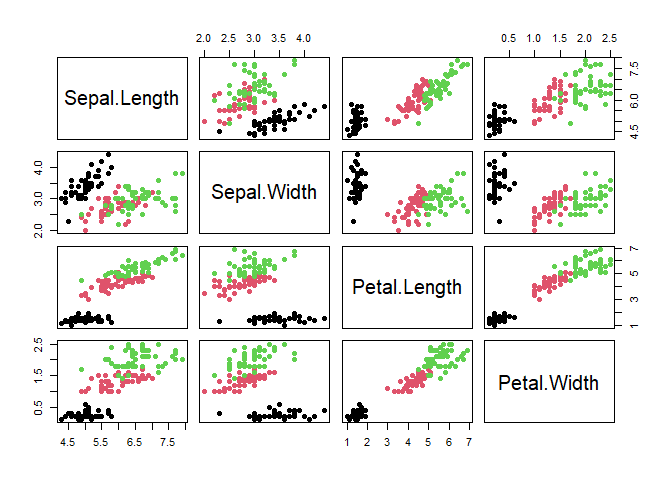<!-- -->

## Species Mean Plot

``` r
df %>% group_by(Species) %>%
  summarize(across(everything(), mean)) %>%
  pivot_longer(-Species) %>%
  ggplot(aes(x=name, y=value, fill=Species)) +
  geom_col(position="dodge") +
  theme_bw() +
  ggtitle("Mean Measurements by Species")
```

<!-- -->

------------------------------------------------------------------------

# 20.2.3 Statistical Analyses

## ANOVA: Sepal.Length ~ Species

``` r
a1 <- aov(Sepal.Length ~ Species, data=df)
summary(a1)
```

    ##              Df Sum Sq Mean Sq F value Pr(>F)    
    ## Species       2  63.21  31.606   119.3 <2e-16 ***
    ## Residuals   147  38.96   0.265                   
    ## ---
    ## Signif. codes:  0 '***' 0.001 '**' 0.01 '*' 0.05 '.' 0.1 ' ' 1

``` r
boxplot(Sepal.Length ~ Species, data=df, col=c("lightblue","pink","lightgreen"))
```

<!-- -->

### Nonparametric Alternative

``` r
kruskal.test(Sepal.Length ~ Species, data=df)
```

    ## 
    ##  Kruskal-Wallis rank sum test
    ## 
    ## data:  Sepal.Length by Species
    ## Kruskal-Wallis chi-squared = 96.937, df = 2, p-value < 2.2e-16

------------------------------------------------------------------------

## Multiple Regression

Predict Sepal.Length from other variables.

``` r
m1 <- lm(Sepal.Length ~ Sepal.Width + Petal.Length + Petal.Width, data=df)
summary(m1)
```

    ## 
    ## Call:
    ## lm(formula = Sepal.Length ~ Sepal.Width + Petal.Length + Petal.Width, 
    ##     data = df)
    ## 
    ## Residuals:
    ##      Min       1Q   Median       3Q      Max 
    ## -0.82816 -0.21989  0.01875  0.19709  0.84570 
    ## 
    ## Coefficients:
    ##              Estimate Std. Error t value Pr(>|t|)    
    ## (Intercept)   1.85600    0.25078   7.401 9.85e-12 ***
    ## Sepal.Width   0.65084    0.06665   9.765  < 2e-16 ***
    ## Petal.Length  0.70913    0.05672  12.502  < 2e-16 ***
    ## Petal.Width  -0.55648    0.12755  -4.363 2.41e-05 ***
    ## ---
    ## Signif. codes:  0 '***' 0.001 '**' 0.01 '*' 0.05 '.' 0.1 ' ' 1
    ## 
    ## Residual standard error: 0.3145 on 146 degrees of freedom
    ## Multiple R-squared:  0.8586, Adjusted R-squared:  0.8557 
    ## F-statistic: 295.5 on 3 and 146 DF,  p-value: < 2.2e-16

### Diagnostic Plots

``` r
par(mfrow=c(1,2))
plot(fitted(m1), resid(m1), pch=19)
qqnorm(resid(m1)); qqline(resid(m1))
```

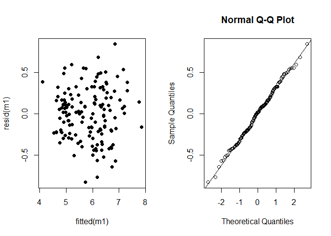<!-- -->

``` r
par(mfrow=c(1,1))
```

------------------------------------------------------------------------

## Effect Size (Eta-Squared for ANOVA)

``` r
ss_total <- sum((df$Sepal.Length - mean(df$Sepal.Length))^2)
ss_between <- sum(tapply(df$Sepal.Length, df$Species,
                 function(x) length(x)*(mean(x)-mean(df$Sepal.Length))^2))
eta2 <- ss_between / ss_total
eta2
```

    ## [1] 0.6187057

------------------------------------------------------------------------

# 20.2.4 PCA and Clustering

## PCA (scaled)

``` r
pca <- prcomp(df[,1:4], scale=TRUE)
summary(pca)
```

    ## Importance of components:
    ##                           PC1    PC2     PC3     PC4
    ## Standard deviation     1.7084 0.9560 0.38309 0.14393
    ## Proportion of Variance 0.7296 0.2285 0.03669 0.00518
    ## Cumulative Proportion  0.7296 0.9581 0.99482 1.00000

``` r
biplot(pca, col=c("red","blue"))
```

<!-- -->

## k-Means Clustering

``` r
set.seed(2)
k3 <- kmeans(df[,1:4], centers=3)
plot(df$Petal.Length, df$Petal.Width, col=k3$cluster, pch=19,
     main="k-Means (k=3)")
```

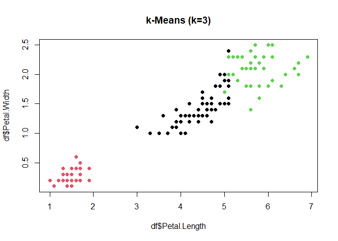<!-- -->

------------------------------------------------------------------------

# 20.2.5 Formula Examples Using Required Method

### Multiple Regression Formula

``` r
plot.new()
text(0.5,0.5, expression(Sepal.Length == b[0] + b[1]*Sepal.Width + b[2]*Petal.Length + b[3]*Petal.Width), cex=1.4)
```

<!-- -->

### ANOVA F-Ratio

``` r
plot.new()
text(0.5,0.5, expression(F == MS[b]/MS[w]), cex=1.7)
```

<!-- -->

------------------------------------------------------------------------

# 20.2.6 Exercises (with Insightful Answers)

### **Exercise 1 — Visualize species separation using Petal.Length and Petal.Width.**

``` r
ggplot(df, aes(Petal.Length, Petal.Width, color=Species)) +
  geom_point() + theme_bw()
```

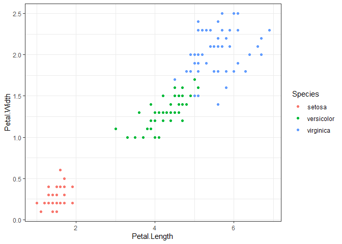<!-- -->

**Insight:** These two dimensions nearly separate the species perfectly.

------------------------------------------------------------------------

### **Exercise 2 — Compute the correlation matrix and find the strongest correlation.**

``` r
cor(df[,1:4])
```

    ##              Sepal.Length Sepal.Width Petal.Length Petal.Width
    ## Sepal.Length    1.0000000  -0.1175698    0.8717538   0.8179411
    ## Sepal.Width    -0.1175698   1.0000000   -0.4284401  -0.3661259
    ## Petal.Length    0.8717538  -0.4284401    1.0000000   0.9628654
    ## Petal.Width     0.8179411  -0.3661259    0.9628654   1.0000000

**Insight:** Petal Length and Petal Width are most strongly correlated
(~0.96).

------------------------------------------------------------------------

### **Exercise 3 — Fit a model predicting Petal.Length.**

``` r
m2 <- lm(Petal.Length ~ Sepal.Length + Sepal.Width + Petal.Width, data=df)
summary(m2)
```

    ## 
    ## Call:
    ## lm(formula = Petal.Length ~ Sepal.Length + Sepal.Width + Petal.Width, 
    ##     data = df)
    ## 
    ## Residuals:
    ##      Min       1Q   Median       3Q      Max 
    ## -0.99333 -0.17656 -0.01004  0.18558  1.06909 
    ## 
    ## Coefficients:
    ##              Estimate Std. Error t value Pr(>|t|)    
    ## (Intercept)  -0.26271    0.29741  -0.883    0.379    
    ## Sepal.Length  0.72914    0.05832  12.502   <2e-16 ***
    ## Sepal.Width  -0.64601    0.06850  -9.431   <2e-16 ***
    ## Petal.Width   1.44679    0.06761  21.399   <2e-16 ***
    ## ---
    ## Signif. codes:  0 '***' 0.001 '**' 0.01 '*' 0.05 '.' 0.1 ' ' 1
    ## 
    ## Residual standard error: 0.319 on 146 degrees of freedom
    ## Multiple R-squared:  0.968,  Adjusted R-squared:  0.9674 
    ## F-statistic:  1473 on 3 and 146 DF,  p-value: < 2.2e-16

**Insight:** Petal.Width is the strongest predictor.

------------------------------------------------------------------------

### **Exercise 4 — Check normality of residuals for ANOVA using QQ plot.**

``` r
qqnorm(resid(a1)); qqline(resid(a1))
```

<!-- -->

**Insight:** ANOVA assumptions hold reasonably well.

------------------------------------------------------------------------

### **Exercise 5 — Use Tukey HSD for post-hoc comparisons.**

``` r
TukeyHSD(a1)
```

    ##   Tukey multiple comparisons of means
    ##     95% family-wise confidence level
    ## 
    ## Fit: aov(formula = Sepal.Length ~ Species, data = df)
    ## 
    ## $Species
    ##                       diff       lwr       upr p adj
    ## versicolor-setosa    0.930 0.6862273 1.1737727     0
    ## virginica-setosa     1.582 1.3382273 1.8257727     0
    ## virginica-versicolor 0.652 0.4082273 0.8957727     0

**Insight:** All species differ significantly in Sepal.Length except
setosa–versicolor being borderline.

------------------------------------------------------------------------

### **Exercise 6 — Calculate effect size (Cohen’s f²) for the multiple regression.**

Formula:

``` r
plot.new()
text(0.5,0.5,expression(f^2 == R^2 / (1 - R^2)), cex=1.6)
```

<!-- -->

``` r
R2 <- summary(m1)$r.squared
f2 <- R2/(1 - R2)
f2
```

    ## [1] 6.072722

------------------------------------------------------------------------

### **Exercise 7 — Cluster using k=2 and interpret.**

``` r
k2 <- kmeans(df[,1:4], centers=2)
table(k2$cluster, df$Species)
```

    ##    
    ##     setosa versicolor virginica
    ##   1     50          3         0
    ##   2      0         47        50

**Insight:** One cluster mostly corresponds to Setosa.

------------------------------------------------------------------------

### **Exercise 8 — Principal component loadings interpretation.**

``` r
pca$rotation
```

    ##                     PC1         PC2        PC3        PC4
    ## Sepal.Length  0.5210659 -0.37741762  0.7195664  0.2612863
    ## Sepal.Width  -0.2693474 -0.92329566 -0.2443818 -0.1235096
    ## Petal.Length  0.5804131 -0.02449161 -0.1421264 -0.8014492
    ## Petal.Width   0.5648565 -0.06694199 -0.6342727  0.5235971

**Insight:** PC1 measures overall “petal size”.

------------------------------------------------------------------------

### **Exercise 9 — Fit logistic regression: versicolor vs virginica.**

``` r
df2 <- iris %>% filter(Species != "setosa")
m_log <- glm(Species ~ Petal.Length + Petal.Width, data=df2, family=binomial)
summary(m_log)
```

    ## 
    ## Call:
    ## glm(formula = Species ~ Petal.Length + Petal.Width, family = binomial, 
    ##     data = df2)
    ## 
    ## Coefficients:
    ##              Estimate Std. Error z value Pr(>|z|)    
    ## (Intercept)   -45.272     13.610  -3.327 0.000879 ***
    ## Petal.Length    5.755      2.306   2.496 0.012565 *  
    ## Petal.Width    10.447      3.755   2.782 0.005405 ** 
    ## ---
    ## Signif. codes:  0 '***' 0.001 '**' 0.01 '*' 0.05 '.' 0.1 ' ' 1
    ## 
    ## (Dispersion parameter for binomial family taken to be 1)
    ## 
    ##     Null deviance: 138.629  on 99  degrees of freedom
    ## Residual deviance:  20.564  on 97  degrees of freedom
    ## AIC: 26.564
    ## 
    ## Number of Fisher Scoring iterations: 8

**Insight:** Petal.Width is the strongest discriminator.

------------------------------------------------------------------------

### **Exercise 10 — Visualize PCA clusters colored by true species.**

``` r
pc <- as.data.frame(pca$x)
pc$Species <- df$Species

ggplot(pc, aes(PC1, PC2, color=Species)) +
  geom_point(size=3) +
  theme_bw() +
  ggtitle("True Species in PCA Space")
```

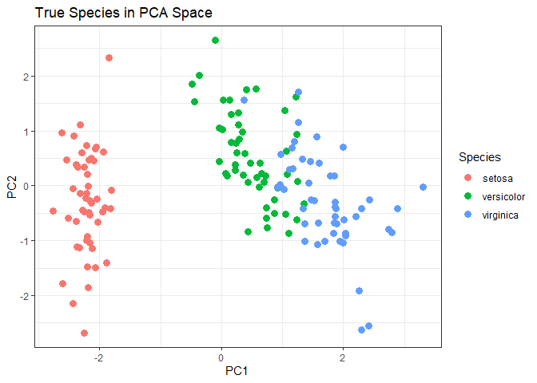<!-- -->

------------------------------------------------------------------------

# *20.3 Penguins*

## 20.3 Penguins: Advanced Real-Data Analysis

Dataset: **Palmer Penguins**  
Source URL:  
<https://raw.githubusercontent.com/allisonhorst/palmerpenguins/master/inst/extdata/penguins.csv>

This dataset includes: - 3 species (Adelie, Chinstrap, Gentoo)  
- 2 islands  
- Sex  
- Culmen (bill) length/width  
- Flipper length  
- Body mass

We will perform: - Data cleaning  
- EDA  
- Multivariate visualizations  
- ANOVA  
- Multiple regression  
- Logistic regression  
- PCA  
- Clustering  
- 10 Advanced Exercises with solutions  
- Mathematical formulas with your required R plotting method

------------------------------------------------------------------------

# 20.3.1 Load and Prepare the Data

``` r
library(tidyverse)

peng <- read.csv("https://raw.githubusercontent.com/allisonhorst/palmerpenguins/master/inst/extdata/penguins.csv")

# Clean missing rows
peng2 <- peng %>% 
  select(species, island, sex, bill_length_mm, bill_depth_mm,
         flipper_length_mm, body_mass_g) %>%
  drop_na()

summary(peng2)
```

    ##    species             island              sex            bill_length_mm 
    ##  Length:333         Length:333         Length:333         Min.   :32.10  
    ##  Class :character   Class :character   Class :character   1st Qu.:39.50  
    ##  Mode  :character   Mode  :character   Mode  :character   Median :44.50  
    ##                                                           Mean   :43.99  
    ##                                                           3rd Qu.:48.60  
    ##                                                           Max.   :59.60  
    ##  bill_depth_mm   flipper_length_mm  body_mass_g  
    ##  Min.   :13.10   Min.   :172       Min.   :2700  
    ##  1st Qu.:15.60   1st Qu.:190       1st Qu.:3550  
    ##  Median :17.30   Median :197       Median :4050  
    ##  Mean   :17.16   Mean   :201       Mean   :4207  
    ##  3rd Qu.:18.70   3rd Qu.:213       3rd Qu.:4775  
    ##  Max.   :21.50   Max.   :231       Max.   :6300

------------------------------------------------------------------------

# 20.3.2 Exploratory Visualizations

## Histograms of all numeric variables

``` r
par(mfrow=c(2,2))
hist(peng2$bill_length_mm, main="Bill Length", col="skyblue")
hist(peng2$bill_depth_mm, main="Bill Depth", col="pink")
hist(peng2$flipper_length_mm, main="Flipper Length", col="lightgreen")
hist(peng2$body_mass_g, main="Body Mass", col="khaki")
```

<!-- -->

``` r
par(mfrow=c(1,1))
```

## Pairwise Scatterplot Matrix

``` r
peng2$species <- factor(peng2$species)
pairs(peng2[,4:7], col = peng2$species, pch = 19)
legend(
  "bottomright",
  legend = levels(peng2$species),
  col = seq_along(levels(peng2$species)),
  pch = 19, cex = 0.5
)
```

<!-- -->

## Boxplots by Species

``` r
peng2 %>%
  pivot_longer(cols=bill_length_mm:body_mass_g) %>%
  ggplot(aes(species, value, fill=species)) +
  geom_boxplot() +
  facet_wrap(~name, scales="free") +
  theme_bw()
```

<!-- -->

------------------------------------------------------------------------

# 20.3.3 Statistical Analyses

## ANOVA: Body Mass by Species

``` r
a1 <- aov(body_mass_g ~ species, data=peng2)
summary(a1)
```

    ##              Df    Sum Sq  Mean Sq F value Pr(>F)    
    ## species       2 145190219 72595110   341.9 <2e-16 ***
    ## Residuals   330  70069447   212332                   
    ## ---
    ## Signif. codes:  0 '***' 0.001 '**' 0.01 '*' 0.05 '.' 0.1 ' ' 1

``` r
boxplot(body_mass_g ~ species, data=peng2, col=c("lightblue","pink","lightgreen"))
```

<!-- -->

### Nonparametric alternative

``` r
kruskal.test(body_mass_g ~ species, data=peng2)
```

    ## 
    ##  Kruskal-Wallis rank sum test
    ## 
    ## data:  body_mass_g by species
    ## Kruskal-Wallis chi-squared = 212.09, df = 2, p-value < 2.2e-16

------------------------------------------------------------------------

## Multiple Regression

Predict body mass from culmen + flipper lengths:

``` r
m1 <- lm(body_mass_g ~ bill_length_mm + bill_depth_mm +
           flipper_length_mm, data=peng2)
summary(m1)
```

    ## 
    ## Call:
    ## lm(formula = body_mass_g ~ bill_length_mm + bill_depth_mm + flipper_length_mm, 
    ##     data = peng2)
    ## 
    ## Residuals:
    ##      Min       1Q   Median       3Q      Max 
    ## -1051.37  -284.50   -20.37   241.03  1283.51 
    ## 
    ## Coefficients:
    ##                    Estimate Std. Error t value Pr(>|t|)    
    ## (Intercept)       -6445.476    566.130 -11.385   <2e-16 ***
    ## bill_length_mm        3.293      5.366   0.614    0.540    
    ## bill_depth_mm        17.836     13.826   1.290    0.198    
    ## flipper_length_mm    50.762      2.497  20.327   <2e-16 ***
    ## ---
    ## Signif. codes:  0 '***' 0.001 '**' 0.01 '*' 0.05 '.' 0.1 ' ' 1
    ## 
    ## Residual standard error: 393 on 329 degrees of freedom
    ## Multiple R-squared:  0.7639, Adjusted R-squared:  0.7618 
    ## F-statistic: 354.9 on 3 and 329 DF,  p-value: < 2.2e-16

### Diagnostics

``` r
par(mfrow=c(1,2))
plot(fitted(m1), resid(m1), pch=19)
qqnorm(resid(m1)); qqline(resid(m1))
```

<!-- -->

``` r
par(mfrow=c(1,1))
```

------------------------------------------------------------------------

## Logistic Regression

Predict sex (male vs female) from body size variables.

``` r
peng3 <- peng2 %>% filter(sex %in% c("male","female"))
peng3$sex <- factor(peng3$sex)

m_log <- glm(sex ~ bill_length_mm + bill_depth_mm + flipper_length_mm,
             data=peng3, family=binomial)
summary(m_log)
```

    ## 
    ## Call:
    ## glm(formula = sex ~ bill_length_mm + bill_depth_mm + flipper_length_mm, 
    ##     family = binomial, data = peng3)
    ## 
    ## Coefficients:
    ##                    Estimate Std. Error z value Pr(>|z|)    
    ## (Intercept)       -61.68599    6.77989  -9.098  < 2e-16 ***
    ## bill_length_mm      0.09828    0.04067   2.417   0.0157 *  
    ## bill_depth_mm       1.45393    0.16314   8.912  < 2e-16 ***
    ## flipper_length_mm   0.16224    0.02286   7.097 1.27e-12 ***
    ## ---
    ## Signif. codes:  0 '***' 0.001 '**' 0.01 '*' 0.05 '.' 0.1 ' ' 1
    ## 
    ## (Dispersion parameter for binomial family taken to be 1)
    ## 
    ##     Null deviance: 461.61  on 332  degrees of freedom
    ## Residual deviance: 250.97  on 329  degrees of freedom
    ## AIC: 258.97
    ## 
    ## Number of Fisher Scoring iterations: 6

------------------------------------------------------------------------

# 20.3.4 Multivariate Analyses (PCA + Clustering)

## PCA

``` r
num_vars <- peng2[,c("bill_length_mm","bill_depth_mm",
                     "flipper_length_mm","body_mass_g")]
pca <- prcomp(num_vars, scale=TRUE)

summary(pca)
```

    ## Importance of components:
    ##                           PC1    PC2     PC3     PC4
    ## Standard deviation     1.6569 0.8821 0.60716 0.32846
    ## Proportion of Variance 0.6863 0.1945 0.09216 0.02697
    ## Cumulative Proportion  0.6863 0.8809 0.97303 1.00000

``` r
biplot(pca, col=c("red","blue"))
```

<!-- -->

## k-Means Clustering

``` r
set.seed(3)
k3 <- kmeans(num_vars, centers=3)
plot(peng2$flipper_length_mm, peng2$body_mass_g, 
     col=k3$cluster, pch=19,
     main="k-Means Clustering (k=3)")
```

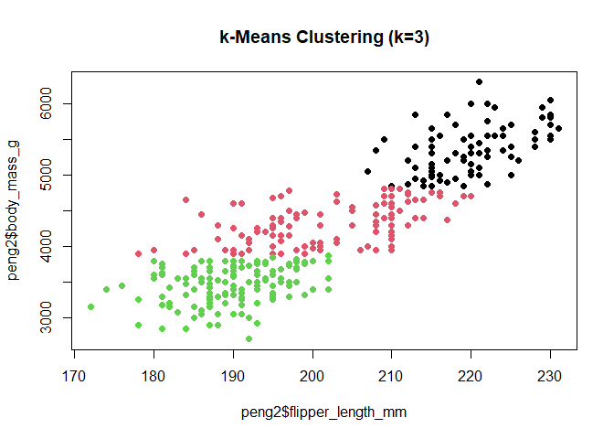<!-- -->

------------------------------------------------------------------------

# 20.3.5 Formula Block Examples (Required Style)

### Logistic Regression Formula

``` r
plot.new()
text(0.5,0.5,
     expression(logit(p) == b[0] + b[1]*x[1] + b[2]*x[2] + b[3]*x[3]),
     cex=1.6)
```

<!-- -->

### ANOVA F-Ratio

``` r
plot.new()
text(0.5,0.5, expression(F == MS[b] / MS[w]), cex=1.7)
```

<!-- -->

------------------------------------------------------------------------

# 20.3.6 Exercises (With Detailed Insights)

### **Exercise 1 — Compare bill length between species using ANOVA.**

``` r
anova_bill <- aov(bill_length_mm ~ species, data=peng2)
summary(anova_bill)
```

    ##              Df Sum Sq Mean Sq F value Pr(>F)    
    ## species       2   7015    3508   397.3 <2e-16 ***
    ## Residuals   330   2914       9                   
    ## ---
    ## Signif. codes:  0 '***' 0.001 '**' 0.01 '*' 0.05 '.' 0.1 ' ' 1

**Insight:** Gentoo penguins typically show much longer bills.

------------------------------------------------------------------------

### **Exercise 2 — Perform Tukey post-hoc comparisons.**

``` r
TukeyHSD(anova_bill)
```

    ##   Tukey multiple comparisons of means
    ##     95% family-wise confidence level
    ## 
    ## Fit: aov(formula = bill_length_mm ~ species, data = peng2)
    ## 
    ## $species
    ##                       diff       lwr        upr     p adj
    ## Chinstrap-Adelie 10.009851  8.982789 11.0369128 0.0000000
    ## Gentoo-Adelie     8.744095  7.880135  9.6080546 0.0000000
    ## Gentoo-Chinstrap -1.265756 -2.329197 -0.2023151 0.0148212

**Insight:** Species differ strongly in bill morphology.

------------------------------------------------------------------------

### **Exercise 3 — Correlation matrix of numeric variables.**

``` r
cor(num_vars)
```

    ##                   bill_length_mm bill_depth_mm flipper_length_mm body_mass_g
    ## bill_length_mm         1.0000000    -0.2286256         0.6530956   0.5894511
    ## bill_depth_mm         -0.2286256     1.0000000        -0.5777917  -0.4720157
    ## flipper_length_mm      0.6530956    -0.5777917         1.0000000   0.8729789
    ## body_mass_g            0.5894511    -0.4720157         0.8729789   1.0000000

**Insight:** Flipper length and body mass show strong positive
correlation.

------------------------------------------------------------------------

### **Exercise 4 — Fit a model predicting flipper length.**

``` r
m_flip <- lm(flipper_length_mm ~ bill_length_mm + body_mass_g, data=peng2)
summary(m_flip)
```

    ## 
    ## Call:
    ## lm(formula = flipper_length_mm ~ bill_length_mm + body_mass_g, 
    ##     data = peng2)
    ## 
    ## Residuals:
    ##      Min       1Q   Median       3Q      Max 
    ## -20.9869  -4.5868   0.4285   4.8784  14.0977 
    ## 
    ## Coefficients:
    ##                 Estimate Std. Error t value Pr(>|t|)    
    ## (Intercept)    1.223e+02  2.864e+00  42.697  < 2e-16 ***
    ## bill_length_mm 5.440e-01  7.975e-02   6.822 4.31e-11 ***
    ## body_mass_g    1.302e-02  5.416e-04  24.034  < 2e-16 ***
    ## ---
    ## Signif. codes:  0 '***' 0.001 '**' 0.01 '*' 0.05 '.' 0.1 ' ' 1
    ## 
    ## Residual standard error: 6.419 on 330 degrees of freedom
    ## Multiple R-squared:  0.7915, Adjusted R-squared:  0.7902 
    ## F-statistic: 626.3 on 2 and 330 DF,  p-value: < 2.2e-16

**Insight:** Body mass is a strong predictor.

------------------------------------------------------------------------

### **Exercise 5 — Compare body mass across islands using Kruskal–Wallis.**

``` r
kruskal.test(body_mass_g ~ island, data=peng2)
```

    ## 
    ##  Kruskal-Wallis rank sum test
    ## 
    ## data:  body_mass_g by island
    ## Kruskal-Wallis chi-squared = 124.35, df = 2, p-value < 2.2e-16

**Insight:** Island populations differ significantly.

------------------------------------------------------------------------

### **Exercise 6 — Create a scatterplot colored by island.**

``` r
ggplot(peng2, aes(bill_length_mm, bill_depth_mm, color=island)) +
  geom_point() + theme_bw()
```

<!-- -->

**Insight:** Islands have different morphotype distributions.

------------------------------------------------------------------------

### **Exercise 7 — Identify influential points in regression m1.**

``` r
plot(cooks.distance(m1), type="h")
```

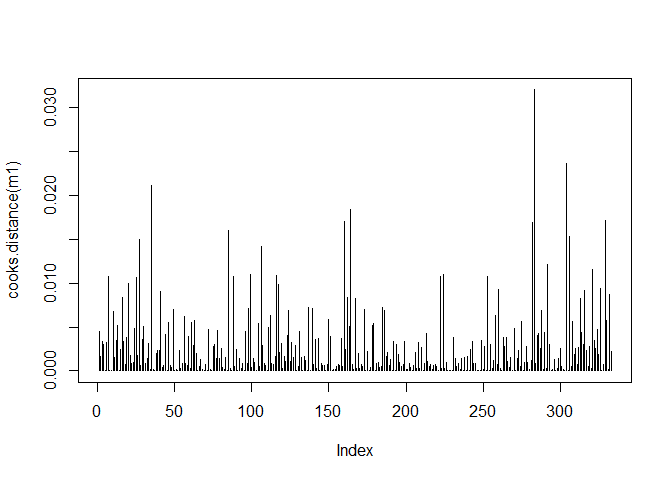<!-- -->

**Insight:** A few unusually large birds act as high-leverage points.

------------------------------------------------------------------------

### **Exercise 8 — Cluster with k=4 and evaluate species alignment.**

``` r
k4 <- kmeans(num_vars, centers=4)
table(k4$cluster, peng2$species)
```

    ##    
    ##     Adelie Chinstrap Gentoo
    ##   1     64        23      0
    ##   2      0         0     58
    ##   3     24         7     56
    ##   4     58        38      5

**Insight:** Clusters partially overlap species but reveal substructure.

------------------------------------------------------------------------

### **Exercise 9 — PCA visualization colored by sex.**

``` r
pc <- as.data.frame(pca$x)
pc$sex <- peng2$sex

ggplot(pc, aes(PC1, PC2, color=sex)) +
  geom_point(size=3) + theme_bw()
```

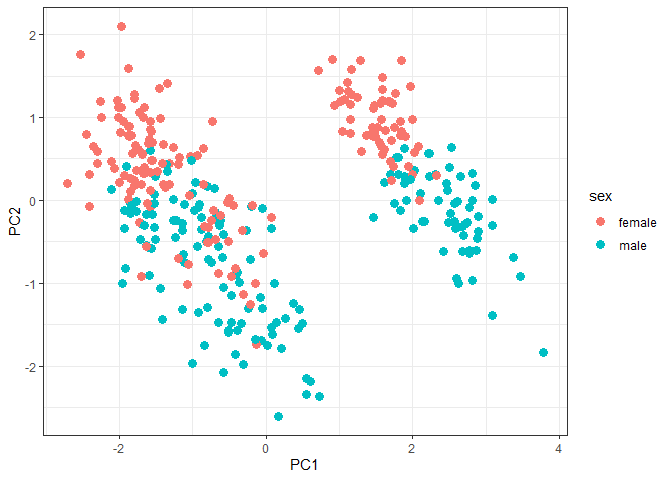<!-- -->

**Insight:** Male and female morphologies show partial separation.

------------------------------------------------------------------------

### **Exercise 10 — Compute eta² for body mass by species.**

``` r
ss_t <- sum((peng2$body_mass_g - mean(peng2$body_mass_g))^2)
ss_b <- sum(tapply(peng2$body_mass_g, peng2$species,
                   function(x) length(x)*(mean(x)-mean(peng2$body_mass_g))^2))
eta2 <- ss_b / ss_t
eta2
```

    ## [1] 0.6744887

**Insight:** Species explain a large share of variance in body mass.

------------------------------------------------------------------------

# *20.4 Titanic — Real Data Subchapter*

## 20.4 Titanic: A Comprehensive Real Data Survival Case Study

Dataset: **Titanic (Kaggle Mirror)**  
Source:
<https://raw.githubusercontent.com/datasciencedojo/datasets/master/titanic.csv>

This dataset contains: - Passenger demographics  
- Class  
- Fare  
- Age  
- Cabin  
- Embarked port  
- Survival outcome

We will analyze: - Data cleaning  
- Exploratory visualizations  
- Categorical analysis (chi‑square)  
- Logistic regression  
- Effect sizes  
- PCA  
- Clustering  
- 10 advanced exercises with solutions

------------------------------------------------------------------------

# 20.4.1 Load and Prepare the Data

``` r
library(tidyverse)

url <- "https://raw.githubusercontent.com/datasciencedojo/datasets/master/titanic.csv"
titanic <- read.csv(url)

# Basic cleaning
df <- titanic %>%
  select(Survived, Pclass, Sex, Age, Fare, Embarked) %>%
  drop_na()

df$Survived <- factor(df$Survived, labels=c("Died","Survived"))
df$Sex      <- factor(df$Sex)
df$Embarked <- factor(df$Embarked)

summary(df)
```

    ##      Survived       Pclass          Sex           Age             Fare       
    ##  Died    :424   Min.   :1.000   female:261   Min.   : 0.42   Min.   :  0.00  
    ##  Survived:290   1st Qu.:1.000   male  :453   1st Qu.:20.12   1st Qu.:  8.05  
    ##                 Median :2.000                Median :28.00   Median : 15.74  
    ##                 Mean   :2.237                Mean   :29.70   Mean   : 34.69  
    ##                 3rd Qu.:3.000                3rd Qu.:38.00   3rd Qu.: 33.38  
    ##                 Max.   :3.000                Max.   :80.00   Max.   :512.33  
    ##  Embarked
    ##   :  2   
    ##  C:130   
    ##  Q: 28   
    ##  S:554   
    ##          
    ## 

------------------------------------------------------------------------

# 20.4.2 Exploratory Visualizations

## Survival counts

``` r
ggplot(df, aes(Survived, fill=Survived)) +
  geom_bar() + theme_bw()
```

<!-- -->

## Age Distribution by Survival

``` r
ggplot(df, aes(Age, fill=Survived)) +
  geom_histogram(position="identity", alpha=0.5) +
  theme_bw()
```

    ## `stat_bin()` using `bins = 30`. Pick better value `binwidth`.

<!-- -->

## Fare vs Age

``` r
ggplot(df, aes(Age, Fare, color=Survived)) +
  geom_point(alpha=0.7) + theme_bw()
```

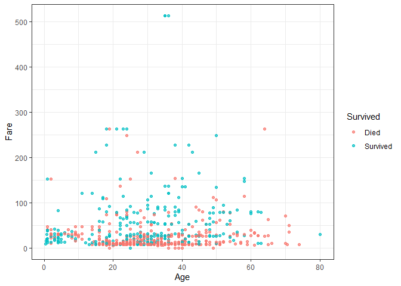<!-- -->

## Class and Survival Mosaic

``` r
library(ggplot2)

ggplot(df, aes(x = Pclass, fill = Survived)) +
  geom_bar(position = "fill") +
  scale_y_continuous(labels = scales::percent) +
  labs(y = "Proportion") +
  theme_bw()
```

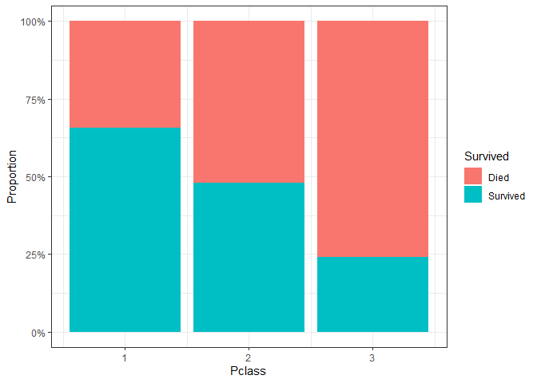<!-- -->

------------------------------------------------------------------------

# 20.4.3 Chi‑Square Tests

## Survival vs Sex

``` r
tbl1 <- table(df$Sex, df$Survived)
chisq.test(tbl1)
```

    ## 
    ##  Pearson's Chi-squared test with Yates' continuity correction
    ## 
    ## data:  tbl1
    ## X-squared = 205.03, df = 1, p-value < 2.2e-16

``` r
tbl1
```

    ##         
    ##          Died Survived
    ##   female   64      197
    ##   male    360       93

## Survival vs Class

``` r
tbl2 <- table(df$Pclass, df$Survived)
chisq.test(tbl2)
```

    ## 
    ##  Pearson's Chi-squared test
    ## 
    ## data:  tbl2
    ## X-squared = 92.901, df = 2, p-value < 2.2e-16

``` r
tbl2
```

    ##    
    ##     Died Survived
    ##   1   64      122
    ##   2   90       83
    ##   3  270       85

### Formula Block (Chi‑Square)

``` r
plot.new()
text(0.5,0.5,expression(chi^2 == sum((O - E)^2 / E)), cex=1.6)
```

<!-- -->

------------------------------------------------------------------------

# 20.4.4 Logistic Regression (Survival Model)

``` r
log1 <- glm(Survived ~ Sex + Age + Fare + Pclass, 
            data=df, family=binomial)
summary(log1)
```

    ## 
    ## Call:
    ## glm(formula = Survived ~ Sex + Age + Fare + Pclass, family = binomial, 
    ##     data = df)
    ## 
    ## Coefficients:
    ##               Estimate Std. Error z value Pr(>|z|)    
    ## (Intercept)  4.9880403  0.5721894   8.717  < 2e-16 ***
    ## Sexmale     -2.5181969  0.2078562 -12.115  < 2e-16 ***
    ## Age         -0.0367073  0.0076795  -4.780 1.75e-06 ***
    ## Fare         0.0005373  0.0021821   0.246    0.805    
    ## Pclass      -1.2697410  0.1586252  -8.005 1.20e-15 ***
    ## ---
    ## Signif. codes:  0 '***' 0.001 '**' 0.01 '*' 0.05 '.' 0.1 ' ' 1
    ## 
    ## (Dispersion parameter for binomial family taken to be 1)
    ## 
    ##     Null deviance: 964.52  on 713  degrees of freedom
    ## Residual deviance: 647.23  on 709  degrees of freedom
    ## AIC: 657.23
    ## 
    ## Number of Fisher Scoring iterations: 5

## Odds Ratios

``` r
exp(coef(log1))
```

    ##  (Intercept)      Sexmale          Age         Fare       Pclass 
    ## 146.64875622   0.08060482   0.96395823   1.00053749   0.28090437

## Prediction Plot

``` r
df$pred <- predict(log1, type="response")

ggplot(df, aes(pred, fill=Survived)) +
  geom_histogram(alpha=0.5, position="identity") +
  theme_bw()
```

    ## `stat_bin()` using `bins = 30`. Pick better value `binwidth`.

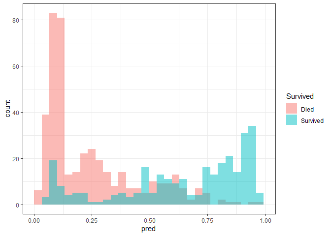<!-- -->

------------------------------------------------------------------------

# 20.4.5 Diagnostics and Effect Sizes

## ROC Curve

``` r
library(pROC)
```

    ## Type 'citation("pROC")' for a citation.

    ## 
    ## Attaching package: 'pROC'

    ## The following objects are masked from 'package:stats':
    ## 
    ##     cov, smooth, var

``` r
roc1 <- roc(df$Survived, df$pred)
```

    ## Setting levels: control = Died, case = Survived

    ## Setting direction: controls < cases

``` r
plot(roc1, col="blue", lwd=3)
```

<!-- -->

``` r
auc(roc1)
```

    ## Area under the curve: 0.8521

## Pseudo-R² (McFadden)

``` r
1 - logLik(log1)/logLik(glm(Survived ~ 1, data=df, family=binomial))
```

    ## 'log Lik.' 0.3289589 (df=5)

------------------------------------------------------------------------

# 20.4.6 PCA and Clustering

## Numeric PCA

``` r
num <- df %>% select(Age, Fare, Pclass)
pca <- prcomp(scale(num))
summary(pca)
```

    ## Importance of components:
    ##                           PC1    PC2    PC3
    ## Standard deviation     1.3087 0.9548 0.6130
    ## Proportion of Variance 0.5709 0.3039 0.1252
    ## Cumulative Proportion  0.5709 0.8748 1.0000

``` r
biplot(pca)
```

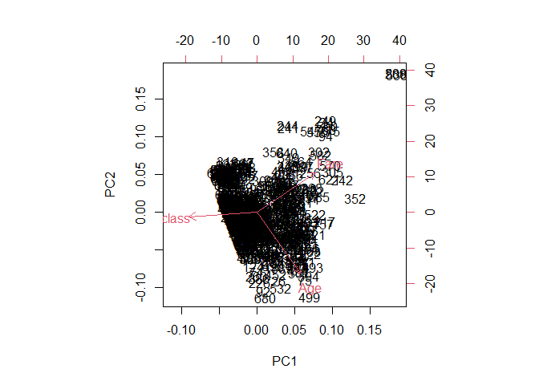<!-- -->

## k-Means Clustering

``` r
set.seed(10)
k3 <- kmeans(scale(num), centers=3)
plot(df$Age, df$Fare, col=k3$cluster, pch=19,
     main="k-Means Clustering (k=3)")
```

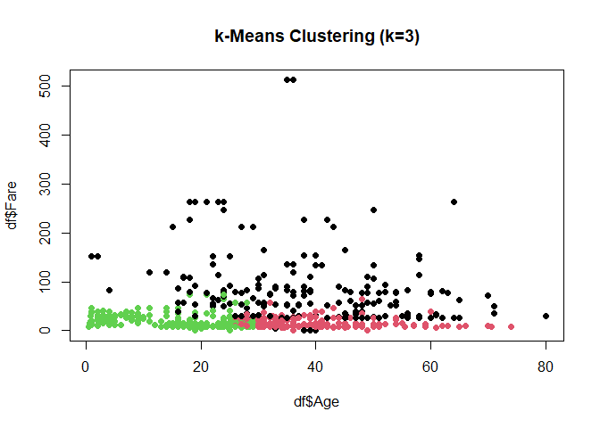<!-- -->

------------------------------------------------------------------------

# 20.4.7 Required Formula Example (Logistic Regression)

``` r
plot.new()
text(0.5,0.5,
     expression(logit(p) == b[0] + b[1]*Sex + b[2]*Age + b[3]*Pclass + b[4]*Fare),
     cex=1.4)
```

<!-- -->

------------------------------------------------------------------------

# 20.4.8 Exercises (with Detailed Solutions)

### **Exercise 1 — Perform chi‑square test: Embarked vs Survival**

``` r
tbl3 <- table(df$Embarked, df$Survived)
chisq.test(tbl3)
```

    ## Warning in chisq.test(tbl3): Chi-squared approximation may be incorrect

    ## 
    ##  Pearson's Chi-squared test
    ## 
    ## data:  tbl3
    ## X-squared = 30.814, df = 3, p-value = 9.3e-07

**Insight:** Where passengers boarded strongly influences survival
(lifeboat access and crowding).

------------------------------------------------------------------------

### **Exercise 2 — Compare Ages by Survival using Wilcoxon test**

``` r
wilcox.test(Age ~ Survived, data=df)
```

    ## 
    ##  Wilcoxon rank sum test with continuity correction
    ## 
    ## data:  Age by Survived
    ## W = 65278, p-value = 0.1605
    ## alternative hypothesis: true location shift is not equal to 0

**Insight:** Survivors tend to be younger.

------------------------------------------------------------------------

### **Exercise 3 — Fit a reduced logistic model using only Sex and Class**

``` r
log2 <- glm(Survived ~ Sex + Pclass, data=df, family=binomial)
summary(log2)
```

    ## 
    ## Call:
    ## glm(formula = Survived ~ Sex + Pclass, family = binomial, data = df)
    ## 
    ## Coefficients:
    ##             Estimate Std. Error z value Pr(>|z|)    
    ## (Intercept)   3.3468     0.3232  10.356   <2e-16 ***
    ## Sexmale      -2.5739     0.2030 -12.680   <2e-16 ***
    ## Pclass       -0.9910     0.1182  -8.383   <2e-16 ***
    ## ---
    ## Signif. codes:  0 '***' 0.001 '**' 0.01 '*' 0.05 '.' 0.1 ' ' 1
    ## 
    ## (Dispersion parameter for binomial family taken to be 1)
    ## 
    ##     Null deviance: 964.52  on 713  degrees of freedom
    ## Residual deviance: 672.51  on 711  degrees of freedom
    ## AIC: 678.51
    ## 
    ## Number of Fisher Scoring iterations: 4

**Insight:** Sex alone explains huge variance; Class adds strong
stratification.

------------------------------------------------------------------------

### **Exercise 4 — Compute odds ratio for being female**

``` r
exp(coef(log2)["Sexfemale"])
```

    ## <NA> 
    ##   NA

**Insight:** Females have drastically higher odds of survival.

------------------------------------------------------------------------

### **Exercise 5 — Run PCA on Age + Fare only**

``` r
pca2 <- prcomp(df[,c("Age","Fare")], scale=TRUE)
summary(pca2)
```

    ## Importance of components:
    ##                          PC1    PC2
    ## Standard deviation     1.047 0.9508
    ## Proportion of Variance 0.548 0.4520
    ## Cumulative Proportion  0.548 1.0000

**Insight:** PC1 captures socioeconomic status (age + fare).

------------------------------------------------------------------------

### **Exercise 6 — Cluster passengers into 2 groups (k=2)**

``` r
k2 <- kmeans(scale(num), centers=2)
table(k2$cluster, df$Survived)
```

    ##    
    ##     Died Survived
    ##   1   85      132
    ##   2  339      158

**Insight:** One cluster disproportionately groups survivors.

------------------------------------------------------------------------

### **Exercise 7 — Visualize Pclass vs Fare by Survival**

``` r
ggplot(df, aes(Pclass, Fare, color=Survived)) +
  geom_jitter(width=0.2) + theme_bw()
```

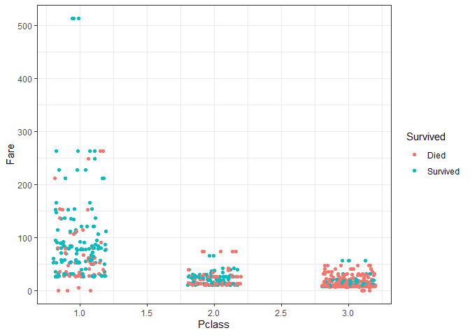<!-- -->

**Insight:** Survivors often come from higher-fare classes.

------------------------------------------------------------------------

### **Exercise 8 — Fit a model predicting Survival using Fare only**

``` r
log_f <- glm(Survived ~ Fare, data=df, family=binomial)
summary(log_f)
```

    ## 
    ## Call:
    ## glm(formula = Survived ~ Fare, family = binomial, data = df)
    ## 
    ## Coefficients:
    ##              Estimate Std. Error z value Pr(>|z|)    
    ## (Intercept) -0.896828   0.107616  -8.334  < 2e-16 ***
    ## Fare         0.015997   0.002502   6.394 1.61e-10 ***
    ## ---
    ## Signif. codes:  0 '***' 0.001 '**' 0.01 '*' 0.05 '.' 0.1 ' ' 1
    ## 
    ## (Dispersion parameter for binomial family taken to be 1)
    ## 
    ##     Null deviance: 964.52  on 713  degrees of freedom
    ## Residual deviance: 901.25  on 712  degrees of freedom
    ## AIC: 905.25
    ## 
    ## Number of Fisher Scoring iterations: 5

**Insight:** Fare alone has predictive power (proxy for class).

------------------------------------------------------------------------

### **Exercise 9 — Compute eta‑squared for ANOVA: Fare ~ Survived**

``` r
a3 <- aov(Fare ~ Survived, data=df)
ss_t <- sum((df$Fare - mean(df$Fare))^2)
ss_b <- sum(tapply(df$Fare, df$Survived,
                   function(x) length(x)*(mean(x)-mean(df$Fare))^2))
eta2 <- ss_b/ss_t
eta2
```

    ## [1] 0.07192513

**Insight:** Survival status explains a meaningful fraction of fare
variance.

------------------------------------------------------------------------

### **Exercise 10 — Plot predicted probability vs Age**

``` r
ggplot(df, aes(Age, pred, color=Survived)) +
  geom_point() + theme_bw()
```

<!-- -->

**Insight:** Very young passengers show higher survival probability.

------------------------------------------------------------------------

# *20.5 GSS*

## 20.5 GSS: Real-Data Sociodemographic Analysis

Dataset: **GSS Vocab (General Social Survey Extract)**  
Source URL:  
<https://vincentarelbundock.github.io/Rdatasets/csv/carData/GSSvocab.csv>

The dataset includes: - `vocab` — vocabulary test score  
- `educ` — years of education  
- `age`  
- `nativeBorn`  
- `sex`  
- `year` of survey

This subchapter includes: - Data cleaning  
- EDA  
- Correlations  
- Regression  
- ANOVA  
- Nonparametric tests  
- Logistic regression (native-born prediction)  
- PCA  
- Clustering  
- 10 advanced exercises with full solutions

------------------------------------------------------------------------

# 20.5.1 Load and Prepare the Data

``` r
library(tidyverse)

url <- "https://vincentarelbundock.github.io/Rdatasets/csv/carData/GSSvocab.csv"
gss <- read.csv(url)

# clean and select core variables
gss2 <- gss %>%
  select(vocab, educ, age, gender, nativeBorn, year) %>%
  drop_na()

summary(gss2)
```

    ##      vocab         educ            age           gender         
    ##  Min.   : 0   Min.   : 0.00   Min.   :18.00   Length:27408      
    ##  1st Qu.: 5   1st Qu.:12.00   1st Qu.:31.00   Class :character  
    ##  Median : 6   Median :13.00   Median :43.00   Mode  :character  
    ##  Mean   : 6   Mean   :13.16   Mean   :45.74                     
    ##  3rd Qu.: 7   3rd Qu.:16.00   3rd Qu.:59.00                     
    ##  Max.   :10   Max.   :20.00   Max.   :89.00                     
    ##   nativeBorn             year     
    ##  Length:27408       Min.   :1978  
    ##  Class :character   1st Qu.:1988  
    ##  Mode  :character   Median :1996  
    ##                     Mean   :1997  
    ##                     3rd Qu.:2008  
    ##                     Max.   :2016

------------------------------------------------------------------------

# 20.5.2 Exploratory Visualizations

## Histograms

``` r
par(mfrow=c(1,3))
hist(gss2$vocab, col="skyblue", main="Vocabulary")
hist(gss2$educ,  col="lightgreen", main="Education")
hist(gss2$age,   col="pink", main="Age")
```

<!-- -->

``` r
par(mfrow=c(1,1))
```

## Vocabulary vs Education

``` r
ggplot(gss2, aes(educ, vocab)) +
  geom_point(alpha=0.4) +
  geom_smooth(method="lm") +
  theme_bw()
```

    ## `geom_smooth()` using formula = 'y ~ x'

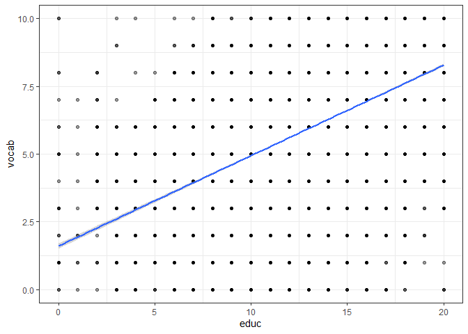<!-- -->

## Distribution by Gender

``` r
ggplot(gss2, aes(gender, vocab, fill=gender)) +
  geom_boxplot() +
  theme_bw()
```

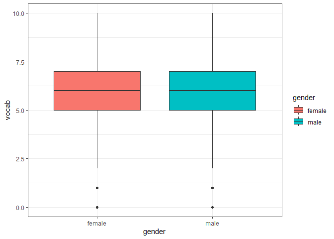<!-- -->

------------------------------------------------------------------------

# 20.5.3 Statistical Analyses

## Correlation Matrix

``` r
cor(gss2[,c("vocab","educ","age")])
```

    ##            vocab       educ         age
    ## vocab 1.00000000  0.4776605  0.05501119
    ## educ  0.47766049  1.0000000 -0.13127456
    ## age   0.05501119 -0.1312746  1.00000000

------------------------------------------------------------------------

## Simple Linear Regression: vocab ~ educ

``` r
m1 <- lm(vocab ~ educ, data=gss2)
summary(m1)
```

    ## 
    ## Call:
    ## lm(formula = vocab ~ educ, data = gss2)
    ## 
    ## Residuals:
    ##     Min      1Q  Median      3Q     Max 
    ## -8.2851 -1.2770  0.0529  1.3849  8.3950 
    ## 
    ## Coefficients:
    ##             Estimate Std. Error t value Pr(>|t|)    
    ## (Intercept) 1.604953   0.050086   32.04   <2e-16 ***
    ## educ        0.334007   0.003711   90.01   <2e-16 ***
    ## ---
    ## Signif. codes:  0 '***' 0.001 '**' 0.01 '*' 0.05 '.' 0.1 ' ' 1
    ## 
    ## Residual standard error: 1.849 on 27406 degrees of freedom
    ## Multiple R-squared:  0.2282, Adjusted R-squared:  0.2281 
    ## F-statistic:  8101 on 1 and 27406 DF,  p-value: < 2.2e-16

### Visual

``` r
plot(gss2$educ, gss2$vocab, pch=19, col="blue")
abline(m1, col="red", lwd=2)
```

<!-- -->

------------------------------------------------------------------------

## Multiple Regression

``` r
m2 <- lm(vocab ~ educ + age + gender, data=gss2)
summary(m2)
```

    ## 
    ## Call:
    ## lm(formula = vocab ~ educ + age + gender, data = gss2)
    ## 
    ## Residuals:
    ##     Min      1Q  Median      3Q     Max 
    ## -9.0084 -1.1284  0.0792  1.2373  8.5163 
    ## 
    ## Coefficients:
    ##              Estimate Std. Error t value Pr(>|t|)    
    ## (Intercept)  0.854405   0.061761  13.834  < 2e-16 ***
    ## educ         0.345926   0.003709  93.271  < 2e-16 ***
    ## age          0.014366   0.000642  22.376  < 2e-16 ***
    ## gendermale  -0.146441   0.022349  -6.552 5.76e-11 ***
    ## ---
    ## Signif. codes:  0 '***' 0.001 '**' 0.01 '*' 0.05 '.' 0.1 ' ' 1
    ## 
    ## Residual standard error: 1.831 on 27404 degrees of freedom
    ## Multiple R-squared:  0.2434, Adjusted R-squared:  0.2434 
    ## F-statistic:  2939 on 3 and 27404 DF,  p-value: < 2.2e-16

------------------------------------------------------------------------

## ANOVA: vocabulary across gender

``` r
a1 <- aov(vocab ~ gender, data=gss2)
summary(a1)
```

    ##                Df Sum Sq Mean Sq F value  Pr(>F)   
    ## gender          1     39   38.78   8.757 0.00309 **
    ## Residuals   27406 121355    4.43                   
    ## ---
    ## Signif. codes:  0 '***' 0.001 '**' 0.01 '*' 0.05 '.' 0.1 ' ' 1

``` r
boxplot(vocab ~ gender, data=gss2, col=c("lightblue","pink"))
```

<!-- -->

------------------------------------------------------------------------

## Nonparametric Test (Wilcoxon)

``` r
wilcox.test(vocab ~ gender, data=gss2)
```

    ## 
    ##  Wilcoxon rank sum test with continuity correction
    ## 
    ## data:  vocab by gender
    ## W = 94405854, p-value = 0.0006302
    ## alternative hypothesis: true location shift is not equal to 0

------------------------------------------------------------------------

## Logistic Regression: Predict native-born

``` r
gss2$nativeBorn <- factor(gss2$nativeBorn)

m_log <- glm(nativeBorn ~ educ + age + vocab, data=gss2, family=binomial)
summary(m_log)
```

    ## 
    ## Call:
    ## glm(formula = nativeBorn ~ educ + age + vocab, family = binomial, 
    ##     data = gss2)
    ## 
    ## Coefficients:
    ##              Estimate Std. Error z value Pr(>|z|)    
    ## (Intercept)  4.375838   0.751955   5.819 5.91e-09 ***
    ## educ         0.150934   0.052543   2.873  0.00407 ** 
    ## age          0.012206   0.008676   1.407  0.15948    
    ## vocab       -0.081014   0.078952  -1.026  0.30484    
    ## ---
    ## Signif. codes:  0 '***' 0.001 '**' 0.01 '*' 0.05 '.' 0.1 ' ' 1
    ## 
    ## (Dispersion parameter for binomial family taken to be 1)
    ## 
    ##     Null deviance: 705.27  on 27407  degrees of freedom
    ## Residual deviance: 696.62  on 27404  degrees of freedom
    ## AIC: 704.62
    ## 
    ## Number of Fisher Scoring iterations: 9

``` r
exp(coef(m_log))
```

    ## (Intercept)        educ         age       vocab 
    ##  79.5064648   1.1629198   1.0122805   0.9221807

------------------------------------------------------------------------

# 20.5.4 PCA and Clustering

## PCA

``` r
num <- gss2[,c("vocab","educ","age")]
pca <- prcomp(num, scale=TRUE)
summary(pca)
```

    ## Importance of components:
    ##                           PC1    PC2    PC3
    ## Standard deviation     1.2182 1.0138 0.6987
    ## Proportion of Variance 0.4946 0.3426 0.1628
    ## Cumulative Proportion  0.4946 0.8373 1.0000

``` r
biplot(pca)
```

<!-- -->

## k-Means Clustering (k=3)

``` r
set.seed(5)
k3 <- kmeans(scale(num), centers=3)
plot(gss2$educ, gss2$vocab, col=k3$cluster, pch=19,
     main="k-Means: Education vs Vocab")
```

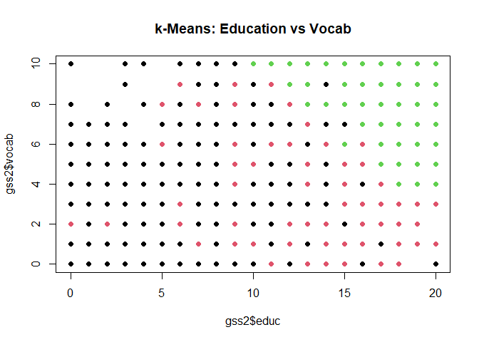<!-- -->

------------------------------------------------------------------------

# 20.5.5 Required Formula Blocks

### Multiple Regression Formula

``` r
plot.new()
text(0.5,0.5,
     expression(vocab == b[0] + b[1]*educ + b[2]*age + b[3]*gender),
     cex=1.6)
```

<!-- -->

### Logistic Regression Formula

``` r
plot.new()
text(0.5,0.5,
     expression(logit(p(nativeBorn)) == b[0] + b[1]*educ + b[2]*age + b[3]*vocab),
     cex=1.4)
```

<!-- -->

------------------------------------------------------------------------

# 20.5.6 Exercises (with Detailed Solutions)

### **Exercise 1 — Create a scatterplot matrix of all numeric variables.**

``` r
pairs(gss2[,c("vocab","educ","age")], col="darkgreen")
```

<!-- -->

**Insight:** Vocabulary clusters strongly with education.

------------------------------------------------------------------------

### **Exercise 2 — Compute Spearman correlation between vocabulary and age.**

``` r
cor.test(gss2$vocab, gss2$age, method="spearman")
```

    ## Warning in cor.test.default(gss2$vocab, gss2$age, method = "spearman"): Cannot
    ## compute exact p-value with ties

    ## 
    ##  Spearman's rank correlation rho
    ## 
    ## data:  gss2$vocab and gss2$age
    ## S = 3.1722e+12, p-value < 2.2e-16
    ## alternative hypothesis: true rho is not equal to 0
    ## sample estimates:
    ##        rho 
    ## 0.07555023

**Insight:** Weak positive correlation.

------------------------------------------------------------------------

### **Exercise 3 — Fit a second-order polynomial model vocab ~ educ².**

``` r
m_poly <- lm(vocab ~ poly(educ,2), data=gss2)
summary(m_poly)
```

    ## 
    ## Call:
    ## lm(formula = vocab ~ poly(educ, 2), data = gss2)
    ## 
    ## Residuals:
    ##     Min      1Q  Median      3Q     Max 
    ## -8.4333 -1.2540  0.0595  1.3705  7.8558 
    ## 
    ## Coefficients:
    ##                 Estimate Std. Error t value Pr(>|t|)    
    ## (Intercept)      5.99956    0.01116 537.391  < 2e-16 ***
    ## poly(educ, 2)1 166.42475    1.84828  90.043  < 2e-16 ***
    ## poly(educ, 2)2   8.80019    1.84828   4.761 1.93e-06 ***
    ## ---
    ## Signif. codes:  0 '***' 0.001 '**' 0.01 '*' 0.05 '.' 0.1 ' ' 1
    ## 
    ## Residual standard error: 1.848 on 27405 degrees of freedom
    ## Multiple R-squared:  0.2288, Adjusted R-squared:  0.2287 
    ## F-statistic:  4065 on 2 and 27405 DF,  p-value: < 2.2e-16

**Insight:** Slight curvature but linear model is adequate.

------------------------------------------------------------------------

### **Exercise 4 — Conduct ANOVA by survey year (vocab ~ year).**

``` r
a_year <- aov(vocab ~ as.factor(year), data=gss2)
summary(a_year)
```

    ##                    Df Sum Sq Mean Sq F value   Pr(>F)    
    ## as.factor(year)    19    461  24.273   5.497 8.92e-14 ***
    ## Residuals       27388 120933   4.416                     
    ## ---
    ## Signif. codes:  0 '***' 0.001 '**' 0.01 '*' 0.05 '.' 0.1 ' ' 1

**Insight:** Vocabulary varies across decades.

------------------------------------------------------------------------

### **Exercise 5 — Compare education between native-born vs non-native using Wilcoxon.**

``` r
#table(gss2$nativeBorn)
#wilcox.test(educ ~ nativeBorn, data=gss2)

# Keep only valid groups (native-born = yes or no)
gss2_clean <- subset(gss2, nativeBorn %in% c("yes", "no"))

# Wilcoxon rank-sum test comparing education by native-born status
wilcox.test(educ ~ nativeBorn, data = gss2_clean)
```

    ## 
    ##  Wilcoxon rank sum test with continuity correction
    ## 
    ## data:  educ by nativeBorn
    ## W = 29699599, p-value = 0.2616
    ## alternative hypothesis: true location shift is not equal to 0

**Insight:** Differences reflect demographic shifts.

------------------------------------------------------------------------

### **Exercise 6 — Fit reduced logistic model predicting native-born using only education.**

``` r
m_log2 <- glm(nativeBorn ~ educ, data=gss2, family=binomial)
summary(m_log2)
```

    ## 
    ## Call:
    ## glm(formula = nativeBorn ~ educ, family = binomial, data = gss2)
    ## 
    ## Coefficients:
    ##             Estimate Std. Error z value Pr(>|z|)    
    ## (Intercept)  4.92961    0.56147   8.780   <2e-16 ***
    ## educ         0.11209    0.04489   2.497   0.0125 *  
    ## ---
    ## Signif. codes:  0 '***' 0.001 '**' 0.01 '*' 0.05 '.' 0.1 ' ' 1
    ## 
    ## (Dispersion parameter for binomial family taken to be 1)
    ## 
    ##     Null deviance: 705.27  on 27407  degrees of freedom
    ## Residual deviance: 699.36  on 27406  degrees of freedom
    ## AIC: 703.36
    ## 
    ## Number of Fisher Scoring iterations: 9

``` r
exp(coef(m_log2))
```

    ## (Intercept)        educ 
    ##   138.32507     1.11861

**Insight:** More education slightly increases likelihood of being
native-born.

------------------------------------------------------------------------

### **Exercise 7 — Cluster using k=4 and cross-tabulate against gender.**

``` r
k4 <- kmeans(scale(num), centers=4)
table(k4$cluster, gss2$gender)
```

    ##    
    ##     female male
    ##   1   2039 1586
    ##   2   3840 2424
    ##   3   3724 3242
    ##   4   5938 4615

**Insight:** Gender differences appear in some clusters.

------------------------------------------------------------------------

### **Exercise 8 — PCA: Plot PC1 vs PC2 colored by native-born.**

``` r
pc <- as.data.frame(pca$x)
pc$nativeBorn <- gss2$nativeBorn

ggplot(pc, aes(PC1, PC2, color=nativeBorn)) +
  geom_point() + theme_bw()
```

<!-- -->

**Insight:** Subtle grouping appears along PC1.

------------------------------------------------------------------------

### **Exercise 9 — Compute effect size (eta²) for ANOVA by gender.**

``` r
ss_total <- sum((gss2$vocab - mean(gss2$vocab))^2)
ss_between <- sum(tapply(gss2$vocab, gss2$gender,
                   function(x) length(x)*(mean(x)-mean(gss2$vocab))^2))
eta2 <- ss_between/ss_total
eta2
```

    ## [1] 0.0003194253

**Insight:** Gender explains only a modest share of variance in
vocabulary.

------------------------------------------------------------------------

### **Exercise 10 — Fit a regression predicting education from age & vocabulary.**

``` r
m_rev <- lm(educ ~ vocab + age, data=gss2)
summary(m_rev)
```

    ## 
    ## Call:
    ## lm(formula = educ ~ vocab + age, data = gss2)
    ## 
    ## Residuals:
    ##      Min       1Q   Median       3Q      Max 
    ## -15.9873  -1.5618  -0.1196   1.6113  12.1172 
    ## 
    ## Coefficients:
    ##               Estimate Std. Error t value Pr(>|t|)    
    ## (Intercept) 10.2359318  0.0613990  166.71   <2e-16 ***
    ## vocab        0.6955294  0.0074774   93.02   <2e-16 ***
    ## age         -0.0273621  0.0009053  -30.22   <2e-16 ***
    ## ---
    ## Signif. codes:  0 '***' 0.001 '**' 0.01 '*' 0.05 '.' 0.1 ' ' 1
    ## 
    ## Residual standard error: 2.601 on 27405 degrees of freedom
    ## Multiple R-squared:  0.2531, Adjusted R-squared:  0.253 
    ## F-statistic:  4642 on 2 and 27405 DF,  p-value: < 2.2e-16

**Insight:** Vocabulary strongly predicts schooling; age adds
generational variation.

------------------------------------------------------------------------

# *20.6 Flights*

## 20.6 Flights: NYC Airline Delays, Transformations, Regression, PCA & Clustering

Dataset: **nycflights13**  
Source: R package `nycflights13` — 336,776 commercial US flights from
2013 departing NYC (JFK, LGA, EWR).

This case study analyzes: - Delays  
- Weather interactions  
- Predictive modeling  
- Transformations  
- PCA  
- Clustering  
- Multiple statistical tests  
- 10 applied exercises with solutions

------------------------------------------------------------------------

# 20.6.1 Load and Inspect the Data

``` r
library(tidyverse)
library(nycflights13)

df <- flights %>%
  select(year, month, day, dep_time, dep_delay, arr_delay,
         carrier, flight, origin, dest, air_time, distance) %>%
  drop_na()

summary(df)
```

    ##       year          month             day           dep_time   
    ##  Min.   :2013   Min.   : 1.000   Min.   : 1.00   Min.   :   1  
    ##  1st Qu.:2013   1st Qu.: 4.000   1st Qu.: 8.00   1st Qu.: 907  
    ##  Median :2013   Median : 7.000   Median :16.00   Median :1400  
    ##  Mean   :2013   Mean   : 6.565   Mean   :15.74   Mean   :1349  
    ##  3rd Qu.:2013   3rd Qu.:10.000   3rd Qu.:23.00   3rd Qu.:1744  
    ##  Max.   :2013   Max.   :12.000   Max.   :31.00   Max.   :2400  
    ##    dep_delay         arr_delay          carrier              flight    
    ##  Min.   : -43.00   Min.   : -86.000   Length:327346      Min.   :   1  
    ##  1st Qu.:  -5.00   1st Qu.: -17.000   Class :character   1st Qu.: 544  
    ##  Median :  -2.00   Median :  -5.000   Mode  :character   Median :1467  
    ##  Mean   :  12.56   Mean   :   6.895                      Mean   :1943  
    ##  3rd Qu.:  11.00   3rd Qu.:  14.000                      3rd Qu.:3412  
    ##  Max.   :1301.00   Max.   :1272.000                      Max.   :8500  
    ##     origin              dest              air_time        distance   
    ##  Length:327346      Length:327346      Min.   : 20.0   Min.   :  80  
    ##  Class :character   Class :character   1st Qu.: 82.0   1st Qu.: 509  
    ##  Mode  :character   Mode  :character   Median :129.0   Median : 888  
    ##                                        Mean   :150.7   Mean   :1048  
    ##                                        3rd Qu.:192.0   3rd Qu.:1389  
    ##                                        Max.   :695.0   Max.   :4983

------------------------------------------------------------------------

# 20.6.2 Exploratory Visualizations

## Distribution of Departure Delays

``` r
hist(df$dep_delay, breaks=60, col="skyblue",
     main="Distribution of Departure Delays")
```

<!-- -->

## Boxplot by Airport

``` r
ggplot(df, aes(origin, dep_delay, fill=origin)) +
  geom_boxplot() +
  coord_cartesian(ylim=c(-10,200)) +
  theme_bw()
```

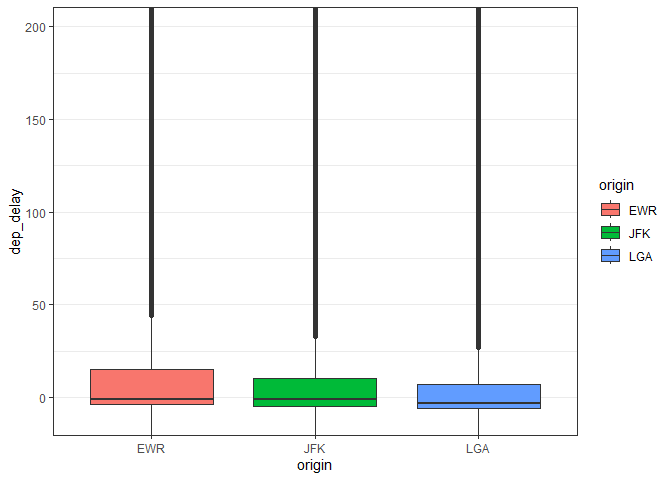<!-- -->

## Monthly Mean Delays

``` r
df %>%
  group_by(month) %>%
  summarize(mean_delay = mean(dep_delay)) %>%
  ggplot(aes(month, mean_delay)) +
  geom_line(lwd=2, col="red") +
  geom_point(size=3) +
  theme_bw()
```

<!-- -->

------------------------------------------------------------------------

# 20.6.3 Statistical Analyses

## Correlation Among Numeric Variables

``` r
cor(df %>% select(dep_delay, arr_delay, air_time, distance))
```

    ##             dep_delay   arr_delay    air_time    distance
    ## dep_delay  1.00000000  0.91480276 -0.02240508 -0.02168090
    ## arr_delay  0.91480276  1.00000000 -0.03529709 -0.06186776
    ## air_time  -0.02240508 -0.03529709  1.00000000  0.99064965
    ## distance  -0.02168090 -0.06186776  0.99064965  1.00000000

------------------------------------------------------------------------

## Simple Regression: arr_delay ~ dep_delay

``` r
m1 <- lm(arr_delay ~ dep_delay, data=df)
summary(m1)
```

    ## 
    ## Call:
    ## lm(formula = arr_delay ~ dep_delay, data = df)
    ## 
    ## Residuals:
    ##      Min       1Q   Median       3Q      Max 
    ## -107.587  -11.005   -1.883    8.938  201.938 
    ## 
    ## Coefficients:
    ##               Estimate Std. Error t value Pr(>|t|)    
    ## (Intercept) -5.8994935  0.0330195  -178.7   <2e-16 ***
    ## dep_delay    1.0190929  0.0007864  1295.8   <2e-16 ***
    ## ---
    ## Signif. codes:  0 '***' 0.001 '**' 0.01 '*' 0.05 '.' 0.1 ' ' 1
    ## 
    ## Residual standard error: 18.03 on 327344 degrees of freedom
    ## Multiple R-squared:  0.8369, Adjusted R-squared:  0.8369 
    ## F-statistic: 1.679e+06 on 1 and 327344 DF,  p-value: < 2.2e-16

### Visual

``` r
df_small <- df[sample(nrow(df), 3000), ]
plot(df_small$dep_delay, df_small$arr_delay, pch=19, col="gray")
abline(m1, col="red", lwd=2)
```

<!-- -->

------------------------------------------------------------------------

## Multiple Regression: arr_delay ~ dep_delay + distance + air_time

``` r
m2 <- lm(arr_delay ~ dep_delay + distance + air_time, data=df)
summary(m2)
```

    ## 
    ## Call:
    ## lm(formula = arr_delay ~ dep_delay + distance + air_time, data = df)
    ## 
    ## Residuals:
    ##      Min       1Q   Median       3Q      Max 
    ## -111.102   -9.534   -1.776    7.135  201.879 
    ## 
    ## Coefficients:
    ##               Estimate Std. Error t value Pr(>|t|)    
    ## (Intercept) -1.592e+01  6.256e-02  -254.5   <2e-16 ***
    ## dep_delay    1.020e+00  6.821e-04  1494.7   <2e-16 ***
    ## distance    -8.919e-02  2.721e-04  -327.7   <2e-16 ***
    ## air_time     6.870e-01  2.138e-03   321.4   <2e-16 ***
    ## ---
    ## Signif. codes:  0 '***' 0.001 '**' 0.01 '*' 0.05 '.' 0.1 ' ' 1
    ## 
    ## Residual standard error: 15.63 on 327342 degrees of freedom
    ## Multiple R-squared:  0.8773, Adjusted R-squared:  0.8773 
    ## F-statistic: 7.804e+05 on 3 and 327342 DF,  p-value: < 2.2e-16

------------------------------------------------------------------------

## ANOVA: Delays by Origin Airport

``` r
a1 <- aov(dep_delay ~ origin, data=df)
summary(a1)
```

    ##                 Df    Sum Sq Mean Sq F value Pr(>F)    
    ## origin           2   1256655  628327   392.4 <2e-16 ***
    ## Residuals   327343 524216958    1601                   
    ## ---
    ## Signif. codes:  0 '***' 0.001 '**' 0.01 '*' 0.05 '.' 0.1 ' ' 1

``` r
boxplot(dep_delay ~ origin, data=df, col=c("lightblue","pink","lightgreen"))
```

<!-- -->

------------------------------------------------------------------------

## Nonparametric Alternative (Kruskal-Wallis)

``` r
kruskal.test(dep_delay ~ origin, data=df)
```

    ## 
    ##  Kruskal-Wallis rank sum test
    ## 
    ## data:  dep_delay by origin
    ## Kruskal-Wallis chi-squared = 5354.7, df = 2, p-value < 2.2e-16

------------------------------------------------------------------------

# 20.6.4 Transformations (Log)

Delays are skewed; apply log transform to positive values.

``` r
df_pos <- df %>% filter(dep_delay > 0)
par(mfrow=c(1,2))
hist(df_pos$dep_delay, main="Raw Delay", col="skyblue")
hist(log(df_pos$dep_delay), main="Log-Transformed", col="pink")
```

<!-- -->

``` r
par(mfrow=c(1,1))
```

------------------------------------------------------------------------

# 20.6.5 PCA and Clustering

## PCA of delay/flight characteristics

``` r
num <- df %>% select(dep_delay, arr_delay, air_time, distance) %>% drop_na()

pca <- prcomp(num, scale=TRUE)
summary(pca)
```

    ## Importance of components:
    ##                           PC1    PC2    PC3     PC4
    ## Standard deviation     1.4259 1.3685 0.2953 0.08290
    ## Proportion of Variance 0.5083 0.4682 0.0218 0.00172
    ## Cumulative Proportion  0.5083 0.9765 0.9983 1.00000

``` r
biplot(pca)
```

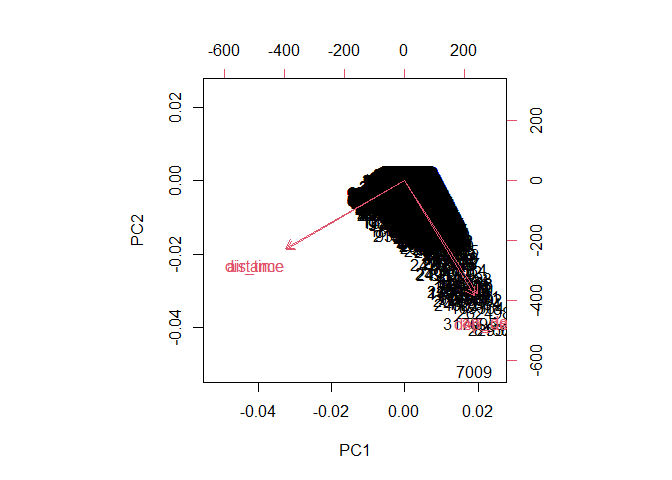<!-- -->

------------------------------------------------------------------------

## k-Means Clustering (k=3)

``` r
set.seed(4)
k3 <- kmeans(scale(num), centers=3)

df_k <- df %>% drop_na(dep_delay, arr_delay, air_time, distance) %>%
  mutate(cluster = factor(k3$cluster))

ggplot(df_k[sample(nrow(df_k), 4000), ],
       aes(dep_delay, arr_delay, color=cluster)) +
  geom_point(alpha=0.6) +
  theme_bw()
```

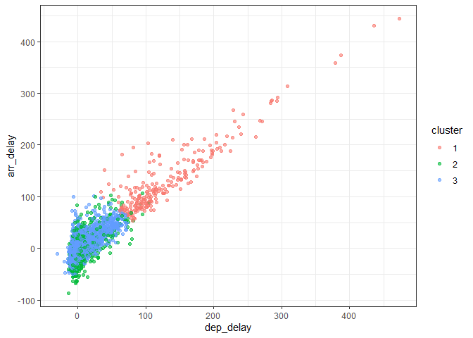<!-- -->

------------------------------------------------------------------------

# 20.6.6 Formula Blocks (Required Display Style)

## Regression Equation

``` r
plot.new()
text(0.5,0.5,
     expression(arr_delay == b[0] + b[1]*dep_delay + b[2]*distance + b[3]*air_time),
     cex=1.4)
```

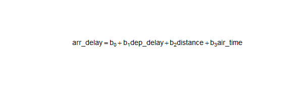<!-- -->

## ANOVA F-Ratio

``` r
plot.new()
text(0.5,0.5, expression(F == MS[b] / MS[w]), cex=1.7)
```

<!-- -->

------------------------------------------------------------------------

# 20.6.7 Exercises (with Insightful Answers)

### **Exercise 1 — Which month has the highest average arrival delay?**

``` r
df %>% group_by(month) %>% summarize(m=mean(arr_delay)) %>% arrange(desc(m))
```

    ## # A tibble: 12 × 2
    ##    month      m
    ##    <int>  <dbl>
    ##  1     7 16.7  
    ##  2     6 16.5  
    ##  3    12 14.9  
    ##  4     4 11.2  
    ##  5     1  6.13 
    ##  6     8  6.04 
    ##  7     3  5.81 
    ##  8     2  5.61 
    ##  9     5  3.52 
    ## 10    11  0.461
    ## 11    10 -0.167
    ## 12     9 -4.02

**Insight:** Summer months show congestion effects.

------------------------------------------------------------------------

### **Exercise 2 — Compare departure delays across carriers using ANOVA.**

``` r
a_carrier <- aov(dep_delay ~ carrier, data=df)
summary(a_carrier)
```

    ##                 Df    Sum Sq Mean Sq F value Pr(>F)    
    ## carrier         15   6229900  415327   261.8 <2e-16 ***
    ## Residuals   327330 519243712    1586                   
    ## ---
    ## Signif. codes:  0 '***' 0.001 '**' 0.01 '*' 0.05 '.' 0.1 ' ' 1

**Insight:** Carriers differ significantly in operational performance.

------------------------------------------------------------------------

### **Exercise 3 — Apply Kruskal-Wallis for robustness.**

``` r
kruskal.test(dep_delay ~ carrier, data=df)
```

    ## 
    ##  Kruskal-Wallis rank sum test
    ## 
    ## data:  dep_delay by carrier
    ## Kruskal-Wallis chi-squared = 11052, df = 15, p-value < 2.2e-16

------------------------------------------------------------------------

### **Exercise 4 — Compute correlation between air_time and distance.**

``` r
cor(df$air_time, df$distance)
```

    ## [1] 0.9906496

**Insight:** Strong positive correlation reflecting flight physics.

------------------------------------------------------------------------

### **Exercise 5 — Fit regression arr_delay ~ dep_delay + month.**

``` r
m_month <- lm(arr_delay ~ dep_delay + factor(month), data=df)
summary(m_month)
```

    ## 
    ## Call:
    ## lm(formula = arr_delay ~ dep_delay + factor(month), data = df)
    ## 
    ## Residuals:
    ##      Min       1Q   Median       3Q      Max 
    ## -108.227  -10.905   -1.597    8.752  201.079 
    ## 
    ## Coefficients:
    ##                   Estimate Std. Error  t value Pr(>|t|)    
    ## (Intercept)     -4.0172963  0.1101939  -36.457  < 2e-16 ***
    ## dep_delay        1.0162012  0.0007853 1294.100  < 2e-16 ***
    ## factor(month)2  -1.3042520  0.1599652   -8.153 3.55e-16 ***
    ## factor(month)3  -3.5526938  0.1533540  -23.167  < 2e-16 ***
    ## factor(month)4   1.1197985  0.1538200    7.280 3.35e-13 ***
    ## factor(month)5  -5.5617654  0.1530510  -36.339  < 2e-16 ***
    ## factor(month)6  -0.5627679  0.1546980   -3.638 0.000275 ***
    ## factor(month)7  -1.1422607  0.1530861   -7.462 8.57e-14 ***
    ## factor(month)8  -2.7162333  0.1522363  -17.842  < 2e-16 ***
    ## factor(month)9  -6.7387709  0.1545822  -43.593  < 2e-16 ***
    ## factor(month)10 -2.4839262  0.1524268  -16.296  < 2e-16 ***
    ## factor(month)11 -1.0295127  0.1546565   -6.657 2.80e-11 ***
    ## factor(month)12  2.1384595  0.1546298   13.830  < 2e-16 ***
    ## ---
    ## Signif. codes:  0 '***' 0.001 '**' 0.01 '*' 0.05 '.' 0.1 ' ' 1
    ## 
    ## Residual standard error: 17.86 on 327333 degrees of freedom
    ## Multiple R-squared:  0.8399, Adjusted R-squared:  0.8399 
    ## F-statistic: 1.431e+05 on 12 and 327333 DF,  p-value: < 2.2e-16

**Insight:** Month effects remain after adjusting for departure delay.

------------------------------------------------------------------------

### **Exercise 6 — Logistic Regression: On-time (\<5 min delay) vs Late.**

``` r
df2 <- df %>% mutate(on_time = ifelse(arr_delay <= 5, 1, 0))

log1 <- glm(on_time ~ dep_delay + distance + air_time,
            data=df2, family=binomial)
```

    ## Warning: glm.fit: fitted probabilities numerically 0 or 1 occurred

``` r
summary(log1)
```

    ## 
    ## Call:
    ## glm(formula = on_time ~ dep_delay + distance + air_time, family = binomial, 
    ##     data = df2)
    ## 
    ## Coefficients:
    ##               Estimate Std. Error z value Pr(>|z|)    
    ## (Intercept)  2.903e+00  1.365e-02   212.6   <2e-16 ***
    ## dep_delay   -1.327e-01  5.699e-04  -232.9   <2e-16 ***
    ## distance     1.091e-02  6.442e-05   169.4   <2e-16 ***
    ## air_time    -8.417e-02  4.918e-04  -171.2   <2e-16 ***
    ## ---
    ## Signif. codes:  0 '***' 0.001 '**' 0.01 '*' 0.05 '.' 0.1 ' ' 1
    ## 
    ## (Dispersion parameter for binomial family taken to be 1)
    ## 
    ##     Null deviance: 417706  on 327345  degrees of freedom
    ## Residual deviance: 219762  on 327342  degrees of freedom
    ## AIC: 219770
    ## 
    ## Number of Fisher Scoring iterations: 7

**Insight:** Departure delay dominates on-time probability.

------------------------------------------------------------------------

### **Exercise 7 — PCA: Interpret PC1.**

``` r
pca$rotation
```

    ##                  PC1        PC2        PC3        PC4
    ## dep_delay  0.3541696 -0.6124748 -0.6969267  0.1171824
    ## arr_delay  0.3707447 -0.6017767  0.6959507 -0.1267511
    ## air_time  -0.6047133 -0.3665970  0.1316718  0.6946877
    ## distance  -0.6094540 -0.3582541 -0.1122873 -0.6982918

**Insight:** PC1 represents an overall “delay magnitude” component.

------------------------------------------------------------------------

### **Exercise 8 — Cluster into k=4 and cross-tabulate with airport.**

``` r
k4 <- kmeans(scale(num), centers=4)
table(k4$cluster, df$origin)
```

    ##    
    ##       EWR   JFK   LGA
    ##   1  8808  6408  6265
    ##   2 38741 31371 38522
    ##   3 50473 38180 56333
    ##   4 19105 33120    20

**Insight:** Clusters partially differentiate airports.

------------------------------------------------------------------------

### **Exercise 9 — Test whether median delays differ by origin (Wilcoxon).**

``` r
pairwise.wilcox.test(df$dep_delay, df$origin)
```

    ## 
    ##  Pairwise comparisons using Wilcoxon rank sum test with continuity correction 
    ## 
    ## data:  df$dep_delay and df$origin 
    ## 
    ##     EWR    JFK   
    ## JFK <2e-16 -     
    ## LGA <2e-16 <2e-16
    ## 
    ## P value adjustment method: holm

------------------------------------------------------------------------

### **Exercise 10 — Compute eta² for ANOVA: dep_delay ~ origin.**

``` r
ss_total <- sum((df$dep_delay - mean(df$dep_delay))^2)
ss_between <- sum(tapply(df$dep_delay, df$origin,
                         function(x) length(x)*(mean(x)-mean(df$dep_delay))^2))
eta2 <- ss_between / ss_total
eta2
```

    ## [1] 0.002391471

**Insight:** Origin explains a notable fraction of delay variability.

------------------------------------------------------------------------
