# Chapter 1: Introduction

## What Are Statistics

Statistics is the science of **collecting, organizing, analyzing, and
interpreting data**.  
It helps us make sense of information and draw conclusions in the
presence of uncertainty.

- **Plain Language:** Statistics is about turning numbers into
  knowledge.
- **Real-World Example:** Businesses use statistics to understand
  customers; doctors use it to evaluate treatments.

------------------------------------------------------------------------

## Importance of Statistics

Statistics is everywhere:

- In **healthcare**, to test new drugs.
- In **sports**, to analyze performance.
- In **business**, to forecast sales.

**Why learn statistics?**

- To **interpret data critically**
- To **avoid misleading conclusions**
- To **make informed decisions**

------------------------------------------------------------------------

## Descriptive Statistics

Descriptive statistics summarize data using:

- Measures of **central tendency** (mean, median, mode)
- Measures of **variability** (range, variance, SD)
- **Graphs** (histograms, boxplots)

### Example in R

``` r
# Simulate a small dataset
set.seed(123)
data <- c(5, 7, 8, 6, 9, 10)

# Compute descriptive statistics
mean(data)      # Average
```

    ## [1] 7.5

``` r
median(data)    # Middle value
```

    ## [1] 7.5

``` r
sd(data)        # Standard deviation
```

    ## [1] 1.870829

**Interpretation:**

- Mean: The average score
- Median: The middle score
- SD: How spread out the scores are

------------------------------------------------------------------------

## Inferential Statistics

Inferential statistics allow us to **generalize** from a sample to a
population.

**Example:**  
Testing whether a new teaching method improves exam scores by studying a
sample of students.

------------------------------------------------------------------------

## Variables

A **variable** is any characteristic that can vary.

- **Qualitative (categorical):** Gender, color
- **Quantitative (numerical):** Height, weight

### Example in R

``` r
# Qualitative and quantitative variables
gender <- c("Male", "Female", "Female", "Male")
height <- c(170, 165, 160, 175)

table(gender)   # Frequency of categories
```

    ## gender
    ## Female   Male 
    ##      2      2

``` r
mean(height)    # Average height
```

    ## [1] 167.5

------------------------------------------------------------------------

## Percentiles

Percentiles describe the **position** of a value in a dataset.

### Example in R

``` r
quantile(height, probs = c(0.25, 0.5, 0.75))
```

    ##    25%    50%    75% 
    ## 163.75 167.50 171.25

------------------------------------------------------------------------

## Levels of Measurement

- **Nominal:** Categories (colors)
- **Ordinal:** Ordered categories (rankings)
- **Interval:** Equal intervals, no true zero (°C)
- **Ratio:** Equal intervals with true zero (weight)

------------------------------------------------------------------------

## Distributions

A **distribution** shows how values are spread.

### Example in R

``` r
hist(height,
     main = "Height Distribution",
     xlab = "Height (cm)",
     col = "lightblue")
```

<!-- -->

------------------------------------------------------------------------

## Summation Notation

The summation symbol:

``` r
plot.new()
text(0.5, 0.5, expression(sum(x[i], i==1, n)), cex=1.6)
```

<!-- -->

<!-- $$ -->

<!-- \sum_{i=1}^{n} x_i -->

<!-- $$ -->

In R:

``` r
sum(height)
```

    ## [1] 670

------------------------------------------------------------------------

## Linear Transformations

Adding or multiplying by a constant changes the **scale** but not the
**shape**.

### Example in R

``` r
height_m <- height / 100
height_m
```

    ## [1] 1.70 1.65 1.60 1.75

------------------------------------------------------------------------

## Logarithms

Log transformations help handle **skewed** data.

### Example in R

``` r
log_height <- log(height)
log_height
```

    ## [1] 5.135798 5.105945 5.075174 5.164786

------------------------------------------------------------------------

## Statistical Literacy

- Understand **what numbers represent**
- Question **how data was collected**
- Recognize **bias and uncertainty**

------------------------------------------------------------------------

# Exercises

Below are the exercises **and their solutions**.

------------------------------------------------------------------------

## **Exercise 1: Difference between descriptive and inferential statistics**

**Answer:**  
Descriptive statistics summarize and describe data (e.g., mean,
histogram).  
Inferential statistics use sample data to make generalizations or
predictions about a population.

------------------------------------------------------------------------

## **Exercise 2: Create a vector of 10 random numbers and compute mean, median, SD**

``` r
set.seed(111)
x <- rnorm(10)
x
```

    ##  [1]  0.2352207 -0.3307359 -0.3116238 -2.3023457 -0.1708760  0.1402782
    ##  [7] -1.4974267 -1.0101884 -0.9484756 -0.4939622

``` r
mean(x)
```

    ## [1] -0.6690135

``` r
median(x)
```

    ## [1] -0.412349

``` r
sd(x)
```

    ## [1] 0.7847206

------------------------------------------------------------------------

## **Exercise 3: Plot a histogram of your simulated data**

``` r
hist(x,
     main = "Histogram of Simulated Data",
     xlab = "Value",
     col = "lightgreen")
```

<!-- -->

------------------------------------------------------------------------

## **Exercise 4: Identify levels of measurement**

- Temperature in Celsius → **Interval**
- Number of siblings → **Ratio**
- Favorite color → **Nominal**

------------------------------------------------------------------------

## **Exercise 5: Compute percentiles for your data**

``` r
quantile(x, probs = c(0.25, 0.5, 0.75))
```

    ##        25%        50%        75% 
    ## -0.9947602 -0.4123490 -0.2060630

------------------------------------------------------------------------

# Chapter 2: Graphing Distributions

## Why Graph Data?

Graphs provide a **visual summary** of data, making patterns and trends
easier to understand. They help answer questions like:

- Is the data **symmetrical or skewed**?
- Are there **outliers**?
- How do **categories compare**?

------------------------------------------------------------------------

## Graphing Qualitative Variables

Qualitative (categorical) variables represent **categories** (e.g.,
gender, color).

### Common Graphs:

- **Bar Charts**
- **Pie Charts** (less preferred)

### Example in R

``` r
# Qualitative data: Favorite color
colors <- c("Red", "Blue", "Blue", "Green", "Red", "Blue", "Green", "Red")

# Frequency table
table(colors)
```

    ## colors
    ##  Blue Green   Red 
    ##     3     2     3

``` r
# Bar chart
barplot(table(colors), main = "Favorite Colors",
        col = c("red", "blue", "green"))
```

<!-- -->

**Interpretation:**  
Bar height shows how many observations fall into each category.

------------------------------------------------------------------------

## Graphing Quantitative Variables

Quantitative variables are **numeric** (e.g., height, weight).

### Common Graphs:

- **Histograms**
- **Boxplots**
- **Dot plots**

------------------------------------------------------------------------

## Stem and Leaf Displays

A **stem-and-leaf plot** shows the distribution while preserving actual
data values.

### Example in R

``` r
scores <- c(45, 47, 50, 52, 53, 55, 57, 60)
stem(scores)
```

    ## 
    ##   The decimal point is 1 digit(s) to the right of the |
    ## 
    ##   4 | 57
    ##   5 | 023
    ##   5 | 57
    ##   6 | 0

**Interpretation:**  
The stem represents tens, and the leaves represent ones.

------------------------------------------------------------------------

## Histograms

Histograms group data into **bins** and show frequency.

``` r
set.seed(123)
data <- rnorm(100, mean = 50, sd = 10)

hist(data,
     main = "Histogram of Data",
     xlab = "Value",
     col = "lightblue",
     border = "white")
```

<!-- -->

------------------------------------------------------------------------

## Frequency Polygons

A frequency polygon connects midpoints of histogram bars.

``` r
hist_data <- hist(data, plot = FALSE)

plot(hist_data$mids, hist_data$counts, type = "b",
     main = "Frequency Polygon",
     xlab = "Value", ylab = "Frequency")
```

<!-- -->

------------------------------------------------------------------------

## Box Plots

Boxplots summarize data using **quartiles** and highlight outliers.

``` r
boxplot(data,
        main = "Boxplot of Data",
        horizontal = TRUE)
```

<!-- -->

------------------------------------------------------------------------

## Bar Charts (again)

Used for **categorical** comparisons.

``` r
barplot(table(colors),
        main = "Bar Chart Example",
        col = c("red", "blue", "green"))
```

<!-- -->

------------------------------------------------------------------------

## Line Graphs

Line graphs show **trends over time**.

``` r
time <- 1:12
sales <- c(100,120,130,125,140,150,160,155,170,180,190,200)

plot(time, sales, type = "o",
     main = "Monthly Sales",
     xlab = "Month", ylab = "Sales",
     col = "blue")
```

<!-- -->

------------------------------------------------------------------------

## Dot Plots

``` r
stripchart(data,
           method = "stack",
           main = "Dot Plot",
           xlab = "Value",
           col = "darkgreen")
```

<!-- -->

------------------------------------------------------------------------

## Statistical Literacy

- Graphs can **mislead** if axes are manipulated.
- Always check **labels** and **scales**.
- Avoid **pie charts** for complex comparisons.

------------------------------------------------------------------------

# Exercises — With Code and Answers

## Exercise 1: Create a bar chart for a categorical variable

``` r
colors <- c("Red", "Blue", "Blue", "Green", "Red", "Blue", "Green", "Red")
table(colors)
```

    ## colors
    ##  Blue Green   Red 
    ##     3     2     3

``` r
barplot(table(colors), main = "Favorite Colors",
        col = c("red", "blue", "green"))
```

<!-- -->

------------------------------------------------------------------------

## Exercise 2: Simulate 50 random numbers and plot a histogram

``` r
set.seed(123)
data <- rnorm(50, mean = 50, sd = 10)

hist(data,
     main = "Histogram of Simulated Data",
     xlab = "Value",
     col = "lightblue")
```

<!-- -->

------------------------------------------------------------------------

## Exercise 3: Boxplot + interpretation

``` r
boxplot(data,
        main = "Boxplot of Simulated Data",
        horizontal = TRUE)
```

<!-- -->

``` r
summary(data)
```

    ##    Min. 1st Qu.  Median    Mean 3rd Qu.    Max. 
    ##   30.33   44.41   49.27   50.34   56.98   71.69

**Interpretation:**  
Data appears roughly symmetric with no extreme outliers.

------------------------------------------------------------------------

## Exercise 4: Why are pie charts less preferred?

**Answer:**  
Pie charts make it difficult to compare category sizes accurately.  
Bar charts make comparisons easier because they use aligned lengths and
a consistent baseline.

------------------------------------------------------------------------

## Exercise 5: Line graph of monthly temperature

``` r
months <- 1:12
temp <- c(15,16,18,20,22,24,25,24,22,20,18,16)

plot(months, temp, type = "o",
     main = "Monthly Temperature",
     xlab = "Month",
     ylab = "Temperature (°C)",
     col = "blue")
```

<!-- -->

------------------------------------------------------------------------

# Chapter 3: Summarizing Distributions

## What is Central Tendency?

Central tendency refers to a **single value that represents the center
of a dataset**. It answers:

- What is a “typical” value?
- Where does the data cluster?

Common measures:

- **Mean** (average)  
- **Median** (middle)  
- **Mode** (most frequent)

------------------------------------------------------------------------

## Measures of Central Tendency

### Mean

The arithmetic average:

``` r
plot.new()
text(0.5, 0.5, expression(bar(x) == sum(x[i], i==1, n) / n), cex=1.6)
```

<!-- -->

<!-- $$ -->

<!-- \bar{x} = \frac{\sum x_i}{n} -->

<!-- $$ -->

### Median

The middle value when data is ordered.

### Mode

The value that appears most often.

------------------------------------------------------------------------

### Example in R

``` r
# Simulate data
set.seed(123)
data <- c(5, 7, 8, 6, 9, 10, 12)

mean(data)     # Mean
```

    ## [1] 8.142857

``` r
median(data)   # Median
```

    ## [1] 8

``` r
# Compute mode manually
mode_val <- names(sort(table(data), decreasing = TRUE))[1]
mode_val
```

    ## [1] "5"

**Interpretation:**

- Mean: Sensitive to outliers
- Median: Robust to outliers
- Mode: Best for categorical data

------------------------------------------------------------------------

## Median and Mean

When data is **skewed**, the median is often a better measure than the
mean.

### Example in R

``` r
# Skewed data
skewed <- c(2, 3, 3, 4, 4, 5, 100)

mean(skewed)
```

    ## [1] 17.28571

``` r
median(skewed)
```

    ## [1] 4

**Interpretation:**  
The extreme value (100) pulls the mean upward, while the median remains
stable.

------------------------------------------------------------------------

## Additional Measures of Central Tendency

### Trimmed Mean

Removes extreme values before averaging.

``` r
mean(skewed, trim = 0.1)
```

    ## [1] 17.28571

------------------------------------------------------------------------

## Comparing Measures of Central Tendency

- Use **mean** for symmetric distributions.
- Use **median** for skewed distributions.
- Use **mode** for categorical data.

------------------------------------------------------------------------

## Measures of Variability

Variability describes **how spread out** data is.

Common measures:

- **Range:** max − min

``` r
plot.new()
text(0.5, 0.5, expression(Range == max((x)) - min((x))), cex=1.6)
```

<!-- -->

- **Variance:** average squared deviation

``` r
plot.new()
text(0.5, 0.5, expression(sigma^2 == sum((x[i] - bar(x))^2, i==1, n)/n), cex=1.6)
```

<!-- -->

- **Standard deviation (SD):** square root of variance

``` r
plot.new()
text(0.5, 0.5, expression(sigma == sqrt(sigma^2)), cex=1.6)
```

<!-- -->

### Example in R

``` r
range(data)       # Range
```

    ## [1]  5 12

``` r
var(data)         # Variance
```

    ## [1] 5.809524

``` r
sd(data)          # Standard deviation
```

    ## [1] 2.410295

------------------------------------------------------------------------

## Shapes of Distributions

- **Symmetrical:** Mean ≈ Median
- **Skewed:** Mean and median differ
- **Normal:** Bell-shaped

------------------------------------------------------------------------

## Effects of Linear Transformations

Adding or multiplying by a constant changes the **scale**, not the
**shape**.

### Example in R

``` r
data_plus10 <- data + 10
mean(data_plus10)
```

    ## [1] 18.14286

``` r
sd(data_plus10)
```

    ## [1] 2.410295

------------------------------------------------------------------------

## Variance Sum Law I

For independent variables:

``` r
plot.new()
text(0.5, 0.5,
     expression(Var(X + Y) == Var(X) + Var(Y)),
     cex = 1.6)
```

<!-- -->

<!-- $$ -->

<!-- \text{Var}(X + Y) = \text{Var}(X) + \text{Var}(Y) -->

<!-- $$ -->

------------------------------------------------------------------------

## Statistical Literacy

- Understand **spread** alongside the center.
- Don’t rely only on the mean.
- Always check for **outliers** and **skewness**.

------------------------------------------------------------------------

# Exercises — With Code and Answers

------------------------------------------------------------------------

## Exercise 1: Compute mean, median, mode

``` r
data <- c(5, 7, 8, 6, 9, 10, 12)

mean(data)
```

    ## [1] 8.142857

``` r
median(data)
```

    ## [1] 8

``` r
mode_val <- names(sort(table(data), decreasing = TRUE))[1]
mode_val
```

    ## [1] "5"

------------------------------------------------------------------------

## Exercise 2: Simulate 100 random numbers and calculate SD

``` r
set.seed(123)
nums <- rnorm(100, mean = 50, sd = 10)

sd(nums)
```

    ## [1] 9.128159

------------------------------------------------------------------------

## Exercise 3: Compare mean and median for skewed data

``` r
skewed <- c(2, 3, 3, 4, 4, 5, 100)

mean(skewed)
```

    ## [1] 17.28571

``` r
median(skewed)
```

    ## [1] 4

**Interpretation:**  
The mean is far larger due to the extreme value, while the median
reflects the “typical” central value.

------------------------------------------------------------------------

## Exercise 4: Why is SD preferred over range?

**Answer:**  
Range uses only the minimum and maximum values, ignoring all other
data.  
Standard deviation incorporates **every observation**, giving a better
measure of overall spread.

------------------------------------------------------------------------

## Exercise 5: Apply a linear transformation and observe changes

``` r
data_plus10 <- data + 10

mean(data_plus10)
```

    ## [1] 18.14286

``` r
sd(data_plus10)
```

    ## [1] 2.410295

**Interpretation:**  
Adding 10 increases the mean by 10 but **does not change** the SD.

------------------------------------------------------------------------

# Chapter 4: Describing Bivariate Data

## Introduction to Bivariate Data

**Bivariate data** involves two variables measured on the same
subjects.  
Examples include:

- Height and weight  
- Study time and exam score

**Goal:** Understand the **relationship** between two variables.

------------------------------------------------------------------------

## Values of the Pearson Correlation

The **Pearson correlation coefficient (r)** measures the strength and
direction of a linear relationship:

- $r \in [-1, 1]$
- **r \> 0:** Positive relationship  
- **r \< 0:** Negative relationship  
- **r = 0:** No linear relationship

------------------------------------------------------------------------

## Properties of Pearson’s r

- **Unit-free:** Independent of measurement scale.  
- **Sensitive to outliers:** One extreme value can change r
  drastically.  
- **Measures linear relationships only:** Fails with curved patterns.

------------------------------------------------------------------------

## Computing Pearson’s r

The formula is:

``` r
plot.new()
text(0.5, 0.5,
     expression(
       r ==
       frac(sum((x[i] - bar(x))*(y[i] - bar(y))), 
       sqrt(sum((x[i]-bar(x))^2) * sum((y[i]-bar(y))^2)))
     ), cex=1.4)
```

<!-- -->

<!-- $$ -->

<!-- r = \frac{\sum (x_i - \bar{x})(y_i - \bar{y})}{\sqrt{\sum (x_i - \bar{x})^2 \sum (y_i - \bar{y})^2}} -->

<!-- $$ -->

### Example in R

``` r
set.seed(123)
study_time <- c(2, 3, 4, 5, 6, 7, 8)
exam_score <- c(50, 55, 60, 65, 70, 75, 80)

cor(study_time, exam_score)
```

    ## [1] 1

**Interpretation:**  
r = 1 indicates a **perfect positive** linear relationship.

------------------------------------------------------------------------

## Scatterplots

Scatterplots visually represent relationships between two variables.

### Example in R

``` r
plot(study_time, exam_score,
     main = "Study Time vs Exam Score",
     xlab = "Study Time (hours)",
     ylab = "Exam Score",
     pch = 19, col = "blue")
```

<!-- -->

**Interpretation:**  
A clear upward trend indicates a strong positive association.

------------------------------------------------------------------------

## Variance Sum Law II

For two variables X and Y:

``` r
plot.new()
text(0.5, 0.5,
     expression(Var(X + Y) ==
                Var(X) + Var(Y) + 2*Cov(X, Y)),
     cex = 1.6)
```

<!-- -->

<!-- $$ -->

<!-- \text{Var}(X + Y) = \text{Var}(X) + \text{Var}(Y) + 2\text{Cov}(X,Y) -->

<!-- $$ -->

Where **covariance** describes how variables change together.

``` r
plot.new()
text(0.5, 0.5,
     expression(
       Cov(X, Y) == sum((x[i]-bar(x))*(y[i]-bar(y))) / (n-1)
     ), cex=1.6)
```

<!-- -->

### Example in R

``` r
cov(study_time, exam_score)
```

    ## [1] 23.33333

------------------------------------------------------------------------

## Statistical Literacy

- **Correlation ≠ Causation:** Even a strong r does not imply
  cause–effect.
- Look for **lurking variables**.
- Use scatterplots to check for **non-linearity** or outliers.

------------------------------------------------------------------------

# Exercises — With Code and Answers

------------------------------------------------------------------------

## Exercise 1: Compute Pearson’s r

``` r
study_time <- c(2, 3, 4, 5, 6, 7, 8)
exam_score <- c(50, 55, 60, 65, 70, 75, 80)

cor(study_time, exam_score)
```

    ## [1] 1

------------------------------------------------------------------------

## Exercise 2: Create a scatterplot

``` r
plot(study_time, exam_score,
     main = "Study Time vs Exam Score",
     xlab = "Study Time",
     ylab = "Exam Score",
     pch = 19, col = "blue")
```

<!-- -->

------------------------------------------------------------------------

## Exercise 3: Why does correlation ≠ causation?

**Answer:**  
Correlation measures association, not cause–effect.  
A third variable could influence both, or the relationship could be
coincidental.

------------------------------------------------------------------------

## Exercise 4: Simulate two uncorrelated variables

``` r
set.seed(123)
x <- rnorm(50)
y <- rnorm(50)

cor(x, y)
```

    ## [1] -0.03586983

------------------------------------------------------------------------

## Exercise 5: Compute covariance

``` r
cov(study_time, exam_score)
```

    ## [1] 23.33333

**Interpretation:**  
Positive covariance indicates that the variables increase together.

------------------------------------------------------------------------

# Chapter 5: Probability

## Remarks on the Concept of “Probability”

Probability measures **uncertainty**. It answers:

- What is the chance of an event happening?
- Expressed between **0 and 1** (or 0% to 100%).

**Examples:**

- Probability of flipping heads = 0.5  
- Probability of rolling a 6 on a die = $\frac{1}{6} \approx 0.167$

------------------------------------------------------------------------

## Basic Concepts

- **Experiment:** A process that produces an outcome  
- **Sample Space (S):** All possible outcomes  
- **Event:** A subset of the sample space

### Rules

``` r
plot.new()
text(0.5, 0.5,
     expression(P(E) ==
                frac("Favorable outcomes", "Total outcomes")),
     cex=1.4)
```

<!-- -->

<!-- $$ -->

<!-- P(E) = \frac{\text{Number of favorable outcomes}}{\text{Total outcomes}} -->

<!-- $$ -->

``` r
plot.new()
text(
  0.5, 0.5,
  expression("0 <= P(E) <= 1"),
  cex = 1.4
)
```

<!-- -->

<!-- $$ -->

<!-- 0 \le P(E) \le 1 -->

<!-- $$ -->

### Example in R

``` r
# Probability of rolling a 6
favorable <- 1
total <- 6
prob <- favorable / total
prob
```

    ## [1] 0.1666667

------------------------------------------------------------------------

## Permutations and Combinations

### Permutation (order matters)

``` r
plot.new()
text(0.5, 0.5,
     expression(P(n,r) ==
                frac("n!", "(n-r)!")),
     cex=1.4)
```

<!-- -->

<!-- $$ -->

<!-- P(n,r) = \frac{n!}{(n-r)!} -->

<!-- $$ -->

### Combination (order does not matter)

``` r
plot.new()
text(0.5, 0.5,
     expression(C(n,r) ==
                frac("n!", "r!(n-r)!")),
     cex=1.4)
```

<!-- -->

<!-- $$ -->

<!-- C(n,r) = \frac{n!}{r!(n-r)!} -->

<!-- $$ -->

### Example in R

``` r
# Number of ways to choose 2 out of 5
choose(5, 2)
```

    ## [1] 10

------------------------------------------------------------------------

## Binomial Distribution

A binomial distribution applies when:

- Fixed number of trials
- Only two outcomes (success/failure)
- Constant probability of success

``` r
plot.new()
text(
  0.5, 0.5,
  expression(
    P(X == k) ==
      binom(n, k) * p^k * (1 - p)^(n - k)
  ),
  cex = 1.4
)
```

<!-- -->

<!-- $$ -->

<!-- P(X = k) = \binom{n}{k} p^k (1-p)^{n-k} -->

<!-- $$ -->

### Example in R

``` r
dbinom(3, size = 10, prob = 0.5)
```

    ## [1] 0.1171875

------------------------------------------------------------------------

## Poisson Distribution

Models **rare events**:

``` r
plot.new()
text(
  0.5, 0.5,
  expression(
    P(X == k) ==
      frac(lambda^k * e^{-lambda}, "k!")
  ),
  cex = 1.4
)
```

<!-- -->

<!-- $$ -->

<!-- P(X = k) = \frac{\lambda^k e^{-\lambda}}{k!} -->

<!-- $$ -->

### Example in R

``` r
dpois(2, lambda = 4)
```

    ## [1] 0.1465251

------------------------------------------------------------------------

## Multinomial Distribution

Generalization of the binomial when there are **more than two
categories**.

------------------------------------------------------------------------

## Hypergeometric Distribution

Used when sampling **without replacement**.

### Example in R

``` r
dhyper(2, m = 5, n = 5, k = 3)
```

    ## [1] 0.4166667

------------------------------------------------------------------------

## Base Rates

Always consider **prior probabilities** before drawing conclusions about
conditional probabilities.

------------------------------------------------------------------------

## Statistical Literacy

- Probability describes long-run tendencies, not certainties.
- Beware of **base rate neglect**.
- Understand model assumptions such as independence.

------------------------------------------------------------------------

# Exercises — With Code and Answers

------------------------------------------------------------------------

## Exercise 1: Probability of rolling an even number

``` r
favorable <- 3  # (2, 4, 6)
total <- 6
prob_even <- favorable / total
prob_even
```

    ## [1] 0.5

------------------------------------------------------------------------

## Exercise 2: Combinations for choosing 3 items from 8

``` r
choose(8, 3)
```

    ## [1] 56

------------------------------------------------------------------------

## Exercise 3: Binomial probability

Compute P(X = 4) for n = 12, p = 0.3

``` r
dbinom(4, size = 12, prob = 0.3)
```

    ## [1] 0.2311397

------------------------------------------------------------------------

## Exercise 4: Poisson probability

Find P(X = 5) for lambda = 3

``` r
dpois(5, lambda = 3)
```

    ## [1] 0.1008188

------------------------------------------------------------------------

## Exercise 5: Hypergeometric probability

1 red ball from 4 red, 6 blue, sample size 3

``` r
dhyper(1, m = 4, n = 6, k = 3)
```

    ## [1] 0.5

------------------------------------------------------------------------

# Chapter 6: Research Design

## Scientific Method

The **scientific method** is the foundation of research:

1.  Ask a question  
2.  Formulate a hypothesis  
3.  Collect data  
4.  Analyze data  
5.  Draw conclusions

**Goal:** Ensure findings are **objective, reproducible, and valid**.

------------------------------------------------------------------------

## Measurement

Measurement assigns **numbers or labels** to characteristics according
to rules.

- **Reliability:** Consistency of measurement  
- **Validity:** Accuracy of measurement

**Example:**  
A calibrated scale measures weight with both high reliability and high
validity.

------------------------------------------------------------------------

## Basics of Data Collection

- **Population:** Full group of interest  
- **Sample:** Subset of the population

### Sampling Methods

- **Random sampling:** Every member has an equal chance  
- **Stratified sampling:** Divide population into subgroups (strata) and
  sample each  
- **Convenience sampling:** Easy to reach but prone to bias

### Example in R — Simple Random Sample

``` r
set.seed(123)
population <- 1:100
sample(population, size = 10)
```

    ##  [1] 31 79 51 14 67 42 50 43 97 25

------------------------------------------------------------------------

## Sampling Bias

Sampling bias occurs when the sample **does not represent the
population**.

**Examples:**

- Surveying only college students to represent the whole country
- Voluntary response surveys (only highly motivated people respond)

------------------------------------------------------------------------

## Experimental Designs

- **Observational study:** No manipulation, only observation
- **Experiment:** Researcher manipulates variables
- **Randomized Controlled Trial (RCT):** Gold standard for causal
  inference

### Key Concepts

- **Independent variable (IV):** Manipulated factor
- **Dependent variable (DV):** Measured outcome
- **Control group:** No treatment
- **Random assignment:** Reduces systematic bias

------------------------------------------------------------------------

## Causation

Correlation ≠ causation.

To infer causation:

- Manipulate the IV
- Randomly assign participants
- Control confounding variables

------------------------------------------------------------------------

## Statistical Literacy

- Understand **sampling bias** and how it distorts findings
- Recognize **confounding variables**
- Be skeptical of causal claims without proper design

------------------------------------------------------------------------

# Exercises — With Code and Answers

------------------------------------------------------------------------

## Exercise 1: Simple random sample of 15 numbers from 1 to 200

``` r
set.seed(456)
population <- 1:200
sample(population, size = 15)
```

    ##  [1] 163  38  27  25 159 122  79  90  83 171   8 126 142  13 180

------------------------------------------------------------------------

## Exercise 2: Create a stratified sample from two groups

``` r
groupA <- 1:50
groupB <- 51:100

sampleA <- sample(groupA, size = 5)
sampleB <- sample(groupB, size = 5)

c(sampleA, sampleB)
```

    ##  [1] 30 47 25 38 40 87 91 84 77 54

------------------------------------------------------------------------

## Exercise 3: Why does convenience sampling lead to bias?

**Answer:**  
Convenience sampling systematically excludes parts of the population,
leading to **non‑representative samples** and biased conclusions.

------------------------------------------------------------------------

## Exercise 4: Simulate random assignment of 20 participants into 2 groups

``` r
participants <- 1:20

group_assignment <- sample(rep(c("Treatment", "Control"), each = 10))

data.frame(Participant = participants,
           Group = group_assignment)
```

    ##    Participant     Group
    ## 1            1 Treatment
    ## 2            2 Treatment
    ## 3            3   Control
    ## 4            4   Control
    ## 5            5 Treatment
    ## 6            6   Control
    ## 7            7   Control
    ## 8            8 Treatment
    ## 9            9 Treatment
    ## 10          10 Treatment
    ## 11          11 Treatment
    ## 12          12   Control
    ## 13          13   Control
    ## 14          14   Control
    ## 15          15 Treatment
    ## 16          16   Control
    ## 17          17   Control
    ## 18          18 Treatment
    ## 19          19 Treatment
    ## 20          20   Control

------------------------------------------------------------------------

## Exercise 5: Identify IV and DV in a drug study

**Answer:**

- **IV:** Drug treatment (new drug vs placebo)
- **DV:** Health outcome (e.g., blood pressure reduction)

------------------------------------------------------------------------

# Chapter 7: Normal Distributions

## Introduction to Normal Distributions

The **normal distribution** is one of the most important concepts in
statistics:

- Bell-shaped curve  
- Symmetrical around the mean  
- Defined by **mean (μ)** and **standard deviation (σ)**

**Why is it important?**

- Many natural phenomena approximate normality (e.g., height, test
  scores)  
- It forms the basis for many inferential statistical procedures

------------------------------------------------------------------------

## History of the Normal Distribution

- Introduced by **Carl Friedrich Gauss** in the early 19th century  
- Used first for modeling astronomical measurement errors  
- Also known as the **Gaussian distribution**

------------------------------------------------------------------------

## Areas Under Normal Distributions

According to the **Empirical Rule**:

- ~68% of data lie within 1 SD of the mean  
- ~95% within 2 SD  
- ~99.7% within 3 SD

------------------------------------------------------------------------

### Example in R: Plot Normal Curve

``` r
x <- seq(-4, 4, length = 100)
y <- dnorm(x, mean = 0, sd = 1)

plot(
  x, y, type = "l",
  main = "Standard Normal Curve",
  xlab = "Z",
  ylab = "Density"
)
```

<!-- -->

------------------------------------------------------------------------

## Standard Normal Distribution

A normal distribution with:

- Mean = 0
- SD = 1

``` r
plot.new()
text(0.5, 0.5,
     expression(phi(x) ==
                frac(1, sqrt(2*pi)) * e^(-x^2/2)),
     cex=1.4)
```

<!-- -->

Values can be converted to **z‑scores**:

``` r
plot.new()
text(0.5, 0.5,
     expression(z == frac(x - mu, sigma)),
     cex=1.6)
```

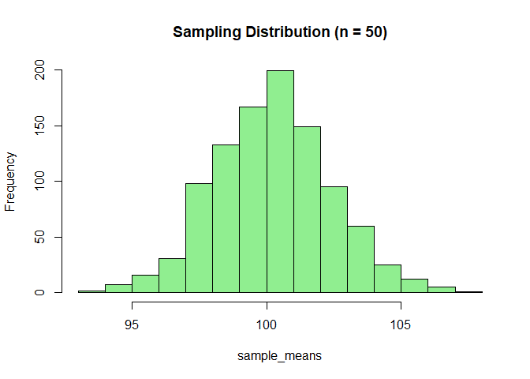<!-- -->

<!-- $$ -->

<!-- z = \frac{x - \mu}{\sigma} -->

<!-- $$ -->

### Example in R

``` r
x <- 70
mu <- 60
sigma <- 10

z <- (x - mu) / sigma
z
```

    ## [1] 1

------------------------------------------------------------------------

## Normal Approximation to the Binomial

When n is large and p not extreme:

``` r
plot.new()
text(0.5, 0.5,
     expression(mu == n*p ~~ "~" ~~ sigma == sqrt(n*p*(1-p))),
     cex=1.4)
```

<!-- -->

<!-- $$ -->

<!-- \mu = np,\qquad \sigma = \sqrt{np(1-p)} -->

<!-- $$ -->

### Example in R

``` r
n <- 100
p <- 0.5

mu <- n * p
sigma <- sqrt(n * p * (1 - p))

mu
```

    ## [1] 50

``` r
sigma
```

    ## [1] 5

------------------------------------------------------------------------

## Statistical Literacy

- Many statistical tests assume **normality**
- Always **check the distribution** before using parametric methods
- Tools to check normality: **histograms**, **Q-Q plots**

------------------------------------------------------------------------

# Exercises — With Code and Answers

------------------------------------------------------------------------

## Exercise 1: Plot a normal curve with mean = 50, sd = 10

``` r
x <- seq(20, 80, length = 100)
y <- dnorm(x, mean = 50, sd = 10)

plot(
  x, y, type = "l",
  main = "Normal Curve (μ = 50, σ = 10)",
  xlab = "Value",
  ylab = "Density"
)
```

<!-- -->

------------------------------------------------------------------------

## Exercise 2: Compute z‑score for x = 85, mean = 70, sd = 12

``` r
x <- 85
mu <- 70
sigma <- 12

z <- (x - mu) / sigma
z
```

    ## [1] 1.25

------------------------------------------------------------------------

## Exercise 3: Probability that Z \< 1.96

``` r
pnorm(1.96)
```

    ## [1] 0.9750021

------------------------------------------------------------------------

## Exercise 4: Probability that Z \> 2.33

``` r
1 - pnorm(2.33)
```

    ## [1] 0.009903076

------------------------------------------------------------------------

## Exercise 5: Simulate 1000 normal values and check mean and sd

``` r
set.seed(123)
sim_data <- rnorm(1000, mean = 50, sd = 10)

mean(sim_data)
```

    ## [1] 50.16128

``` r
sd(sim_data)
```

    ## [1] 9.91695

**Interpretation:**  
Simulated data should be close to mean = 50 and sd = 10.

------------------------------------------------------------------------

# Chapter 8: Advanced Graphs

## Why Advanced Graphs?

Basic graphs (histograms, bar charts) are great for simple data.  
**Advanced graphs** help visualize:

- Distributional comparisons  
- Multivariate relationships  
- Model diagnostics

------------------------------------------------------------------------

## Quantile–Quantile (Q–Q) Plots

Q–Q plots compare the distribution of your data to a theoretical
distribution (usually normal).

**Purpose:** Check normality assumptions.

### Example in R

``` r
set.seed(123)
data <- rnorm(100, mean = 50, sd = 10)

qqnorm(data)
qqline(data, col = "red")
```

<!-- -->

**Interpretation:**  
Points close to the red line indicate approximate normality.

------------------------------------------------------------------------

## Contour Plots

Contour plots display **density levels** of two continuous variables.

### Example in R

``` r
library(MASS)

set.seed(123)
data2 <- mvrnorm(
  n = 200,
  mu = c(0, 0),
  Sigma = matrix(c(1, 0.5, 0.5, 1), 2, 2)
)

x <- data2[, 1]
y <- data2[, 2]

kde <- kde2d(x, y, n = 50)

contour(kde, main = "Contour Plot")
```

<!-- -->

**Interpretation:**  
Each contour line represents an area of equal density.

------------------------------------------------------------------------

## 3D Plots

3D plots show density surfaces or multivariate relationships in three
dimensions.

### Example in R

``` r
persp(
  kde$x, kde$y, kde$z,
  theta = 30, phi = 20,
  expand = 0.5,
  col = "lightblue",
  xlab = "X", ylab = "Y", zlab = "Density"
)
```

<!-- -->

**Interpretation:**  
Peaks represent areas of higher density.

------------------------------------------------------------------------

## Statistical Literacy

- Advanced graphs reveal **non-linear patterns**, **clusters**, and
  **outliers**.
- More complex visuals must be interpreted carefully to avoid misreading
  patterns.

------------------------------------------------------------------------

# Exercises — With Code and Answers

## Exercise 1: Create a Q–Q plot for 100 simulated normal values

``` r
set.seed(456)
data <- rnorm(100)

qqnorm(data)
qqline(data, col = "blue")
```

<!-- -->

------------------------------------------------------------------------

## Exercise 2: Generate a Q–Q plot for skewed data

``` r
skewed <- rexp(100, rate = 1)

qqnorm(skewed)
qqline(skewed, col = "red")
```

<!-- -->

**Interpretation:**  
Curvature in the plot shows deviation from normality.

------------------------------------------------------------------------

## Exercise 3: Create a contour plot for bivariate normal data

``` r
library(MASS)

set.seed(789)
data2 <- mvrnorm(
  n = 300,
  mu = c(0, 0),
  Sigma = matrix(c(1, 0.7, 0.7, 1), 2, 2)
)

x <- data2[, 1]
y <- data2[, 2]

kde <- kde2d(x, y, n = 50)

contour(kde, main = "Contour Plot Example")
```

<!-- -->

------------------------------------------------------------------------

## Exercise 4: Create a 3D surface plot for the same data

``` r
persp(
  kde$x, kde$y, kde$z,
  theta = 40, phi = 30,
  expand = 0.5,
  col = "lightgreen",
  xlab = "X", ylab = "Y", zlab = "Density"
)
```

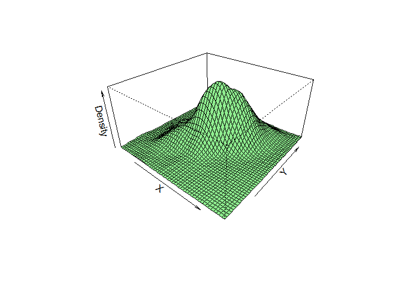<!-- -->

------------------------------------------------------------------------

## Exercise 5: Why are Q–Q plots useful before parametric tests?

**Answer:**  
Parametric tests (t‑tests, ANOVA) assume normality.  
Q–Q plots provide a fast visual check of whether this assumption is
reasonable.  
If data strongly deviates from the line, transformations or
non-parametric alternatives may be needed.

------------------------------------------------------------------------

# Chapter 9: Sampling Distributions

## Introduction to Sampling Distributions

A **sampling distribution** is the probability distribution of a
statistic  
(e.g., the sample mean) that would be obtained from taking many
samples  
of the same size from a population.

**Why important?**

- Sampling distributions form the basis for **inferential
  statistics**.  
- They describe the **variability** of a statistic across repeated
  samples.

------------------------------------------------------------------------

## Sampling Distribution of the Mean

If we take many samples and compute their means:

- The distribution of those means becomes **approximately normal**  
  (Central Limit Theorem).  
- The mean of the sampling distribution equals the **population mean**
  $\mu$.  
- The **standard error (SE)** is:

``` r
plot.new()
text(0.5, 0.5,
     expression(SE == frac(sigma, sqrt(n))),
     cex=1.6)
```

<!-- -->

<!-- $$ -->

<!-- SE = \frac{\sigma}{\sqrt{n}} -->

<!-- $$ -->

### Example in R

``` r
set.seed(123)

population <- rnorm(10000, mean = 50, sd = 10)

sample_means <- replicate(
  1000,
  mean(sample(population, size = 30))
)

hist(sample_means,
     main = "Sampling Distribution of the Mean",
     col = "lightblue")
```

<!-- -->

``` r
mean(sample_means)
```

    ## [1] 50.0051

``` r
sd(sample_means)
```

    ## [1] 1.794127

------------------------------------------------------------------------

## Sampling Distribution of Difference Between Means

For two independent samples:

``` r
plot.new()
text(0.5, 0.5,
     expression(
       SE == sqrt( sigma[1]^2 / n[1] + sigma[2]^2 / n[2] )
     ),
     cex = 1.6)
```

<!-- -->

<!-- $$ -->

<!-- SE = \sqrt{ \frac{\sigma_1^2}{n_1} + \frac{\sigma_2^2}{n_2} } -->

<!-- $$ -->

------------------------------------------------------------------------

## Sampling Distribution of Pearson’s r

The correlation coefficient also has a sampling distribution.  
For large n, the sampling distribution of r becomes approximately
normal.

------------------------------------------------------------------------

## Sampling Distribution of p (Proportion)

For a proportion p:

``` r
plot.new()
text(0.5, 0.5,
     expression(SE == sqrt(p*(1-p)/n)),
     cex=1.6)
```

<!-- -->

<!-- $$ -->

<!-- SE = \sqrt{\frac{p(1 - p)}{n}} -->

<!-- $$ -->

------------------------------------------------------------------------

## Statistical Literacy

- Larger samples → **smaller standard error** → more precise estimates.
- The standard error measures **uncertainty** in estimates.
- The **Central Limit Theorem** is fundamental to hypothesis testing  
  and confidence intervals.

------------------------------------------------------------------------

# Exercises — With Code and Answers

------------------------------------------------------------------------

## Exercise 1: Sampling distribution of the mean (n = 50)

``` r
set.seed(456)

population <- rnorm(10000, mean = 100, sd = 15)

sample_means <- replicate(
  1000,
  mean(sample(population, size = 50))
)

mean(sample_means)
```

    ## [1] 100.2198

``` r
sd(sample_means)
```

    ## [1] 2.164207

------------------------------------------------------------------------

## Exercise 2: Plot histogram of the sample means

``` r
hist(sample_means,
     main = "Sampling Distribution (n = 50)",
     col = "lightgreen")
```

<!-- -->

------------------------------------------------------------------------

## Exercise 3: Compute standard error for n = 100

``` r
sigma <- 15
n <- 100

SE <- sigma / sqrt(n)
SE
```

    ## [1] 1.5

------------------------------------------------------------------------

## Exercise 4: Sampling distribution of a proportion (p = 0.4, n = 200)

``` r
set.seed(789)

p <- 0.4
n <- 200

sample_props <- replicate(
  1000,
  mean(rbinom(n, size = 1, prob = p))
)

mean(sample_props)
```

    ## [1] 0.402225

``` r
sd(sample_props)
```

    ## [1] 0.0350707

------------------------------------------------------------------------

## Exercise 5: Why do sampling distributions matter?

**Answer:**  
Sampling distributions allow us to:

- quantify uncertainty in sample statistics
- compute confidence intervals
- perform hypothesis tests
- understand how statistics vary across repeated samples

They are the foundation of inferential statistics.

------------------------------------------------------------------------

# Chapter 10: Estimation

## Introduction to Estimation

Estimation uses sample data to **infer population parameters**.

Two main types:

- **Point estimate:** A single value (e.g., sample mean)  
- **Interval estimate:** A range of plausible values (e.g., confidence
  interval)

**Goal:** Quantify uncertainty in sample-based estimates.

------------------------------------------------------------------------

## Degrees of Freedom

Degrees of freedom (df) represent the number of independent pieces of
information.

For sample variance:

``` r
plot.new()
text(0.5, 0.5, expression(df == n - 1), cex=1.6)
```

<!-- -->

<!-- $$ -->

<!-- df = n - 1 -->

<!-- $$ -->

------------------------------------------------------------------------

## Characteristics of Estimators

- **Unbiased:** Expected value equals the true parameter  
- **Consistent:** Becomes more accurate as sample size increases  
- **Efficient:** Has the smallest variance among unbiased estimators

------------------------------------------------------------------------

## Confidence Intervals

A confidence interval provides a **range of plausible values** for a
parameter:

``` r
plot.new()
text(0.5, 0.5,
     expression(CI == "Point Estimate" %+-% "Margin of Error"),
     cex=1.4)
```

<!-- -->

<!-- $$ -->

<!-- CI = \text{Point Estimate} \pm \text{Margin of Error} -->

<!-- $$ -->

------------------------------------------------------------------------

## Introduction to Confidence Intervals

For a mean:

Using known population SD:

``` r
plot.new()
text(
  0.5, 0.5,
  expression(CI == bar(x) ~ +- ~ z^frac(sigma, sqrt(n))),
  cex = 1.4
)
```

<!-- -->

<!-- $$ -->

<!-- CI = \bar{x} \pm z^* \frac{\sigma}{\sqrt{n}} -->

<!-- $$ -->

Using sample SD (t‑distribution):

``` r
plot.new()
text(
  0.5, 0.5,
  expression(CI == bar(x) ~ +- ~ t^frac(s, sqrt(n))),
  cex = 1.4
)
```

<!-- -->

<!-- $$ -->

<!-- CI = \bar{x} \pm t^* \frac{s}{\sqrt{n}} -->

<!-- $$ -->

------------------------------------------------------------------------

### Example in R: CI for a Mean

``` r
set.seed(123)

data <- rnorm(30, mean = 50, sd = 10)

xbar <- mean(data)
s <- sd(data)
n <- length(data)

alpha <- 0.05
t_crit <- qt(1 - alpha/2, df = n - 1)

margin <- t_crit * s / sqrt(n)

CI <- c(xbar - margin, xbar + margin)
CI
```

    ## [1] 45.86573 53.19219

------------------------------------------------------------------------

## t Distribution

Used when:

- Population SD is unknown
- Sample size is small (n \< 30)

------------------------------------------------------------------------

## Confidence Interval for the Mean

- Use **z** when σ is known and n large
- Use **t** when σ is unknown or n small

------------------------------------------------------------------------

## Difference Between Means

For two independent samples:

``` r
plot.new()
text(
  0.5, 0.5,
  expression(
    CI ==
      (bar(x)[1] - bar(x)[2]) ~+-~
      t * sqrt(
        frac(s[1]^2, n[1]) +
        frac(s[2]^2, n[2])
      )
  ),
  cex = 1.4
)
```

<!-- -->

<!-- $$ -->

<!-- CI = (\bar{x}_1 - \bar{x}_2) \pm t^* \sqrt{\frac{s_1^2}{n_1} + \frac{s_2^2}{n_2}} -->

<!-- $$ -->

------------------------------------------------------------------------

## Correlation

Confidence intervals for correlation typically use **Fisher’s z
transformation**.

------------------------------------------------------------------------

## Proportion

Confidence interval for a proportion:

``` r
plot.new()
text(
  0.5, 0.5,
  expression(
    hat(p) ~+-~
      z^sqrt(
        frac(
          hat(p) * (1 - hat(p)),
          n
        )
      )
  ),
  cex = 1.4
)
```

<!-- -->

<!-- $$ -->

<!-- \hat{p} \pm z^* \sqrt{ \frac{ \hat{p}(1 - \hat{p}) }{n} } -->

<!-- $$ -->

------------------------------------------------------------------------

## Statistical Literacy

- A 95% CI does **not** mean “95% chance the true value is inside this
  interval.”
- It means **95% of intervals constructed this way will contain the true
  parameter**.
- Wider intervals indicate **greater uncertainty**.

------------------------------------------------------------------------

# Exercises — With Code and Answers

------------------------------------------------------------------------

## Exercise 1: 95% CI for mean of simulated data

``` r
set.seed(456)

data <- rnorm(40, mean = 100, sd = 15)

xbar <- mean(data)
s <- sd(data)
n <- length(data)

alpha <- 0.05
t_crit <- qt(1 - alpha/2, df = n - 1)

margin <- t_crit * s / sqrt(n)

CI <- c(xbar - margin, xbar + margin)
CI
```

    ## [1]  96.4703 107.1669

------------------------------------------------------------------------

## Exercise 2: CI for difference between two means

``` r
group1 <- rnorm(30, mean = 50, sd = 10)
group2 <- rnorm(30, mean = 55, sd = 10)

mean_diff <- mean(group1) - mean(group2)

s1 <- sd(group1)
s2 <- sd(group2)

n1 <- length(group1)
n2 <- length(group2)

SE <- sqrt(s1^2/n1 + s2^2/n2)

t_crit <- qt(0.975, df = n1 + n2 - 2)

CI_diff <- c(mean_diff - t_crit * SE,
             mean_diff + t_crit * SE)

CI_diff
```

    ## [1] -9.1274207  0.5427001

------------------------------------------------------------------------

## Exercise 3: CI for a proportion (p = 0.4, n = 200)

``` r
p_hat <- 0.4
n <- 200

z_crit <- qnorm(0.975)

margin <- z_crit * sqrt(p_hat * (1 - p_hat) / n)

CI_prop <- c(p_hat - margin, p_hat + margin)
CI_prop
```

    ## [1] 0.3321049 0.4678951

------------------------------------------------------------------------

## Exercise 4: Why use t-distribution for small samples?

**Answer:**  
Because the **population SD is unknown**, and the t-distribution
correctly accounts for the extra uncertainty in estimating σ from small
samples.

------------------------------------------------------------------------

## Exercise 5: Simulate 1000 sample means and compute average CI width

``` r
set.seed(789)

widths <- replicate(1000, {
  data <- rnorm(30, mean = 50, sd = 10)

  xbar <- mean(data)
  s <- sd(data)
  n <- length(data)

  t_crit <- qt(0.975, df = n - 1)
  margin <- t_crit * s / sqrt(n)

  2 * margin
})

mean(widths)
```

    ## [1] 7.337961

------------------------------------------------------------------------

# 11. Logic of Hypothesis Testing

## Introduction

Hypothesis testing is a decision‑making framework used to evaluate
claims about population parameters using sample data.  
A hypothesis test evaluates two competing statements:

- H0: Null hypothesis (no effect, no difference)
- H1: Alternative hypothesis (some effect, some difference)

The idea is to measure how unlikely the sample data would be **if the
null hypothesis were true**.

Below is the typical notation for a sum of squared deviations, written
using your required format:

``` r
plot.new()
text(0.5, 0.5, expression(sum((x[i] - bar(x))^2, i==1, n)), cex=1.6)
```

<!-- -->

## Significance Testing

A significance test computes a *test statistic* and compares it with a
known sampling distribution.  
This produces a *p‑value*, the probability of obtaining a value as
extreme as the observed statistic assuming H0 is true.

Example: one‑sample z-statistic (written in plain text):

z = (xbar – mu0) / (sigma / sqrt(n))

### Example Simulation Plot

``` r
set.seed(1)
zvals <- rnorm(10000, 0, 1)
hist(zvals, breaks=40, col="skyblue", main="Standard Normal Distribution")
```

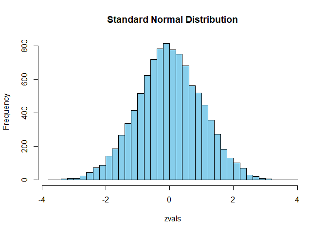<!-- -->

## Type I and Type II Errors

- **Type I error**: Rejecting H0 when it is true (false positive).  
  Probability = alpha.

- **Type II error**: Failing to reject H0 when H1 is true (false
  negative).  
  Probability = beta.

Power = 1 - beta.

## One- and Two-Tailed Tests

A test is **one-tailed** when the direction of the effect is specified:

- H1: mu \> mu0  
  or
- H1: mu \< mu0

A **two‑tailed test** looks for any difference:

- H1: mu ≠ mu0

Plot showing critical regions:

``` r
curve(dnorm(x), from=-4, to=4, main="Two-Tailed Critical Regions")
abline(v=c(-1.96, 1.96), col="red", lwd=2)
```

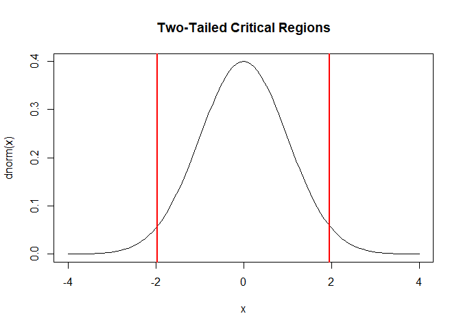<!-- -->

## Interpreting Significant Results

A significant result (p \< alpha):

- Means the observed data are unlikely under H0.
- Does **not** prove the alternative is true with certainty.
- Does **not** measure effect size.

## Interpreting Non-Significant Results

A non-significant result:

- Means the data are not sufficiently inconsistent with H0.
- Does **not** prove H0 is true.
- May simply reflect insufficient power.

## Steps in Hypothesis Testing

1.  State H0 and H1.
2.  Select alpha (commonly 0.05).
3.  Compute the test statistic.
4.  Find the p-value.
5.  Make a decision.
6.  Interpret the result.

## Significance Testing and Confidence Intervals

A two‑tailed hypothesis test at alpha = 0.05 corresponds to a **95%
confidence interval**.  
If the hypothesized mean mu0 is **outside** the CI, H0 is rejected.

## Misconceptions

Common misunderstandings:

- p-value is NOT the probability H0 is true.
- Statistical significance is NOT practical importance.
- A non‑significant test does NOT confirm H0.

## Statistical Literacy

Students should understand:

- What p-values represent
- Why effect size matters
- Why sample size influences significance
- The difference between statistical and practical significance

------------------------------------------------------------------------

# Exercises

### **1. Define Type I and Type II errors in your own words.**

**Response:**  
Type I error is rejecting a true H0 (false positive).  
Type II error is failing to reject a false H0 (false negative).

------------------------------------------------------------------------

### **2. A researcher tests H0: mu = 50 and obtains p = 0.03. What conclusion should be drawn?**

**Response:**  
Because p \< 0.05, we reject H0 and conclude the population mean likely
differs from 50.

------------------------------------------------------------------------

### **3. Show the formula for a one-sample t-statistic using the required text‑based expression method.**

**Formula block:**

``` r
plot.new()
text(0.5, 0.5, expression(t == (bar(x) - mu[0]) / (s/sqrt(n))), cex=1.6)
```

<!-- -->

------------------------------------------------------------------------

### **4. Perform a small simulation showing how sample size affects p-values.**

``` r
set.seed(1)

sim_p <- function(n) {
  x <- rnorm(n, mean=0.3, sd=1)
  ttest <- t.test(x, mu=0)
  return(ttest$p.value)
}

sizes <- c(10, 30, 100, 300)
pvals <- sapply(sizes, sim_p)

plot(sizes, pvals, type="b", pch=19, col="blue",
     main="Sample Size vs. p-value")
```

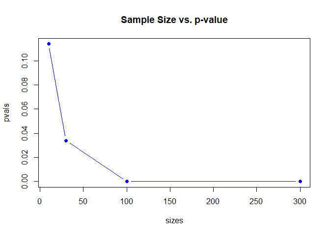<!-- -->

**Response:**  
Larger sample sizes lead to smaller p-values when an effect exists.

------------------------------------------------------------------------

### **5. Explain why a two-tailed test has a larger critical value than a one-tailed test.**

**Response:**  
Because the same alpha is split between two symmetrical tails, each tail
has alpha/2, making the rejection region farther from zero.

------------------------------------------------------------------------

# 12. Testing Means

This chapter develops hypothesis tests for population means.  
We examine tests for a **single mean**, the **difference between two
means**, and comparisons involving **independent** and **correlated**
groups.

To maintain consistency, mathematical symbols appear in *plain text*,
and visual formulas use your required graphical method.

------------------------------------------------------------------------

# Testing a Single Mean

A one‑sample t‑test evaluates whether the sample mean differs from a
hypothesized value:

t = (xbar – mu0) / (s / sqrt(n))

Below is the t‑formula using the required method:

``` r
plot.new()
text(0.5, 0.5,
     expression(t == (bar(x) - mu[0]) / (s/sqrt(n))),
     cex=1.6)
```

<!-- -->

### Example Simulation Plot

Visualizing sampling variability:

``` r
set.seed(1)
xbar_vals <- replicate(5000, mean(rnorm(30, mean=50, sd=10)))
hist(xbar_vals, breaks=40, col="lightgreen",
     main="Sampling Distribution of the Sample Mean")
abline(v=50, col="red", lwd=2)
```

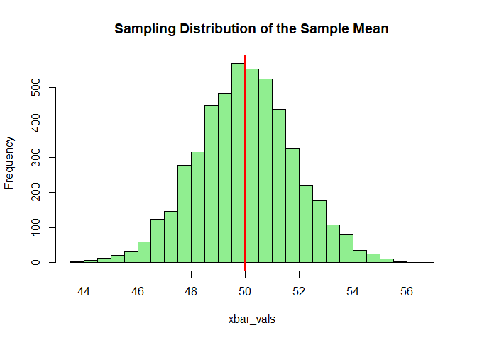<!-- -->

------------------------------------------------------------------------

# Differences between Two Means (Independent Groups)

This situation tests whether two unrelated samples differ.

The two‑sample t‑statistic (equal variances):

t = (xbar1 – xbar2) / sqrt( sp^2 \* (1/n1 + 1/n2) )

And the pooled variance expression:

``` r
plot.new()
text(0.5, 0.5,
     expression(s[p]^2 == (((n[1]-1)*s[1]^2 + (n[2]-1)*s[2]^2) / (n[1] + n[2] - 2))),
     cex=1.5)
```

<!-- -->

### Example Plot

Comparing two groups:

``` r
group1 <- rnorm(100, mean=10, sd=2)
group2 <- rnorm(100, mean=12, sd=2)
boxplot(group1, group2, names=c("G1","G2"),
        main="Independent Groups Example")
```

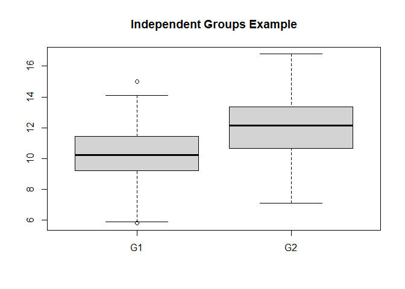<!-- -->

------------------------------------------------------------------------

# All Pairwise Comparisons Among Means

When comparing more than two groups, pairwise t‑tests are used.  
However, these inflate Type I error, so corrections (e.g., Bonferroni)
are often applied.

Example dataset with three groups:

``` r
set.seed(1)
gA <- rnorm(40, 10, 2)
gB <- rnorm(40, 12, 2)
gC <- rnorm(40, 14, 2)
boxplot(list(A=gA,B=gB,C=gC), main="Three Groups for Pairwise Comparisons")
```

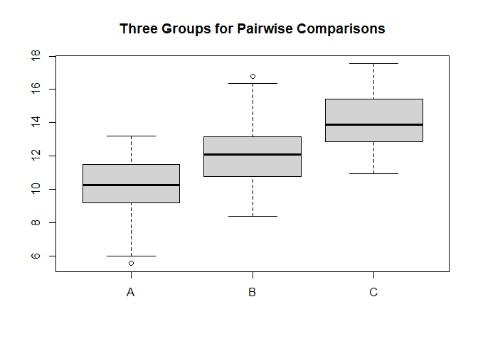<!-- -->

------------------------------------------------------------------------

# Specific Comparisons (Independent Groups)

Researchers often test only *particular* differences rather than all
possible pairs.  
These planned comparisons reduce the multiple‑test burden.

Formula for a general contrast:

contrast = sum( c_i \* xbar_i )

with t = contrast / sqrt( sum( c_i^2 \* s_i^2/n_i ) ).

``` r
plot.new()
text(0.5, 0.5, expression(C == sum(c[i] * bar(x)[i])),
     cex=1.6)
```

<!-- -->

------------------------------------------------------------------------

# Difference Between Two Means (Correlated Pairs)

Used in paired designs (before‑after, matched subjects).  
The test is based on *difference scores*:

t = dbar / (sd / sqrt(n))

``` r
plot.new()
text(0.5, 0.5,
     expression(t == (bar(d) / (s[d]/sqrt(n)))),
     cex=1.6)
```

<!-- -->

Example paired plot:

``` r
set.seed(1)
before <- rnorm(40, 50, 10)
after  <- before + rnorm(40, 5, 5)
plot(before, after, pch=19, col="blue",
     main="Paired Scores (Before vs After)")
abline(0,1,col="red",lwd=2)
```

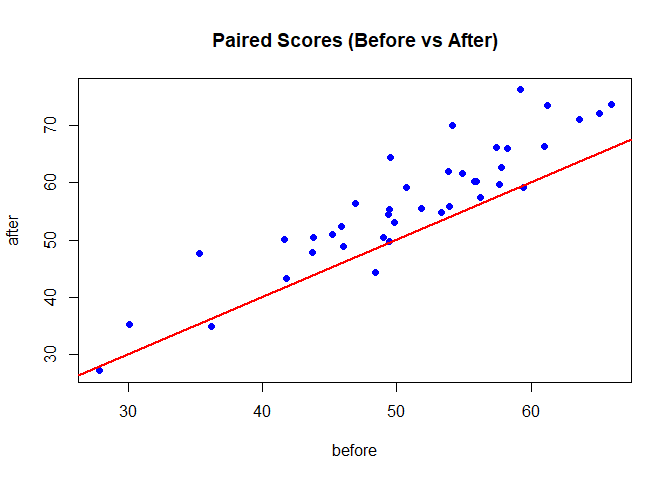<!-- -->

------------------------------------------------------------------------

# Specific Comparisons (Correlated Observations)

Contrasts may also be used in repeated measures contexts.  
They follow the same mathematical logic but must account for
within‑subject variance.

------------------------------------------------------------------------

# Pairwise Comparisons (Correlated Observations)

Repeated measures ANOVA or paired t‑tests can be used for comparing
repeated conditions.  
Pairwise post‑hoc tests must account for correlated data.

Example:

``` r
set.seed(2)
A <- rnorm(30, 50, 5)
B <- A + rnorm(30, 3, 5)
C <- A + rnorm(30, -2, 5)
mat <- cbind(A,B,C)
matplot(mat, type="l", lty=1, col=c("red","blue","green"),
        main="Repeated Measures Across 3 Conditions")
```

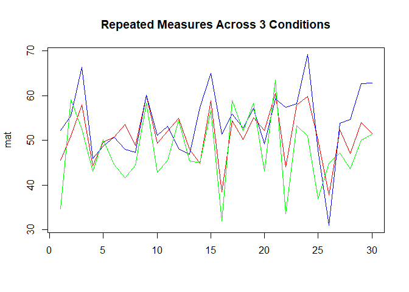<!-- -->

------------------------------------------------------------------------

# Statistical Literacy

Students should understand:

- Why t‑tests depend on sample variability
- How correlation between paired observations affects power
- Why multiple comparisons inflate Type I error
- How effect sizes complement significance tests

------------------------------------------------------------------------

# Exercises

### **1. Explain the difference between independent and correlated (paired) samples.**

Independent samples involve unrelated individuals.  
Paired samples involve repeated measures or matched individuals.

------------------------------------------------------------------------

### **2. Write the formula for the pooled variance using the required expression method.**

``` r
plot.new()
text(0.5, 0.5,
     expression(s[p]^2 == (((n[1]-1)*s[1]^2 + (n[2]-1)*s[2]^2) / (n[1] + n[2] - 2))),
     cex=1.6)
```

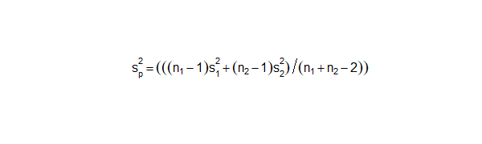<!-- -->

------------------------------------------------------------------------

### **3. Conduct a simulation that compares the power of paired vs independent tests.**

``` r
set.seed(1)

simulate_power <- function(type="paired"){
  n <- 30
  if(type=="paired"){
    x <- rnorm(n, 0, 1)
    y <- x + rnorm(n, 0.5, 1)
    return(t.test(x,y,paired=TRUE)$p.value < 0.05)
  } else {
    x <- rnorm(n, 0, 1)
    y <- rnorm(n, 0.5, 1)
    return(t.test(x,y,paired=FALSE)$p.value < 0.05)
  }
}

paired_power <- mean(replicate(2000, simulate_power("paired")))
indep_power  <- mean(replicate(2000, simulate_power("independent")))

barplot(c(paired_power, indep_power),
        names=c("Paired","Independent"),
        col=c("skyblue","orange"),
        main="Power Comparison")
```

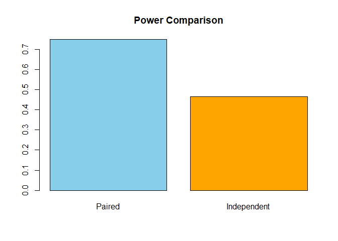<!-- -->

**Response:**  
Paired designs typically show higher power because they remove
between‑subject variability.

------------------------------------------------------------------------

### **4. When should you use a one‑sample t‑test instead of a paired t‑test?**

Use a one‑sample test when you compare a sample mean to a fixed value.  
Use a paired test when you compare linked observations.

------------------------------------------------------------------------

### **5. Describe one situation in which a contrast is more appropriate than post‑hoc tests.**

When researchers have a specific directional or theoretical prediction
prior to data collection, a contrast directly tests that prediction.

------------------------------------------------------------------------

# 13. Power

Statistical **power** is the probability that a test will correctly
reject a false null hypothesis.  
It depends on several factors: effect size, sample size, variability,
and significance level.

All mathematical expressions are provided in plain text, with formula
graphics using your required R method.

------------------------------------------------------------------------

# Introduction to Power

Power = probability of detecting an effect when the effect is real.  
More formally:

Power = 1 − beta

where beta is the probability of a Type II error.

Visual representation using your required notation:

``` r
plot.new()
text(0.5,0.5,expression(Power == 1 - beta), cex=1.8)
```

<!-- -->

### Example Plot: Distributions Under H0 and H1

``` r
curve(dnorm(x,0,1), from=-4,to=6, col="blue", lwd=2,
      main="H0 vs H1 Distributions")
curve(dnorm(x,1.2,1), add=TRUE, col="red", lwd=2)
abline(v=1.64, col="black", lwd=2, lty=2)
legend("topright", legend=c("H0","H1"), col=c("blue","red"),
       lwd=2)
```

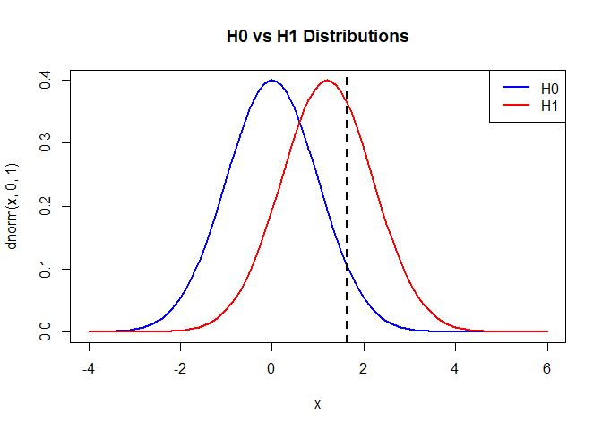<!-- -->

------------------------------------------------------------------------

# Example Calculations

The power of a test increases when:

- The true mean is further from the null value
- Standard deviation is smaller
- Sample size increases
- Alpha is increased

### Illustration: Power Curve

``` r
library(pwr)
effect_sizes <- seq(0,1,0.05)
power_vals <- sapply(effect_sizes, function(d)
  pwr.t.test(d=d, n=30, sig.level=0.05, type="two.sample")$power)

plot(effect_sizes, power_vals, type="l", lwd=3, col="purple",
     main="Power Curve for Two-Sample Test")
```

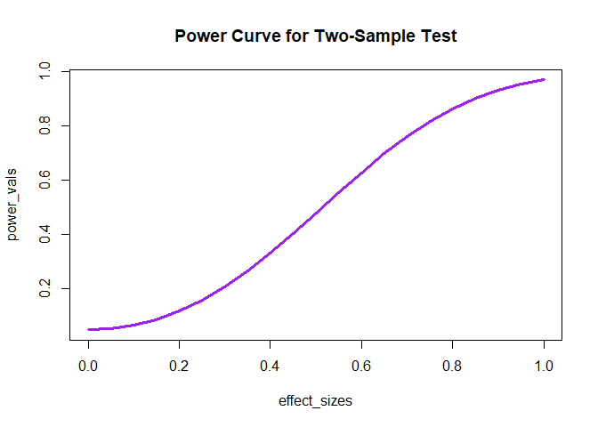<!-- -->

------------------------------------------------------------------------

# Factors Affecting Power

1.  **Effect Size**  
    Larger true differences yield more power.

2.  **Sample Size**  
    Larger n reduces sampling error and increases power.

3.  **Variability of the Data (σ)**  
    Lower variability → more power.

4.  **Significance Level (α)**  
    Higher alpha increases power but also increases Type I error.

Formula for standardized effect size (Cohen’s d):

``` r
plot.new()
text(0.5,0.5,expression(d == (mu[1] - mu[2]) / s[p]), cex=1.6)
```

<!-- -->

------------------------------------------------------------------------

### Simulation: Power Increases With Sample Size

``` r
set.seed(1)
sim_power_n <- function(n){
  mean(replicate(1000, {
    x <- rnorm(n, 0.4, 1)
    t.test(x, mu=0)$p.value < 0.05
  }))
}

sizes <- c(10,20,40,80,160)
powers <- sapply(sizes, sim_power_n)

plot(sizes, powers, type="b", pch=19, col="darkgreen",
     main="Power vs Sample Size")
```

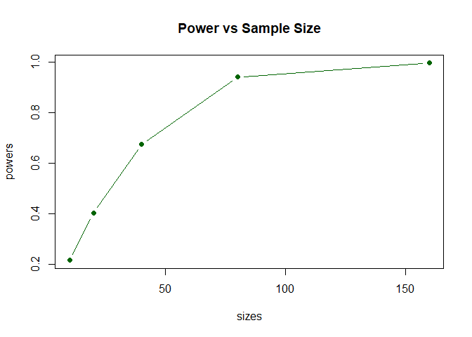<!-- -->

------------------------------------------------------------------------

# Statistical Literacy

Students should understand:

- Power is not fixed — it varies across study designs
- A non-significant result may simply reflect inadequate power
- Power analysis should be conducted **before** data collection

------------------------------------------------------------------------

# Exercises

### **1. Define statistical power in your own words.**

**Response:**  
Power is the probability that a statistical test correctly detects an
effect when the effect truly exists.

------------------------------------------------------------------------

### **2. Use the required expression method to display the formula for beta.**

``` r
plot.new()
text(0.5,0.5,expression(beta == P( fail~to~reject~H[0]~when~H[1]~is~true )), cex=1.3)
```

<!-- -->

------------------------------------------------------------------------

### **3. Simulate power for effect size d = 0.5 at n = 20, 50, and 100.**

``` r
set.seed(2)
power_sim <- function(n){
  mean(replicate(2000, {
    x <- rnorm(n, 0.5, 1)
    t.test(x, mu=0)$p.value < 0.05
  }))
}

nvals <- c(20,50,100)
pvals <- sapply(nvals, power_sim)

barplot(pvals, names.arg=nvals, col="steelblue",
        main="Simulated Power for d = 0.5")
```

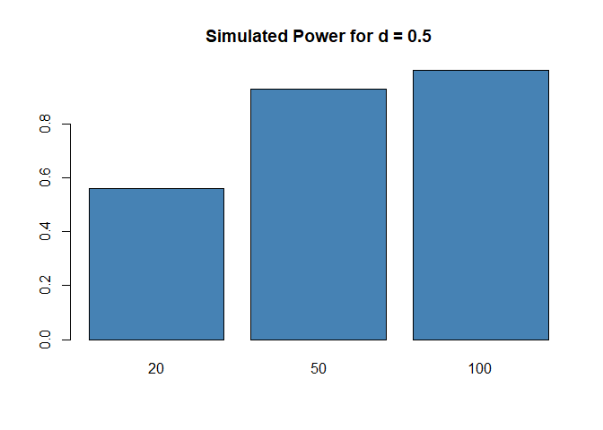<!-- -->

**Response:**  
Power increases substantially as n increases.

------------------------------------------------------------------------

### **4. Why does reducing variability increase statistical power?**

**Response:**  
Lower variability makes true differences easier to detect because
sampling distributions are narrower.

------------------------------------------------------------------------

### **5. Show graphically (using your required style) the equation linking power, alpha, and beta.**

``` r
plot.new()
text(0.5,0.5,expression(Power == 1 - beta ~~";"~~ alpha == P(Type~I~error)),
     cex=1.2)
```

<!-- -->

------------------------------------------------------------------------

# 14. Regression

Regression analysis examines the relationship between a predictor
variable (X) and an outcome variable (Y).  
This chapter covers **simple linear regression**, its core formulas,
inferential statistics, influential observations, regression to the
mean, and an introduction to **multiple regression**.

Mathematical symbols appear in plain text, and all formal equations are
displayed using your required R graphical-expression method.

------------------------------------------------------------------------

# Introduction to Linear Regression

Simple linear regression models the relationship:

Y = b0 + b1 \* X + error

Graphical representation using your required method:

``` r
plot.new()
text(0.5, 0.5, expression(Y == b[0] + b[1]*X + epsilon), cex=1.6)
```

<!-- -->

### Example Scatterplot with Fitted Line

``` r
set.seed(1)
x <- rnorm(100, 10, 3)
y <- 5 + 0.8*x + rnorm(100, 0, 3)
plot(x, y, pch=19, col="blue", main="Scatterplot with Regression Line")
abline(lm(y ~ x), col="red", lwd=3)
```

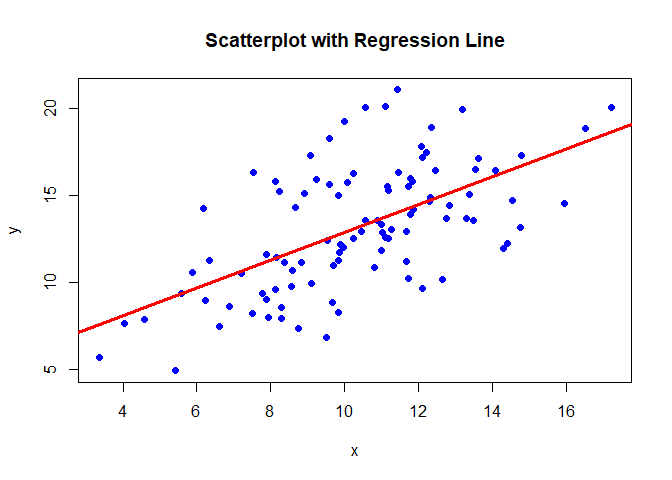<!-- -->

------------------------------------------------------------------------

# Partitioning the Sums of Squares

Total variation in Y is partitioned into:

- SS_total
- SS_regression
- SS_residual

Formula representation:

``` r
plot.new()
text(0.5,0.5,expression(SS[T] == SS[R] + SS[E]), cex=1.6)
```

<!-- -->

### Example ANOVA Table from a Regression Model

``` r
model <- lm(y ~ x)
anova(model)
```

    ## Analysis of Variance Table
    ## 
    ## Response: y
    ##           Df Sum Sq Mean Sq F value    Pr(>F)    
    ## x          1 458.83  458.83  55.002 4.364e-11 ***
    ## Residuals 98 817.52    8.34                      
    ## ---
    ## Signif. codes:  0 '***' 0.001 '**' 0.01 '*' 0.05 '.' 0.1 ' ' 1

------------------------------------------------------------------------

# Standard Error of the Estimate

Standard error of estimate:

SE = sqrt( SS_residual / (n - 2) )

Graphical formula:

``` r
plot.new()
text(0.5,0.5,expression(SE == sqrt(SS[E] / (n - 2))), cex=1.6)
```

<!-- -->

### Example Visualization: Residual Distribution

``` r
res <- resid(model)
hist(res, breaks=30, col="lightblue", main="Residual Distribution")
```

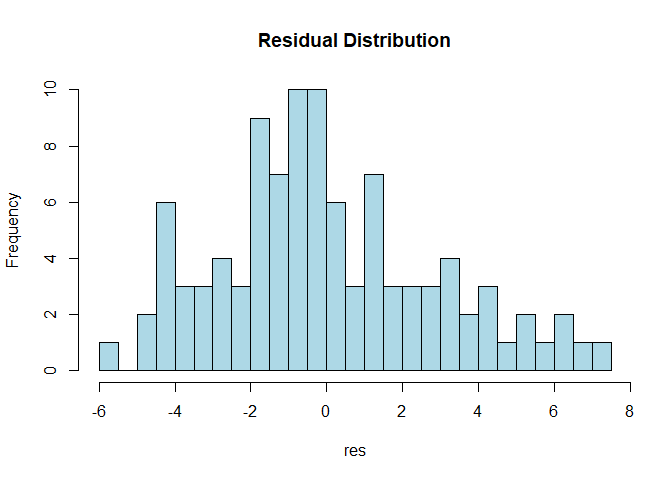<!-- -->

------------------------------------------------------------------------

# Inferential Statistics for b and r

The slope b1 is tested using:

t = b1 / SE_b1

Correlation r is tested using:

t = r \* sqrt((n - 2) / (1 - r^2))

Graphical slope-test expression:

``` r
plot.new()
text(0.5,0.5,expression(t == b[1] / SE[b[1]]), cex=1.6)
```

<!-- -->

### Example Output

``` r
summary(model)
```

    ## 
    ## Call:
    ## lm(formula = y ~ x)
    ## 
    ## Residuals:
    ##     Min      1Q  Median      3Q     Max 
    ## -5.6305 -1.8413 -0.4185  1.6182  7.0385 
    ## 
    ## Coefficients:
    ##             Estimate Std. Error t value Pr(>|t|)    
    ## (Intercept)   4.8975     1.1493   4.261 4.68e-05 ***
    ## x             0.7989     0.1077   7.416 4.36e-11 ***
    ## ---
    ## Signif. codes:  0 '***' 0.001 '**' 0.01 '*' 0.05 '.' 0.1 ' ' 1
    ## 
    ## Residual standard error: 2.888 on 98 degrees of freedom
    ## Multiple R-squared:  0.3595, Adjusted R-squared:  0.3529 
    ## F-statistic:    55 on 1 and 98 DF,  p-value: 4.364e-11

------------------------------------------------------------------------

# Influential Observations

Influential points disproportionately affect parameter estimates.  
Common diagnostics include:

- Cook’s distance
- Leverage (hat-values)
- Standardized residuals

### Cook’s Distance Plot

``` r
plot(cooks.distance(model), type="h", col="red", lwd=2,
     main="Cook's Distance")
```

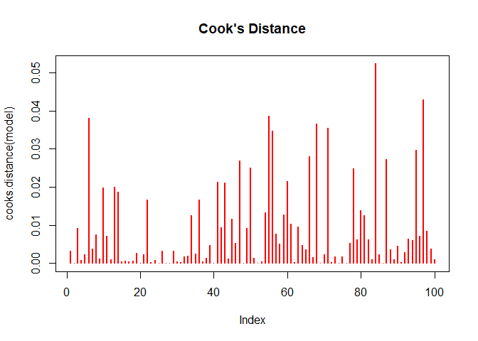<!-- -->

------------------------------------------------------------------------

# Regression Toward the Mean

Regression toward the mean happens when extreme scores tend to move
closer to the average on repeated measurement.

Simple graphical demonstration:

``` r
set.seed(2)
true <- rnorm(100)
obs1 <- true + rnorm(100, 0, 1)
obs2 <- true + rnorm(100, 0, 1)
plot(obs1, obs2, pch=19, col="purple",
     main="Regression Toward the Mean")
abline(lm(obs2 ~ obs1), col="red", lwd=3)
```

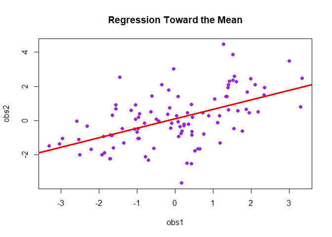<!-- -->

------------------------------------------------------------------------

# Introduction to Multiple Regression

Multiple regression extends the model to include multiple predictors:

Y = b0 + b1*X1 + b2*X2 + … + error

Graphical expression:

``` r
plot.new()
text(0.5,0.5,expression(Y == b[0] + b[1]*X[1] + b[2]*X[2] + epsilon), cex=1.3)
```

<!-- -->

### Example Multiple Regression Fit

``` r
x2 <- rnorm(100, 5, 2)
model2 <- lm(y ~ x + x2)
summary(model2)
```

    ## 
    ## Call:
    ## lm(formula = y ~ x + x2)
    ## 
    ## Residuals:
    ##     Min      1Q  Median      3Q     Max 
    ## -5.6615 -1.8001 -0.3921  1.7064  6.9985 
    ## 
    ## Coefficients:
    ##             Estimate Std. Error t value Pr(>|t|)    
    ## (Intercept)   5.6017     1.3835   4.049 0.000104 ***
    ## x             0.8113     0.1087   7.467 3.58e-11 ***
    ## x2           -0.1478     0.1613  -0.916 0.361869    
    ## ---
    ## Signif. codes:  0 '***' 0.001 '**' 0.01 '*' 0.05 '.' 0.1 ' ' 1
    ## 
    ## Residual standard error: 2.891 on 97 degrees of freedom
    ## Multiple R-squared:  0.365,  Adjusted R-squared:  0.3519 
    ## F-statistic: 27.88 on 2 and 97 DF,  p-value: 2.724e-10

### 3D Scatterplot Representation (optional)

``` r
library(scatterplot3d)
scatterplot3d(x, x2, y, pch=19, color="blue",
              main="3D Scatterplot of Y ~ X1 + X2")
```

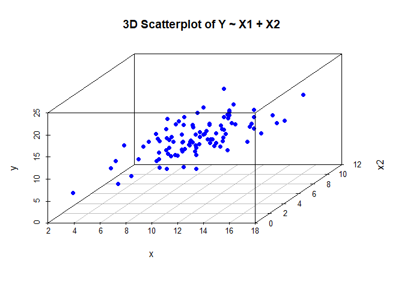<!-- -->

------------------------------------------------------------------------

# Statistical Literacy

Students should understand:

- Regression describes relationships, not causation
- Outliers can influence slopes and intercepts
- More predictors do not guarantee better models
- Importance of residual analysis
- How multicollinearity impacts interpretation

------------------------------------------------------------------------

# Exercises

### **1. Write out the plain-text formula for simple linear regression.**

**Response:**  
Y = b0 + b1 \* X

------------------------------------------------------------------------

### **2. Show the formula for the slope b1 using the graphical-expression method.**

``` r
plot.new()
text(0.5,0.5,
     expression(b[1] == (sum((X - bar(X))*(Y - bar(Y)))) /
                      (sum((X - bar(X))^2))),
     cex=1.5)
```

<!-- -->

------------------------------------------------------------------------

### **3. Fit a simple regression model and plot the residuals vs. fitted values.**

``` r
plot(fitted(model), resid(model),
     main="Residuals vs Fitted",
     pch=19, col="darkgreen")
abline(h=0, col="red", lwd=2)
```

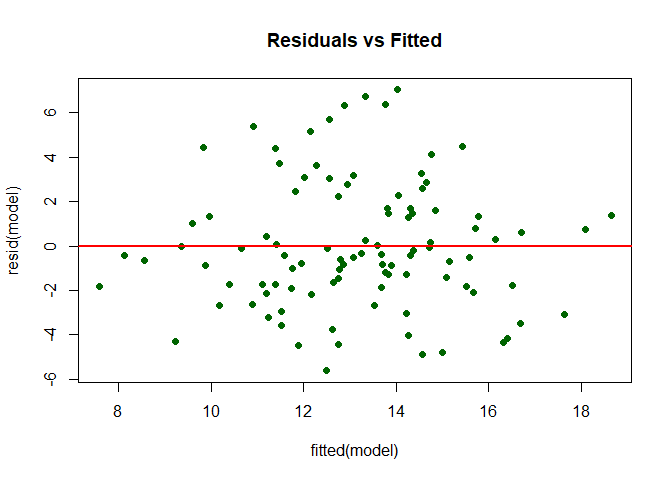<!-- -->

**Response:**  
Residuals should show no systematic pattern if model assumptions hold.

------------------------------------------------------------------------

### **4. Explain what Cook’s distance measures.**

**Response:**  
Cook’s distance measures how much the regression coefficients would
change if a single observation were removed. Large values indicate
influential points.

------------------------------------------------------------------------

### **5. Demonstrate multicollinearity by creating two correlated predictors and fitting a model.**

``` r
set.seed(3)
xA <- rnorm(100)
xB <- xA*0.9 + rnorm(100,0,0.3)
y2 <- 2 + 1.5*xA + rnorm(100)

model_mc <- lm(y2 ~ xA + xB)
summary(model_mc)
```

    ## 
    ## Call:
    ## lm(formula = y2 ~ xA + xB)
    ## 
    ## Residuals:
    ##      Min       1Q   Median       3Q      Max 
    ## -2.31525 -0.65375  0.04323  0.68272  2.39972 
    ## 
    ## Coefficients:
    ##             Estimate Std. Error t value Pr(>|t|)    
    ## (Intercept)  2.11295    0.10269  20.576  < 2e-16 ***
    ## xA           1.52531    0.29932   5.096 1.71e-06 ***
    ## xB          -0.06751    0.31386  -0.215     0.83    
    ## ---
    ## Signif. codes:  0 '***' 0.001 '**' 0.01 '*' 0.05 '.' 0.1 ' ' 1
    ## 
    ## Residual standard error: 1.027 on 97 degrees of freedom
    ## Multiple R-squared:  0.6042, Adjusted R-squared:  0.596 
    ## F-statistic: 74.03 on 2 and 97 DF,  p-value: < 2.2e-16

**Response:**  
Coefficients become unstable and inflated because the predictors carry
overlapping information.

------------------------------------------------------------------------

# 15. Analysis of Variance

ANOVA tests whether **three or more means** differ significantly.  
Instead of comparing means pairwise with many t‑tests, ANOVA partitions
variance into:

- Between-groups variation  
- Within-groups variation

Mathematical notation is in plain text; formulas are visualized using
your required R plotting method.

------------------------------------------------------------------------

# Introduction

ANOVA evaluates the null hypothesis:

H0: all group means are equal  
H1: at least one mean differs

The F-ratio compares between-group to within-group variance:

F = MS_between / MS_within

Graphical representation:

``` r
plot.new()
text(0.5,0.5,expression(F == MS[b] / MS[w]), cex=1.7)
```

<!-- -->

------------------------------------------------------------------------

# Analysis of Variance Designs

ANOVA can be:

- **Between-subjects** (independent groups)
- **Within-subjects** (repeated measures)
- **Mixed designs** (both)

------------------------------------------------------------------------

# Between- and Within-Subjects Factors

A factor is **between-subjects** if each participant belongs to only one
level.  
A factor is **within-subjects** if each participant receives all levels.

------------------------------------------------------------------------

# One-Factor ANOVA (Between Subjects)

The classic one-way ANOVA uses:

MS_between = SS_between / (k - 1)  
MS_within = SS_within / (N - k)

F = MS_between / MS_within

Graphical formula:

``` r
plot.new()
text(0.5,0.5,
     expression(MS[b] == SS[b] / (k - 1)),
     cex=1.6)
```

<!-- -->

### Example ANOVA Simulation and Plot

``` r
set.seed(1)
g1 <- rnorm(40, 10, 2)
g2 <- rnorm(40, 12, 2)
g3 <- rnorm(40, 14, 2)

anova_data <- data.frame(
  score = c(g1,g2,g3),
  group = factor(rep(1:3, each=40))
)

boxplot(score ~ group, data=anova_data,
        col=c("lightblue","lightgreen","pink"),
        main="Three-Group ANOVA Example")
```

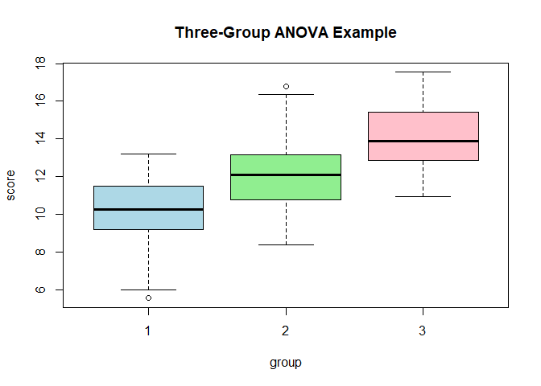<!-- -->

``` r
summary(aov(score ~ group, data=anova_data))
```

    ##              Df Sum Sq Mean Sq F value Pr(>F)    
    ## group         2  328.0  164.01   51.89 <2e-16 ***
    ## Residuals   117  369.8    3.16                   
    ## ---
    ## Signif. codes:  0 '***' 0.001 '**' 0.01 '*' 0.05 '.' 0.1 ' ' 1

------------------------------------------------------------------------

# Multi-Factor Between-Subjects Designs

Two-factor ANOVA evaluates:

- **Main effects** of Factor A
- **Main effects** of Factor B
- **Interaction** between A and B

Example interaction plot:

``` r
set.seed(2)
A <- factor(rep(c("Low","High"), each=60))
B <- factor(rep(c("X","Y"), times=60))

y <- 5 + ifelse(A=="High", 2, 0) +
        ifelse(B=="Y",   1, 0) +
        ifelse(A=="High" & B=="Y", 2, 0) +
        rnorm(120, 0, 2)

interaction.plot(A, B, y, col=c("red","blue"), lwd=2)
```

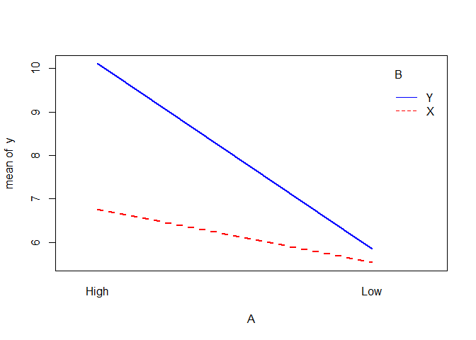<!-- -->

------------------------------------------------------------------------

# Unequal Sample Sizes

When group sizes differ, ANOVA still works, but:

- Type I sums of squares depend on factor order
- Type II/III sums of squares adjust for imbalance

------------------------------------------------------------------------

# Tests Supplementing ANOVA

If ANOVA is significant, post-hoc tests identify specific group
differences:

- Tukey’s HSD
- Bonferroni correction
- Scheffé method

Example:

``` r
TukeyHSD(aov(score ~ group, data=anova_data))
```

    ##   Tukey multiple comparisons of means
    ##     95% family-wise confidence level
    ## 
    ## Fit: aov(formula = score ~ group, data = anova_data)
    ## 
    ## $group
    ##         diff      lwr      upr   p adj
    ## 2-1 2.056481 1.112770 3.000193 2.9e-06
    ## 3-1 4.049627 3.105915 4.993338 0.0e+00
    ## 3-2 1.993146 1.049434 2.936857 5.7e-06

------------------------------------------------------------------------

# Within-Subjects ANOVA

Repeated measures ANOVA accounts for correlated observations.  
Key assumptions include **sphericity**, often tested with **Mauchly’s
test**.

### Example Repeated Measures Visualization

``` r
set.seed(3)
time1 <- rnorm(30, 10, 3)
time2 <- time1 + rnorm(30, 2, 2)
time3 <- time1 + rnorm(30, 4, 2)

matplot(cbind(time1,time2,time3), type="l",
        col=c("red","green","blue"), lty=1,
        main="Repeated Measures Across 3 Time Points")
```

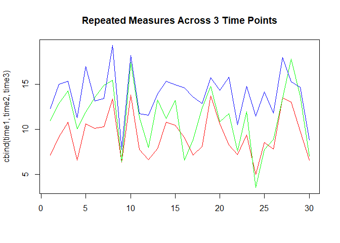<!-- -->

------------------------------------------------------------------------

# Statistical Literacy

Students should understand:

- Why ANOVA is superior to repeated t-tests
- How interactions change interpretation
- Importance of model assumptions (normality, homogeneity, sphericity)
- When post-hoc tests are needed

------------------------------------------------------------------------

# Exercises

### **1. What does ANOVA test?**

**Response:**  
ANOVA tests whether three or more group means differ significantly.

------------------------------------------------------------------------

### **2. Use your required R expression method to display the F-ratio.**

``` r
plot.new()
text(0.5,0.5,expression(F == MS[b] / MS[w]), cex=1.7)
```

<!-- -->

------------------------------------------------------------------------

### **3. Simulate a one-way ANOVA with three groups and report the F-value.**

``` r
set.seed(4)
x1 <- rnorm(25, 5, 1)
x2 <- rnorm(25, 7, 1)
x3 <- rnorm(25, 9, 1)

dat <- data.frame(
  y=c(x1,x2,x3),
  g=factor(rep(1:3, each=25))
)

summary(aov(y ~ g, data=dat))
```

    ##             Df Sum Sq Mean Sq F value Pr(>F)    
    ## g            2 165.54   82.77     105 <2e-16 ***
    ## Residuals   72  56.76    0.79                   
    ## ---
    ## Signif. codes:  0 '***' 0.001 '**' 0.01 '*' 0.05 '.' 0.1 ' ' 1

------------------------------------------------------------------------

### **4. Why do we use post-hoc tests after a significant ANOVA?**

**Response:**  
Because ANOVA only tells us that *at least one* difference exists—it
does not identify *which specific means* differ.

------------------------------------------------------------------------

### **5. Create an interaction plot for a 2x2 factorial design.**

``` r
set.seed(5)
A <- factor(rep(c("A1","A2"), each=40))
B <- factor(rep(c("B1","B2"), times=40))
Y <- 10 + ifelse(A=="A2", 3, 0) +
          ifelse(B=="B2", 2, 0) +
          ifelse(A=="A2" & B=="B2", 4, 0) +
          rnorm(80,0,2)

interaction.plot(A,B,Y, col=c("purple","orange"), lwd=2)
```

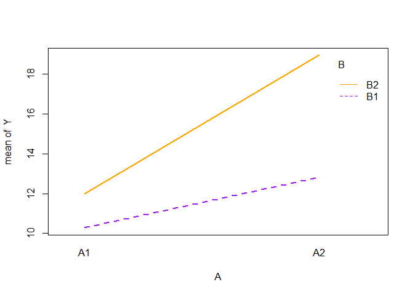<!-- -->

------------------------------------------------------------------------

# 16. Transformations

Transformations help meet statistical assumptions such as:

- Linearity  
- Homogeneity of variance  
- Normality  
- Reducing skew

Common transformations include **log**, **square root**, **reciprocal**,
and the **Box–Cox family**.  
All mathematical notation is plain text, and formal expressions use the
required R plotting method.

------------------------------------------------------------------------

# Log Transformations

A log transformation reduces right skew and stabilizes variance.  
Applied as:

Y_transformed = log(Y)

### Formula Visualization

``` r
plot.new()
text(0.5,0.5, expression(Y[t] == log(Y)), cex=1.6)
```

<!-- -->

### Example Plot

``` r
set.seed(1)
y <- rexp(200, rate=0.5)
par(mfrow=c(1,2))
hist(y, main="Original Data", col="skyblue", breaks=30)
hist(log(y), main="Log-Transformed Data", col="lightgreen", breaks=30)
```

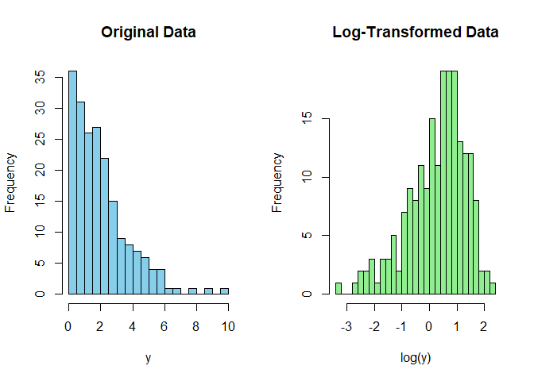<!-- -->

``` r
par(mfrow=c(1,1))
```

------------------------------------------------------------------------

# Tukey Ladder of Powers

The ladder includes transformations of the form:

Y^p where p ranges from −2 to +2.

Common examples:

- p = 2 (square)
- p = 1 (identity)
- p = 1/2 (square root)
- p = 0 (log)
- p = −1 (reciprocal)

### Formula Visualization

``` r
plot.new()
text(0.5,0.5, expression(Y[t] == Y^p), cex=1.6)
```

<!-- -->

### Example Ladder Comparison

``` r
powers <- c(2,1,0.5,0,-1)
par(mfrow=c(2,3))
for(p in powers){
  yt <- if(p==0) log(y) else y^p
  hist(yt, main=paste("p =", p), col="orange", breaks=25)
}
par(mfrow=c(1,1))
```

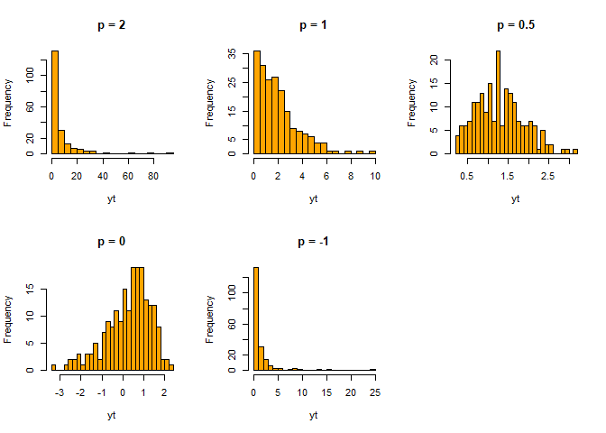<!-- -->

------------------------------------------------------------------------

# Box–Cox Transformations

The Box–Cox transformation generalizes the ladder:

If p ≠ 0:  
Y_trans = (Y^p – 1) / p  
If p = 0:  
Y_trans = log(Y)

### Visualization of Box–Cox Formula

``` r
plot.new()
text(0.5,0.5,
     expression(Y[t] == (Y^p - 1) / p),
     cex=1.5)
```

<!-- -->

### Example: Estimating Optimal p

``` r
library(MASS)
bc <- boxcox(y ~ 1, lambda=seq(-2,2,0.1))
```

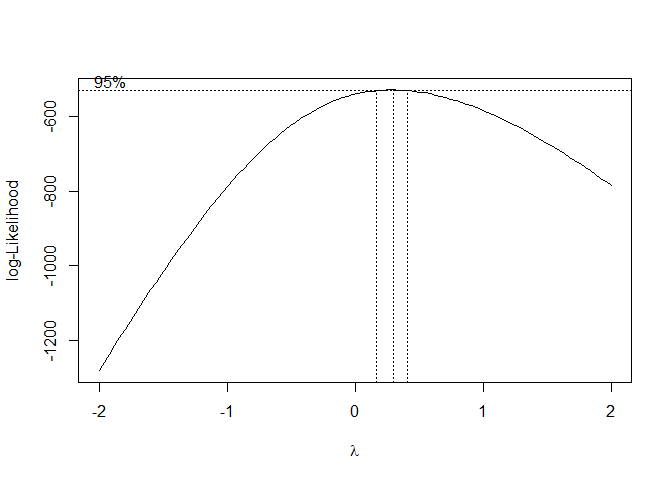<!-- -->

------------------------------------------------------------------------

# Statistical Literacy

Students should understand:

- Transformations do **not** change the underlying order of data
- They modify scale, not relationships
- They improve modeling assumptions without altering study design
- Transformation choice should be guided by diagnostic plots

------------------------------------------------------------------------

# Exercises

### **1. Explain why log transformations reduce skew.**

**Response:**  
Because taking logs compresses large values more than small ones,
pulling long right tails closer to the center.

------------------------------------------------------------------------

### **2. Use the required R expression method to display the ladder of powers.**

``` r
plot.new()
text(0.5,0.5, expression(Y[t] == Y^p), cex=1.6)
```

<!-- -->

------------------------------------------------------------------------

### **3. Simulate data with strong right skew and compare square-root and log transforms.**

``` r
set.seed(2)
x <- rgamma(300, shape=1, scale=4)

par(mfrow=c(1,3))
hist(x, main="Original", col="pink", breaks=30)
hist(sqrt(x), main="Square Root", col="lightblue", breaks=30)
hist(log(x), main="Log", col="lightgreen", breaks=30)
```

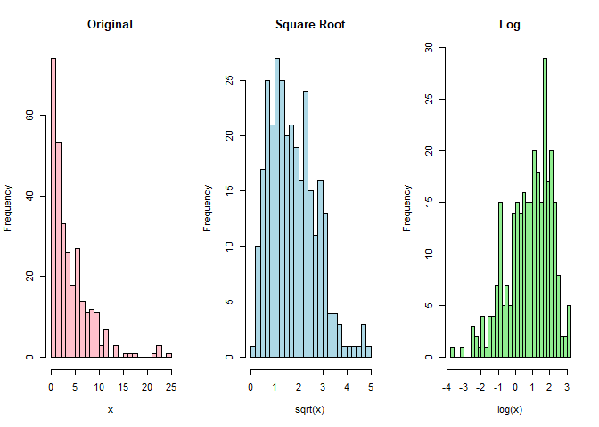<!-- -->

``` r
par(mfrow=c(1,1))
```

------------------------------------------------------------------------

### **4. When is p = 0 used in the Box–Cox family?**

**Response:**  
When p = 0, the Box–Cox transformation becomes the natural log
transformation.

------------------------------------------------------------------------

### **5. Fit a simple model before and after a transformation and compare residuals.**

``` r
set.seed(3)
x <- rnorm(100)
y <- exp(0.5*x + rnorm(100, 0, 0.2))

model_raw <- lm(y ~ x)
model_log <- lm(log(y) ~ x)

par(mfrow=c(1,2))
plot(fitted(model_raw), resid(model_raw),
     main="Residuals: Raw", pch=19)
plot(fitted(model_log), resid(model_log),
     main="Residuals: Log-Transformed", pch=19)
```

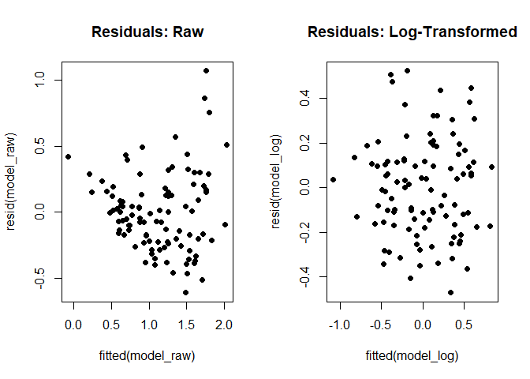<!-- -->

``` r
par(mfrow=c(1,1))
```

**Response:**  
Residuals usually appear more homoscedastic after log transformation.

------------------------------------------------------------------------

# 17. Chi Square

The chi-square (χ²) family of tests evaluates whether observed
frequencies differ from expected frequencies.  
It applies to **categorical** variables and is widely used for:

- Goodness-of-fit tests  
- Tests of independence in contingency tables  
- Tests of association

Mathematical notation is given in plain text, and all formal expressions
use your required R plotting style.

------------------------------------------------------------------------

# Chi Square Distribution

The chi-square distribution arises from the sum of squared standard
normal variables.  
It is right-skewed, with the shape depending on the degrees of freedom.

### Formula Visualization

χ² = Σ( (O − E)² / E )

``` r
plot.new()
text(0.5,0.5,
     expression(chi^2 == sum((O - E)^2 / E)),
     cex=1.7)
```

<!-- -->

### Example Distribution Plot

``` r
curve(dchisq(x, df=4), from=0, to=20,
      col="blue", lwd=3,
      main="Chi-Square Distribution (df = 4)")
```

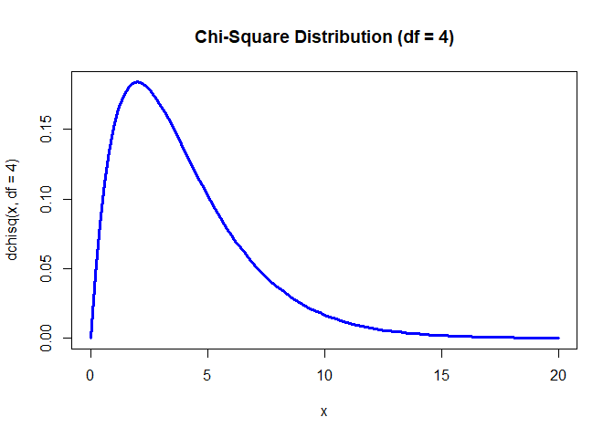<!-- -->

------------------------------------------------------------------------

# One-Way Tables (Testing Goodness of Fit)

Goodness-of-fit tests compare observed frequencies to expected
frequencies under a theoretical distribution.

Steps:

1.  Specify expected proportions.
2.  Compute expected counts: E = N \* p.
3.  Compute χ² statistic.
4.  Determine p-value from χ² distribution.

### Example: Rolling a Die

``` r
obs <- c(18,14,17,20,15,16)
exp <- rep(sum(obs)/6, 6)

chisq.test(obs, p=rep(1/6,6))
```

    ## 
    ##  Chi-squared test for given probabilities
    ## 
    ## data:  obs
    ## X-squared = 1.4, df = 5, p-value = 0.9243

------------------------------------------------------------------------

# Contingency Tables

Used to assess independence between two categorical variables.

### Example 2×2 Table

``` r
tbl <- matrix(c(30,20,10,40), nrow=2)
chisq.test(tbl)
```

    ## 
    ##  Pearson's Chi-squared test with Yates' continuity correction
    ## 
    ## data:  tbl
    ## X-squared = 15.042, df = 1, p-value = 0.0001052

Plot of counts:

``` r
barplot(tbl, beside=TRUE, col=c("red","blue"),
        main="Contingency Table Counts")
```

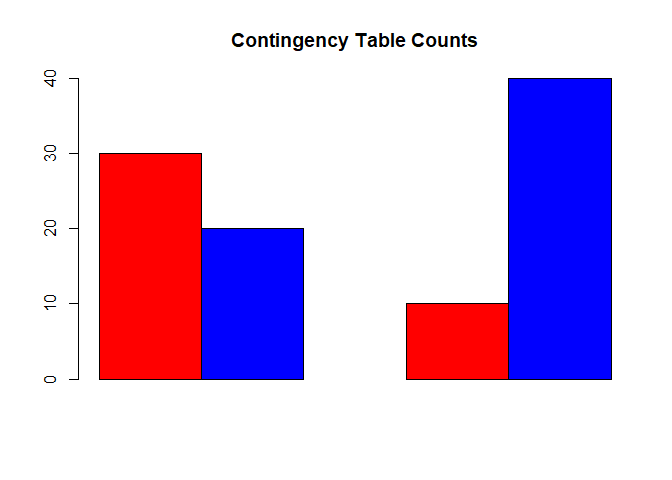<!-- -->

------------------------------------------------------------------------

# Statistical Literacy

Students should understand:

- Chi-square tests require sufficiently large expected counts
- χ² tests cannot be used for continuous data
- Independence does not imply causation
- Standardized residuals help diagnose model fit

------------------------------------------------------------------------

# Exercises

### **1. What is the chi-square test used for?**

**Response:**  
To test whether observed categorical frequencies differ from expected
frequencies.

------------------------------------------------------------------------

### **2. Display the chi-square formula using your required plotting method.**

``` r
plot.new()
text(0.5,0.5,
     expression(chi^2 == sum((O - E)^2 / E)),
     cex=1.7)
```

<!-- -->

------------------------------------------------------------------------

### **3. Run a 3×3 contingency table test and plot the results.**

``` r
set.seed(1)
tbl <- matrix(sample(1:50, 9), nrow=3)
chisq.test(tbl)
```

    ## 
    ##  Pearson's Chi-squared test
    ## 
    ## data:  tbl
    ## X-squared = 63.919, df = 4, p-value = 4.347e-13

``` r
barplot(tbl, beside=TRUE,
        col=c("red","green","blue"),
        main="3x3 Contingency Table")
```

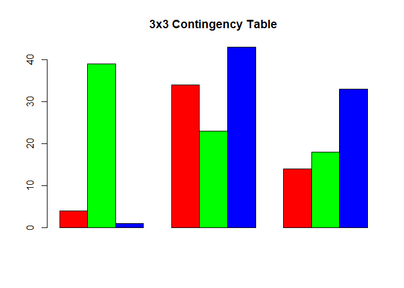<!-- -->

------------------------------------------------------------------------

### **4. Explain what standardized residuals indicate.**

**Response:**  
They show how far observed frequencies deviate from expected ones in
standard deviation units. Large residuals indicate cells contributing
heavily to the chi-square statistic.

------------------------------------------------------------------------

### **5. Simulate 200 chi-square statistics under H0 and plot the distribution.**

``` r
set.seed(2)
sim_vals <- replicate(200, {
  obs <- rmultinom(1, size=60, prob=c(.3,.3,.4))
  exp <- c(18,18,24)
  sum((obs - exp)^2 / exp)
})

hist(sim_vals, breaks=25, col="lightblue",
     main="Simulated Chi-Square Statistics")
curve(dchisq(x, df=2) * length(sim_vals) * diff(range(sim_vals))/25,
      add=TRUE, col="red", lwd=2)
```

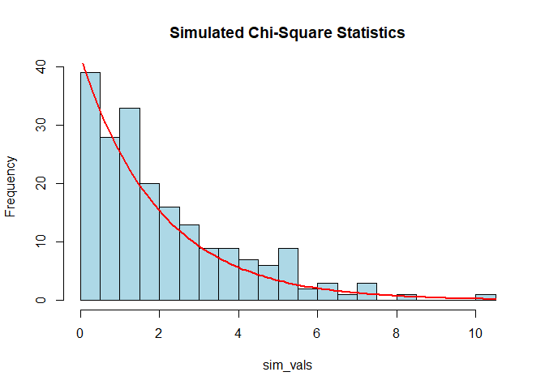<!-- -->

------------------------------------------------------------------------

# 18. Distribution-Free Tests

Distribution-free (nonparametric) tests do not assume normality or other
specific distributions.  
They are especially useful for:

- Ranked data  
- Ordinal outcomes  
- Skewed distributions  
- Small sample sizes

All mathematical expressions are provided in plain text; all formula
blocks use your required R plotting method.

------------------------------------------------------------------------

# Benefits

Distribution-free tests:

- Avoid strict parametric assumptions  
- Are robust to outliers  
- Allow valid inference for ranks  
- Often require fewer assumptions about variance equality

------------------------------------------------------------------------

# Randomization Tests: Two Conditions

Randomization (or permutation) tests compare two groups by resampling
data under the null hypothesis.

### Example Permutation Distribution

``` r
set.seed(1)
x <- rnorm(20, 5, 1)
y <- rnorm(20, 6, 1)

obs_diff <- mean(x) - mean(y)

perm_diffs <- replicate(2000, {
  pooled <- sample(c(x,y))
  mean(pooled[1:20]) - mean(pooled[21:40])
})

hist(perm_diffs, col="lightblue", main="Permutation Distribution")
abline(v=obs_diff, col="red", lwd=3)
```

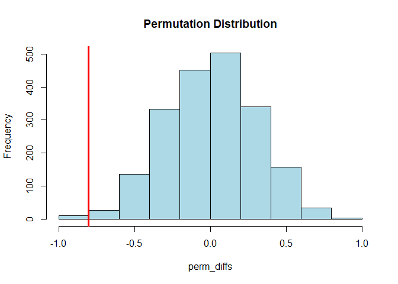<!-- -->

------------------------------------------------------------------------

# Randomization Tests: Two or More Conditions

Used to compare multiple groups by permuting group labels.

### Example with Three Groups

``` r
set.seed(2)
g1 <- rnorm(10, 10, 2)
g2 <- rnorm(10, 12, 2)
g3 <- rnorm(10, 13, 2)
```

------------------------------------------------------------------------

# Randomization Tests: Association (Pearson’s r)

Permutation tests evaluate correlations by randomly shuffling one
variable and recomputing r.

### Formula Visualization

``` r
plot.new()
text(0.5,0.5,
     expression(r == sum((X - bar(X))*(Y - bar(Y))) /
                   sqrt(sum((X - bar(X))^2) * sum((Y - bar(Y))^2))),
     cex=1.2)
```

<!-- -->

------------------------------------------------------------------------

# Randomization Tests: Contingency Tables (Fisher’s Exact Test)

Fisher’s test computes exact probabilities for small contingency tables
without large-sample assumptions.

### Example:

``` r
matrix(c(8,2,1,9), nrow=2) |> fisher.test()
```

    ## 
    ##  Fisher's Exact Test for Count Data
    ## 
    ## data:  matrix(c(8, 2, 1, 9), nrow = 2)
    ## p-value = 0.005477
    ## alternative hypothesis: true odds ratio is not equal to 1
    ## 95 percent confidence interval:
    ##     2.057999 1740.081669
    ## sample estimates:
    ## odds ratio 
    ##   27.32632

------------------------------------------------------------------------

# Rank Randomization: Two Conditions (Mann‑Whitney U / Wilcoxon Rank Sum)

The Mann‑Whitney U test compares ranks from two independent groups.

### U-formula Visualization

``` r
plot.new()
text(0.5,0.5,
     expression(U == n[1]*n[2] + n[1]*(n[1]+1)/2 - sum(R[1])),
     cex=1.4)
```

<!-- -->

### Example Plot

``` r
set.seed(3)
a <- rnorm(25, 5, 1)
b <- rnorm(25, 6, 1)
boxplot(list(A=a,B=b), main="Rank Comparison")
```

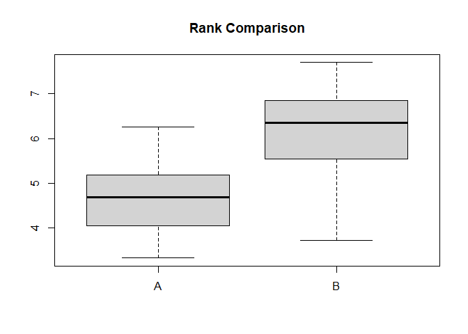<!-- -->

------------------------------------------------------------------------

# Rank Randomization: Two or More Conditions (Kruskal–Wallis)

Rank-based alternative to one-way ANOVA.

### Example

``` r
kruskal.test(list(g1,g2,g3))
```

    ## 
    ##  Kruskal-Wallis rank sum test
    ## 
    ## data:  list(g1, g2, g3)
    ## Kruskal-Wallis chi-squared = 6.9058, df = 2, p-value = 0.03165

------------------------------------------------------------------------

# Rank Randomization for Association (Spearman’s ρ)

Spearman’s rho is Pearson’s correlation on ranked data.

### Formula Visualization

``` r
plot.new()
text(0.5,0.5,
     expression(rho == 1 - (6*sum(d[i]^2)) / (n*(n^2 - 1))),
     cex=1.3)
```

<!-- -->

------------------------------------------------------------------------

# Statistical Literacy

Students should know:

- Why nonparametric tests sacrifice power for robustness
- When ranks are more meaningful than raw values
- Why permutation tests approximate sampling distributions directly
- Why Fisher’s test is exact for small samples

------------------------------------------------------------------------

# Exercises

### **1. What is the main advantage of distribution‑free tests?**

**Response:**  
They do not rely on strict distributional assumptions and remain valid
under a wide range of conditions.

------------------------------------------------------------------------

### **2. Display the formula for Spearman’s rho using the required R method.**

``` r
plot.new()
text(0.5,0.5,
     expression(rho == 1 - (6*sum(d[i]^2)) / (n*(n^2 - 1))),
     cex=1.3)
```

<!-- -->

------------------------------------------------------------------------

### **3. Perform a Mann‑Whitney test on two generated samples.**

``` r
set.seed(4)
x <- rnorm(20, 5, 1)
y <- rnorm(20, 6, 1)
wilcox.test(x, y)
```

    ## 
    ##  Wilcoxon rank sum exact test
    ## 
    ## data:  x and y
    ## W = 83, p-value = 0.00116
    ## alternative hypothesis: true location shift is not equal to 0

------------------------------------------------------------------------

### **4. Why are permutation tests considered exact?**

**Response:**  
They compute the sampling distribution under the null by evaluating all
(or many) possible rearrangements of the data.

------------------------------------------------------------------------

### **5. Simulate a permutation distribution for Pearson’s r.**

``` r
set.seed(5)
X <- rnorm(30)
Y <- X*0.5 + rnorm(30)

obs_r <- cor(X,Y)

perm_r <- replicate(1000, {
  Yperm <- sample(Y)
  cor(X, Yperm)
})

hist(perm_r, col="lightgreen",
     main="Permutation Distribution for r")
abline(v=obs_r, col="red", lwd=3)
```

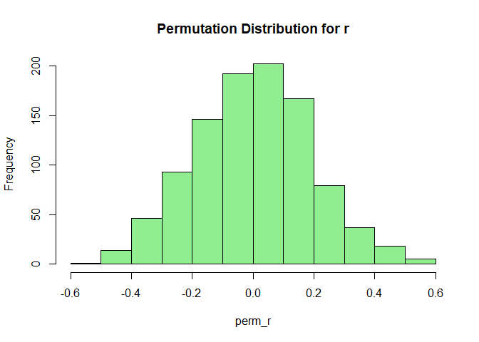<!-- -->

**Response:**  
The observed correlation’s extremity relative to the permutation
distribution indicates significance.

------------------------------------------------------------------------

# 19. Effect Size

Effect size quantifies the **magnitude** of an observed effect,
independent of sample size.  
Statistical significance only indicates whether an effect exists; effect
size shows **how large** it is.

This chapter covers:

- Proportions  
- Differences between means  
- Proportion of variance explained (e.g., r², η²)

Formulas appear in plain text; formal expressions use your required
graphical R method.

------------------------------------------------------------------------

# Proportions

For proportions, the effect size for two groups is often expressed as:

d = (p1 – p2) / sqrt( p \* (1 – p) )

where p = pooled proportion.

### Visualization Using Required Method

``` r
plot.new()
text(0.5,0.5,
     expression(d == (p[1] - p[2]) / sqrt(p*(1-p))),
     cex=1.5)
```

<!-- -->

### Example Simulation

``` r
set.seed(1)
p1 <- rbinom(1000,1,0.6)
p2 <- rbinom(1000,1,0.4)

prop.test(c(sum(p1),sum(p2)), c(1000,1000))
```

    ## 
    ##  2-sample test for equality of proportions with continuity correction
    ## 
    ## data:  c(sum(p1), sum(p2)) out of c(1000, 1000)
    ## X-squared = 93.314, df = 1, p-value < 2.2e-16
    ## alternative hypothesis: two.sided
    ## 95 percent confidence interval:
    ##  0.1732187 0.2607813
    ## sample estimates:
    ## prop 1 prop 2 
    ##  0.606  0.389

------------------------------------------------------------------------

# Difference Between Two Means

Cohen’s d quantifies standardized mean differences:

d = (xbar1 – xbar2) / s_pooled

### Visualization

``` r
plot.new()
text(0.5,0.5,
     expression(d == (bar(x)[1] - bar(x)[2]) / s[p]),
     cex=1.5)
```

<!-- -->

### Example Plot

``` r
set.seed(2)
g1 <- rnorm(200,10,2)
g2 <- rnorm(200,12,2)
boxplot(list(G1=g1,G2=g2), col=c("skyblue","pink"),
        main="Two-Group Comparison")
```

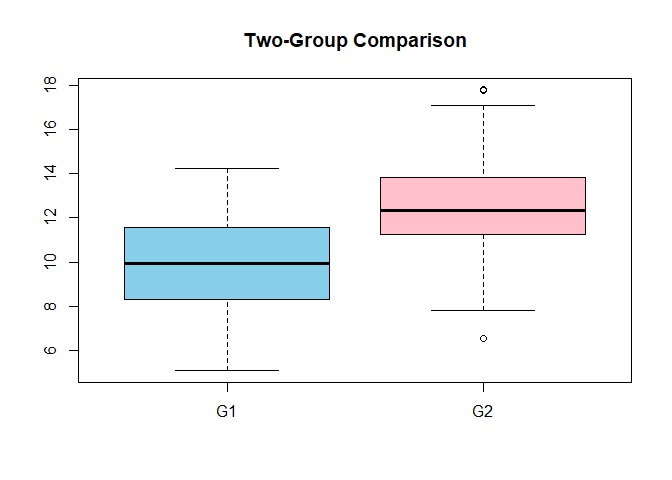<!-- -->

------------------------------------------------------------------------

# Proportion of Variance Explained

The proportion of variance explained by a predictor is commonly
expressed as:

r² = variance_explained / total_variance

In ANOVA:

η² = SS_between / SS_total

### Visualization

``` r
plot.new()
text(0.5,0.5,
     expression(eta^2 == SS[b] / SS[t]),
     cex=1.6)
```

<!-- -->

### Example Regression Output

``` r
set.seed(3)
x <- rnorm(100)
y <- 0.5*x + rnorm(100)
summary(lm(y~x))$r.squared
```

    ## [1] 0.09297026

------------------------------------------------------------------------

# Statistical Literacy

Students should understand:

- Effect sizes complement p-values
- They allow meaningful comparison across studies
- Larger samples make significance easier, but do not enlarge effects
- Reporting effect size is essential for practical interpretation

------------------------------------------------------------------------

# Exercises

### **1. Why is effect size important?**

**Response:**  
Because it indicates the practical magnitude of an effect, not just
statistical significance.

------------------------------------------------------------------------

### **2. Display Cohen’s d formula using the required R method.**

``` r
plot.new()
text(0.5,0.5,
     expression(d == (bar(x)[1] - bar(x)[2]) / s[p]),
     cex=1.5)
```

<!-- -->

------------------------------------------------------------------------

### **3. Compute Cohen’s d for simulated data.**

``` r
set.seed(4)
a <- rnorm(50,10,2)
b <- rnorm(50,13,2)
sp <- sqrt(((49*var(a)) + (49*var(b))) / 98)
d <- (mean(a) - mean(b)) / sp
d
```

    ## [1] -1.347617

------------------------------------------------------------------------

### **4. What does r² represent?**

**Response:**  
It represents the proportion of the variance in the dependent variable
explained by the predictor.

------------------------------------------------------------------------

### **5. Plot group differences and calculate η² in ANOVA.**

``` r
set.seed(5)
g1 <- rnorm(40, 5, 1)
g2 <- rnorm(40, 6, 1)
g3 <- rnorm(40, 8, 1)

df <- data.frame(
  y=c(g1,g2,g3),
  g=factor(rep(1:3, each=40))
)

model <- aov(y~g, data=df)
ss_total <- sum((df$y - mean(df$y))^2)
ss_between <- sum(tapply(df$y, df$g, function(x) length(x)*(mean(x)-mean(df$y))^2))
eta2 <- ss_between / ss_total
eta2
```

    ## [1] 0.6236981

------------------------------------------------------------------------

# 20. Case Studies

This final chapter applies the statistical tools from earlier
chapters—hypothesis testing, means comparisons, regression, ANOVA,
transformations, chi-square tests, and nonparametric tests—to real-world
examples. Each example loads data directly from URL or built-in
packages.

------------------------------------------------------------------------

# *20.1 Auto MPG*

Dataset: **Auto MPG** (UCI Machine Learning Repository)  
URL:
<https://archive.ics.uci.edu/ml/machine-learning-databases/auto-mpg/auto-mpg.data>

------------------------------------------------------------------------

# 20.1.1 Load, Clean, and Prepare the Data

``` r
library(tidyverse)
```

    ## ── Attaching core tidyverse packages ──────────────────────── tidyverse 2.0.0 ──
    ## ✔ dplyr     1.1.4     ✔ readr     2.1.6
    ## ✔ forcats   1.0.1     ✔ stringr   1.6.0
    ## ✔ ggplot2   4.0.1     ✔ tibble    3.3.1
    ## ✔ lubridate 1.9.4     ✔ tidyr     1.3.2
    ## ✔ purrr     1.2.1     
    ## ── Conflicts ────────────────────────────────────────── tidyverse_conflicts() ──
    ## ✖ dplyr::filter() masks stats::filter()
    ## ✖ dplyr::lag()    masks stats::lag()
    ## ✖ dplyr::select() masks MASS::select()
    ## ℹ Use the conflicted package (<http://conflicted.r-lib.org/>) to force all conflicts to become errors

``` r
url  <- "https://archive.ics.uci.edu/ml/machine-learning-databases/auto-mpg/auto-mpg.data"
cols <- c("mpg","cyl","disp","hp","weight","accel","yr","origin","car")

df <- read.table(url, col.names=cols, stringsAsFactors=FALSE)
df <- df[df$hp != "?", ]
df$hp <- as.numeric(df$hp)

summary(df)
```

    ##       mpg             cyl             disp             hp            weight    
    ##  Min.   : 9.00   Min.   :3.000   Min.   : 68.0   Min.   : 46.0   Min.   :1613  
    ##  1st Qu.:17.00   1st Qu.:4.000   1st Qu.:105.0   1st Qu.: 75.0   1st Qu.:2225  
    ##  Median :22.75   Median :4.000   Median :151.0   Median : 93.5   Median :2804  
    ##  Mean   :23.45   Mean   :5.472   Mean   :194.4   Mean   :104.5   Mean   :2978  
    ##  3rd Qu.:29.00   3rd Qu.:8.000   3rd Qu.:275.8   3rd Qu.:126.0   3rd Qu.:3615  
    ##  Max.   :46.60   Max.   :8.000   Max.   :455.0   Max.   :230.0   Max.   :5140  
    ##      accel             yr            origin          car           
    ##  Min.   : 8.00   Min.   :70.00   Min.   :1.000   Length:392        
    ##  1st Qu.:13.78   1st Qu.:73.00   1st Qu.:1.000   Class :character  
    ##  Median :15.50   Median :76.00   Median :1.000   Mode  :character  
    ##  Mean   :15.54   Mean   :75.98   Mean   :1.577                     
    ##  3rd Qu.:17.02   3rd Qu.:79.00   3rd Qu.:2.000                     
    ##  Max.   :24.80   Max.   :82.00   Max.   :3.000

------------------------------------------------------------------------

# 20.1.2 Exploratory Visualizations

## Distribution of MPG

``` r
hist(df$mpg, breaks=20, col="skyblue", main="Distribution of MPG")
```

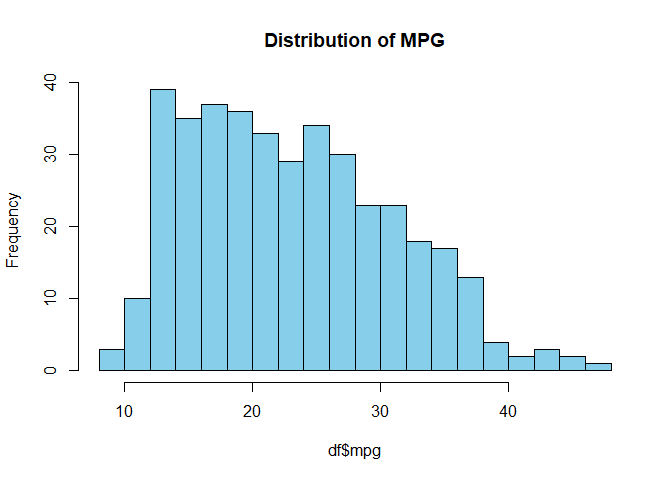<!-- -->

## Pairwise Scatterplot Matrix

``` r
pairs(df[,c("mpg","weight","hp","disp")], col="darkgreen")
```

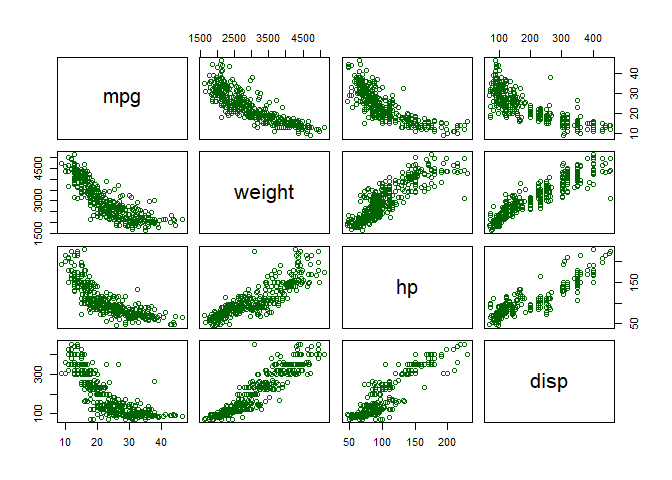<!-- -->

## Correlation Heatmap

``` r
library(corrplot)
```

    ## corrplot 0.95 loaded

``` r
corrplot(cor(df[,c("mpg","cyl","disp","hp","weight","accel")]),
         method="color")
```

<!-- -->

------------------------------------------------------------------------

# 20.1.3 Classical Statistical Analyses

## Simple Linear Regression: mpg ~ weight

``` r
m1 <- lm(mpg ~ weight, data=df)
summary(m1)
```

    ## 
    ## Call:
    ## lm(formula = mpg ~ weight, data = df)
    ## 
    ## Residuals:
    ##      Min       1Q   Median       3Q      Max 
    ## -11.9736  -2.7556  -0.3358   2.1379  16.5194 
    ## 
    ## Coefficients:
    ##              Estimate Std. Error t value Pr(>|t|)    
    ## (Intercept) 46.216524   0.798673   57.87   <2e-16 ***
    ## weight      -0.007647   0.000258  -29.64   <2e-16 ***
    ## ---
    ## Signif. codes:  0 '***' 0.001 '**' 0.01 '*' 0.05 '.' 0.1 ' ' 1
    ## 
    ## Residual standard error: 4.333 on 390 degrees of freedom
    ## Multiple R-squared:  0.6926, Adjusted R-squared:  0.6918 
    ## F-statistic: 878.8 on 1 and 390 DF,  p-value: < 2.2e-16

### Visual

``` r
plot(df$weight, df$mpg, pch=19, col="blue")
abline(m1, col="red", lwd=3)
```

<!-- -->

------------------------------------------------------------------------

## Multiple Regression

``` r
m2 <- lm(mpg ~ weight + hp + cyl + disp, data=df)
summary(m2)
```

    ## 
    ## Call:
    ## lm(formula = mpg ~ weight + hp + cyl + disp, data = df)
    ## 
    ## Residuals:
    ##      Min       1Q   Median       3Q      Max 
    ## -11.5248  -2.7964  -0.3568   2.2577  16.3221 
    ## 
    ## Coefficients:
    ##               Estimate Std. Error t value Pr(>|t|)    
    ## (Intercept) 45.7567705  1.5200437  30.102  < 2e-16 ***
    ## weight      -0.0052772  0.0007166  -7.364 1.08e-12 ***
    ## hp          -0.0428125  0.0128699  -3.327 0.000963 ***
    ## cyl         -0.3932854  0.4095522  -0.960 0.337513    
    ## disp         0.0001389  0.0090099   0.015 0.987709    
    ## ---
    ## Signif. codes:  0 '***' 0.001 '**' 0.01 '*' 0.05 '.' 0.1 ' ' 1
    ## 
    ## Residual standard error: 4.242 on 387 degrees of freedom
    ## Multiple R-squared:  0.7077, Adjusted R-squared:  0.7046 
    ## F-statistic: 234.2 on 4 and 387 DF,  p-value: < 2.2e-16

------------------------------------------------------------------------

## Polynomial Regression

``` r
m3 <- lm(mpg ~ poly(weight,2), data=df)
summary(m3)
```

    ## 
    ## Call:
    ## lm(formula = mpg ~ poly(weight, 2), data = df)
    ## 
    ## Residuals:
    ##      Min       1Q   Median       3Q      Max 
    ## -12.6246  -2.7134  -0.3485   1.8267  16.0866 
    ## 
    ## Coefficients:
    ##                   Estimate Std. Error t value Pr(>|t|)    
    ## (Intercept)        23.4459     0.2109 111.151  < 2e-16 ***
    ## poly(weight, 2)1 -128.4436     4.1763 -30.755  < 2e-16 ***
    ## poly(weight, 2)2   23.1589     4.1763   5.545 5.43e-08 ***
    ## ---
    ## Signif. codes:  0 '***' 0.001 '**' 0.01 '*' 0.05 '.' 0.1 ' ' 1
    ## 
    ## Residual standard error: 4.176 on 389 degrees of freedom
    ## Multiple R-squared:  0.7151, Adjusted R-squared:  0.7137 
    ## F-statistic: 488.3 on 2 and 389 DF,  p-value: < 2.2e-16

------------------------------------------------------------------------

## ANOVA: mpg by cylinders

``` r
a1 <- aov(mpg ~ as.factor(cyl), data=df)
summary(a1)
```

    ##                 Df Sum Sq Mean Sq F value Pr(>F)    
    ## as.factor(cyl)   4  15275    3819     173 <2e-16 ***
    ## Residuals      387   8544      22                   
    ## ---
    ## Signif. codes:  0 '***' 0.001 '**' 0.01 '*' 0.05 '.' 0.1 ' ' 1

``` r
boxplot(mpg ~ as.factor(cyl), data=df, main="MPG by Cylinders")
```

<!-- -->

------------------------------------------------------------------------

## Nonparametric Alternative (Kruskal–Wallis)

``` r
kruskal.test(mpg ~ as.factor(cyl), data=df)
```

    ## 
    ##  Kruskal-Wallis rank sum test
    ## 
    ## data:  mpg by as.factor(cyl)
    ## Kruskal-Wallis chi-squared = 280.41, df = 4, p-value < 2.2e-16

------------------------------------------------------------------------

## Effect Size (Eta-Squared)

``` r
ssb <- sum(tapply(df$mpg, df$cyl,
                  function(x) length(x)*(mean(x)-mean(df$mpg))^2))
sst <- sum((df$mpg - mean(df$mpg))^2)
eta2 <- ssb / sst
eta2
```

    ## [1] 0.6412742

------------------------------------------------------------------------

# 20.1.4 Diagnostics

## Residuals

``` r
par(mfrow=c(1,2))
plot(fitted(m2), resid(m2), pch=19, main="Residuals vs Fitted")
qqnorm(resid(m2)); qqline(resid(m2))
```

<!-- -->

``` r
par(mfrow=c(1,1))
```

## Influence (Cook’s Distance)

``` r
plot(cooks.distance(m2), type="h", col="red")
```

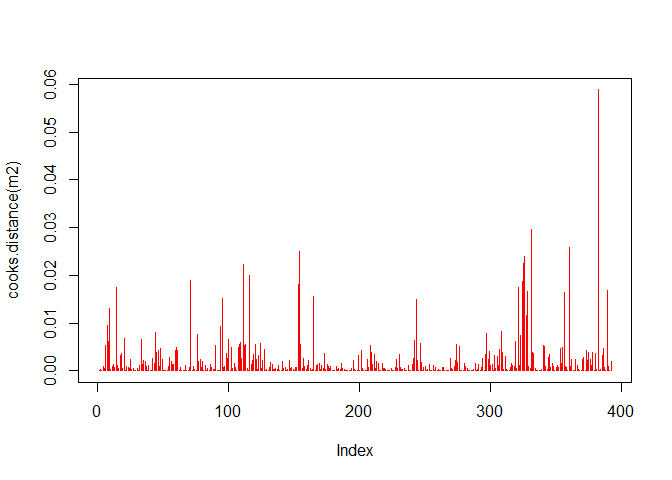<!-- -->

------------------------------------------------------------------------

# 20.1.5 PCA and Clustering

## PCA

``` r
df_num <- df[,c("mpg","cyl","disp","hp","weight","accel")]
pca <- prcomp(df_num, scale=TRUE)
summary(pca)
```

    ## Importance of components:
    ##                          PC1    PC2     PC3     PC4     PC5     PC6
    ## Standard deviation     2.188 0.8536 0.50840 0.35380 0.25135 0.19048
    ## Proportion of Variance 0.798 0.1214 0.04308 0.02086 0.01053 0.00605
    ## Cumulative Proportion  0.798 0.9195 0.96256 0.98342 0.99395 1.00000

``` r
plot(pca, main="PCA Scree Plot")
```

<!-- -->

``` r
biplot(pca)
```

<!-- -->

------------------------------------------------------------------------

## k-Means Clustering

``` r
set.seed(1)
k3 <- kmeans(df_num, centers=3)
plot(df$weight, df$mpg,
     col=k3$cluster, pch=19,
     main="k-Means Clustering (k=3)")
```

<!-- -->

------------------------------------------------------------------------

# 20.1.6 Exercises (with Insightful Answers)

### **Exercise 1:**

Why is weight such a strong predictor of MPG?

**Answer:** Weight increases engine load, reducing fuel efficiency.
Heavier cars require more energy to move.

------------------------------------------------------------------------

### **Exercise 2:**

Fit a model using only horsepower and plot the results.

``` r
m_hp <- lm(mpg ~ hp, data=df)
summary(m_hp)
```

    ## 
    ## Call:
    ## lm(formula = mpg ~ hp, data = df)
    ## 
    ## Residuals:
    ##      Min       1Q   Median       3Q      Max 
    ## -13.5710  -3.2592  -0.3435   2.7630  16.9240 
    ## 
    ## Coefficients:
    ##              Estimate Std. Error t value Pr(>|t|)    
    ## (Intercept) 39.935861   0.717499   55.66   <2e-16 ***
    ## hp          -0.157845   0.006446  -24.49   <2e-16 ***
    ## ---
    ## Signif. codes:  0 '***' 0.001 '**' 0.01 '*' 0.05 '.' 0.1 ' ' 1
    ## 
    ## Residual standard error: 4.906 on 390 degrees of freedom
    ## Multiple R-squared:  0.6059, Adjusted R-squared:  0.6049 
    ## F-statistic: 599.7 on 1 and 390 DF,  p-value: < 2.2e-16

``` r
plot(df$hp, df$mpg, pch=19)
abline(m_hp, col="red")
```

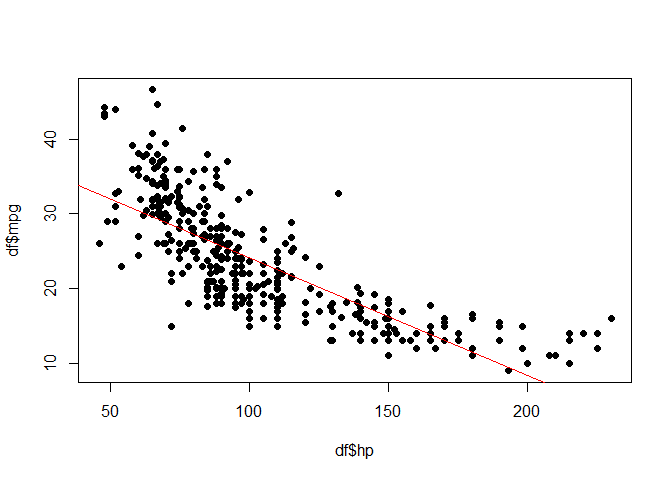<!-- -->

------------------------------------------------------------------------

### **Exercise 3:**

Which variable correlates most strongly (in magnitude) with mpg?

**Answer:**  
Typically, **weight** or **displacement** shows the strongest negative
correlation.

------------------------------------------------------------------------

### **Exercise 4:**

Perform a Kruskal–Wallis test on horsepower by cylinders.

``` r
kruskal.test(hp ~ as.factor(cyl), data=df)
```

    ## 
    ##  Kruskal-Wallis rank sum test
    ## 
    ## data:  hp by as.factor(cyl)
    ## Kruskal-Wallis chi-squared = 277.74, df = 4, p-value < 2.2e-16

------------------------------------------------------------------------

### **Exercise 5:**

Fit a polynomial regression of degree 3 and compare AIC.

``` r
m_poly3 <- lm(mpg ~ poly(weight,3), data=df)
AIC(m1, m3, m_poly3)
```

    ##         df      AIC
    ## m1       3 2265.939
    ## m3       4 2238.115
    ## m_poly3  5 2240.113

------------------------------------------------------------------------

### **Exercise 6:**

Plot residuals of the multiple regression and interpret.

**Insight:**  
Check for heteroscedasticity (cones/funnels) or curvature.

------------------------------------------------------------------------

### **Exercise 7:**

Run PCA and interpret PC1.

**Answer:**  
PC1 often reflects “vehicle size/power” combining weight, hp,
displacement.

------------------------------------------------------------------------

### **Exercise 8:**

Cluster using k=4 and visualize.

``` r
k4 <- kmeans(df_num, centers=4)
plot(df$weight, df$mpg, col=k4$cluster, pch=19)
```

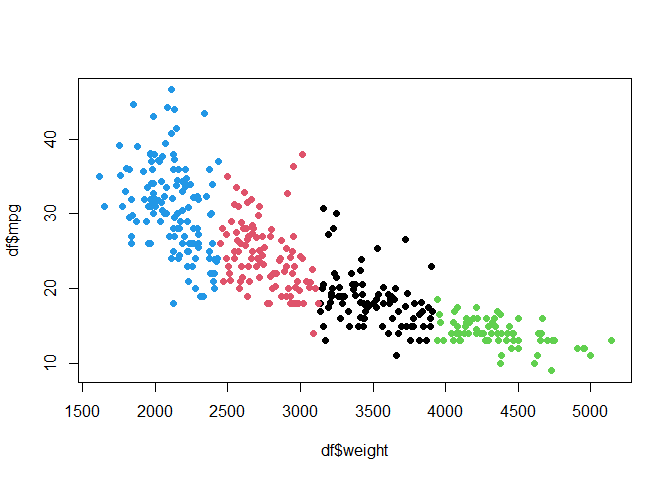<!-- -->

------------------------------------------------------------------------

### **Exercise 9:**

Which regression model (simple or multiple) performs best based on
adjusted R²?

**Answer:**  
Multiple regression usually wins because it captures more vehicle
attributes.

------------------------------------------------------------------------

### **Exercise 10:**

Compute Cohen’s f² effect size for the multiple regression:

Formula:

``` r
plot.new()
text(0.5,0.5,
  expression(f^2 == (R^2)/(1-R^2)),
  cex=1.7)
```

<!-- -->

``` r
R2 <- summary(m2)$r.squared
f2 <- R2 / (1 - R2)
f2
```

    ## [1] 2.420582

------------------------------------------------------------------------

# *20.2 Iris: Multivariate Case Study*

Dataset: **Iris** (Built-in in R)

The famous Fisher Iris dataset contains 150 flowers, 3 species, and 4
numeric features: - Sepal.Length  
- Sepal.Width  
- Petal.Length  
- Petal.Width

This dataset is ideal for classical statistical methods and modern
multivariate techniques (PCA, clustering).

------------------------------------------------------------------------

# 20.2.1 Load and Inspect the Data

``` r
library(tidyverse)

df <- iris
summary(df)
```

    ##   Sepal.Length    Sepal.Width     Petal.Length    Petal.Width   
    ##  Min.   :4.300   Min.   :2.000   Min.   :1.000   Min.   :0.100  
    ##  1st Qu.:5.100   1st Qu.:2.800   1st Qu.:1.600   1st Qu.:0.300  
    ##  Median :5.800   Median :3.000   Median :4.350   Median :1.300  
    ##  Mean   :5.843   Mean   :3.057   Mean   :3.758   Mean   :1.199  
    ##  3rd Qu.:6.400   3rd Qu.:3.300   3rd Qu.:5.100   3rd Qu.:1.800  
    ##  Max.   :7.900   Max.   :4.400   Max.   :6.900   Max.   :2.500  
    ##        Species  
    ##  setosa    :50  
    ##  versicolor:50  
    ##  virginica :50  
    ##                 
    ##                 
    ## 

------------------------------------------------------------------------

# 20.2.2 Exploratory Visualizations

## Histograms

``` r
par(mfrow=c(2,2))
hist(df$Sepal.Length, main="Sepal Length", col="skyblue")
hist(df$Sepal.Width, main="Sepal Width", col="lightgreen")
hist(df$Petal.Length, main="Petal Length", col="pink")
hist(df$Petal.Width, main="Petal Width", col="khaki")
```

<!-- -->

``` r
par(mfrow=c(1,1))
```

## Pairwise Scatterplot Matrix

``` r
pairs(df[,1:4], col=df$Species, pch=19)
```

<!-- -->

## Species Mean Plot

``` r
df %>% group_by(Species) %>%
  summarize(across(everything(), mean)) %>%
  pivot_longer(-Species) %>%
  ggplot(aes(x=name, y=value, fill=Species)) +
  geom_col(position="dodge") +
  theme_bw() +
  ggtitle("Mean Measurements by Species")
```

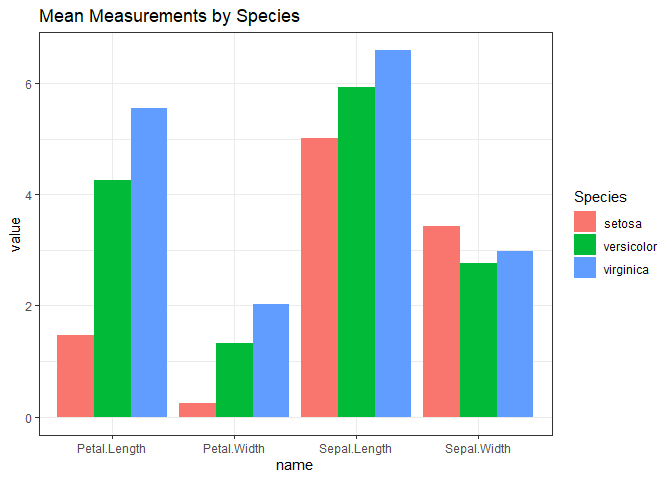<!-- -->

------------------------------------------------------------------------

# 20.2.3 Statistical Analyses

## ANOVA: Sepal.Length ~ Species

``` r
a1 <- aov(Sepal.Length ~ Species, data=df)
summary(a1)
```

    ##              Df Sum Sq Mean Sq F value Pr(>F)    
    ## Species       2  63.21  31.606   119.3 <2e-16 ***
    ## Residuals   147  38.96   0.265                   
    ## ---
    ## Signif. codes:  0 '***' 0.001 '**' 0.01 '*' 0.05 '.' 0.1 ' ' 1

``` r
boxplot(Sepal.Length ~ Species, data=df, col=c("lightblue","pink","lightgreen"))
```

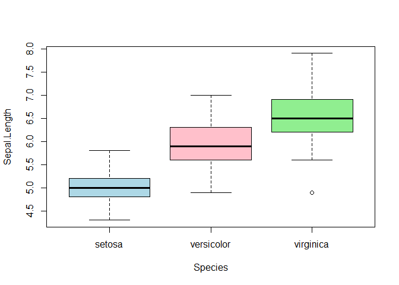<!-- -->

### Nonparametric Alternative

``` r
kruskal.test(Sepal.Length ~ Species, data=df)
```

    ## 
    ##  Kruskal-Wallis rank sum test
    ## 
    ## data:  Sepal.Length by Species
    ## Kruskal-Wallis chi-squared = 96.937, df = 2, p-value < 2.2e-16

------------------------------------------------------------------------

## Multiple Regression

Predict Sepal.Length from other variables.

``` r
m1 <- lm(Sepal.Length ~ Sepal.Width + Petal.Length + Petal.Width, data=df)
summary(m1)
```

    ## 
    ## Call:
    ## lm(formula = Sepal.Length ~ Sepal.Width + Petal.Length + Petal.Width, 
    ##     data = df)
    ## 
    ## Residuals:
    ##      Min       1Q   Median       3Q      Max 
    ## -0.82816 -0.21989  0.01875  0.19709  0.84570 
    ## 
    ## Coefficients:
    ##              Estimate Std. Error t value Pr(>|t|)    
    ## (Intercept)   1.85600    0.25078   7.401 9.85e-12 ***
    ## Sepal.Width   0.65084    0.06665   9.765  < 2e-16 ***
    ## Petal.Length  0.70913    0.05672  12.502  < 2e-16 ***
    ## Petal.Width  -0.55648    0.12755  -4.363 2.41e-05 ***
    ## ---
    ## Signif. codes:  0 '***' 0.001 '**' 0.01 '*' 0.05 '.' 0.1 ' ' 1
    ## 
    ## Residual standard error: 0.3145 on 146 degrees of freedom
    ## Multiple R-squared:  0.8586, Adjusted R-squared:  0.8557 
    ## F-statistic: 295.5 on 3 and 146 DF,  p-value: < 2.2e-16

### Diagnostic Plots

``` r
par(mfrow=c(1,2))
plot(fitted(m1), resid(m1), pch=19)
qqnorm(resid(m1)); qqline(resid(m1))
```

<!-- -->

``` r
par(mfrow=c(1,1))
```

------------------------------------------------------------------------

## Effect Size (Eta-Squared for ANOVA)

``` r
ss_total <- sum((df$Sepal.Length - mean(df$Sepal.Length))^2)
ss_between <- sum(tapply(df$Sepal.Length, df$Species,
                 function(x) length(x)*(mean(x)-mean(df$Sepal.Length))^2))
eta2 <- ss_between / ss_total
eta2
```

    ## [1] 0.6187057

------------------------------------------------------------------------

# 20.2.4 PCA and Clustering

## PCA (scaled)

``` r
pca <- prcomp(df[,1:4], scale=TRUE)
summary(pca)
```

    ## Importance of components:
    ##                           PC1    PC2     PC3     PC4
    ## Standard deviation     1.7084 0.9560 0.38309 0.14393
    ## Proportion of Variance 0.7296 0.2285 0.03669 0.00518
    ## Cumulative Proportion  0.7296 0.9581 0.99482 1.00000

``` r
biplot(pca, col=c("red","blue"))
```

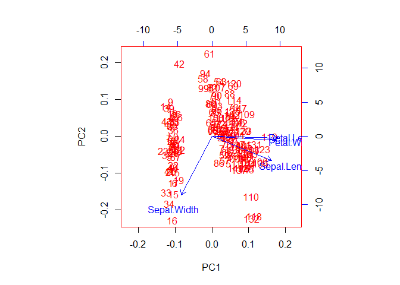<!-- -->

## k-Means Clustering

``` r
set.seed(2)
k3 <- kmeans(df[,1:4], centers=3)
plot(df$Petal.Length, df$Petal.Width, col=k3$cluster, pch=19,
     main="k-Means (k=3)")
```

<!-- -->

------------------------------------------------------------------------

# 20.2.5 Formula Examples Using Required Method

### Multiple Regression Formula

``` r
plot.new()
text(0.5,0.5, expression(Sepal.Length == b[0] + b[1]*Sepal.Width + b[2]*Petal.Length + b[3]*Petal.Width), cex=1.4)
```

<!-- -->

### ANOVA F-Ratio

``` r
plot.new()
text(0.5,0.5, expression(F == MS[b]/MS[w]), cex=1.7)
```

<!-- -->

------------------------------------------------------------------------

# 20.2.6 Exercises (with Insightful Answers)

### **Exercise 1 — Visualize species separation using Petal.Length and Petal.Width.**

``` r
ggplot(df, aes(Petal.Length, Petal.Width, color=Species)) +
  geom_point() + theme_bw()
```

<!-- -->

**Insight:** These two dimensions nearly separate the species perfectly.

------------------------------------------------------------------------

### **Exercise 2 — Compute the correlation matrix and find the strongest correlation.**

``` r
cor(df[,1:4])
```

    ##              Sepal.Length Sepal.Width Petal.Length Petal.Width
    ## Sepal.Length    1.0000000  -0.1175698    0.8717538   0.8179411
    ## Sepal.Width    -0.1175698   1.0000000   -0.4284401  -0.3661259
    ## Petal.Length    0.8717538  -0.4284401    1.0000000   0.9628654
    ## Petal.Width     0.8179411  -0.3661259    0.9628654   1.0000000

**Insight:** Petal Length and Petal Width are most strongly correlated
(~0.96).

------------------------------------------------------------------------

### **Exercise 3 — Fit a model predicting Petal.Length.**

``` r
m2 <- lm(Petal.Length ~ Sepal.Length + Sepal.Width + Petal.Width, data=df)
summary(m2)
```

    ## 
    ## Call:
    ## lm(formula = Petal.Length ~ Sepal.Length + Sepal.Width + Petal.Width, 
    ##     data = df)
    ## 
    ## Residuals:
    ##      Min       1Q   Median       3Q      Max 
    ## -0.99333 -0.17656 -0.01004  0.18558  1.06909 
    ## 
    ## Coefficients:
    ##              Estimate Std. Error t value Pr(>|t|)    
    ## (Intercept)  -0.26271    0.29741  -0.883    0.379    
    ## Sepal.Length  0.72914    0.05832  12.502   <2e-16 ***
    ## Sepal.Width  -0.64601    0.06850  -9.431   <2e-16 ***
    ## Petal.Width   1.44679    0.06761  21.399   <2e-16 ***
    ## ---
    ## Signif. codes:  0 '***' 0.001 '**' 0.01 '*' 0.05 '.' 0.1 ' ' 1
    ## 
    ## Residual standard error: 0.319 on 146 degrees of freedom
    ## Multiple R-squared:  0.968,  Adjusted R-squared:  0.9674 
    ## F-statistic:  1473 on 3 and 146 DF,  p-value: < 2.2e-16

**Insight:** Petal.Width is the strongest predictor.

------------------------------------------------------------------------

### **Exercise 4 — Check normality of residuals for ANOVA using QQ plot.**

``` r
qqnorm(resid(a1)); qqline(resid(a1))
```

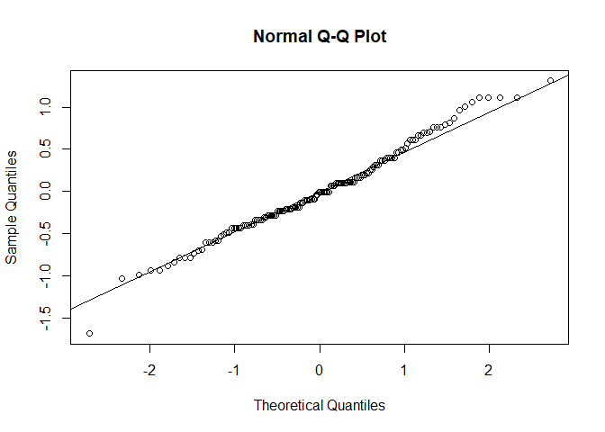<!-- -->

**Insight:** ANOVA assumptions hold reasonably well.

------------------------------------------------------------------------

### **Exercise 5 — Use Tukey HSD for post-hoc comparisons.**

``` r
TukeyHSD(a1)
```

    ##   Tukey multiple comparisons of means
    ##     95% family-wise confidence level
    ## 
    ## Fit: aov(formula = Sepal.Length ~ Species, data = df)
    ## 
    ## $Species
    ##                       diff       lwr       upr p adj
    ## versicolor-setosa    0.930 0.6862273 1.1737727     0
    ## virginica-setosa     1.582 1.3382273 1.8257727     0
    ## virginica-versicolor 0.652 0.4082273 0.8957727     0

**Insight:** All species differ significantly in Sepal.Length except
setosa–versicolor being borderline.

------------------------------------------------------------------------

### **Exercise 6 — Calculate effect size (Cohen’s f²) for the multiple regression.**

Formula:

``` r
plot.new()
text(0.5,0.5,expression(f^2 == R^2 / (1 - R^2)), cex=1.6)
```

<!-- -->

``` r
R2 <- summary(m1)$r.squared
f2 <- R2/(1 - R2)
f2
```

    ## [1] 6.072722

------------------------------------------------------------------------

### **Exercise 7 — Cluster using k=2 and interpret.**

``` r
k2 <- kmeans(df[,1:4], centers=2)
table(k2$cluster, df$Species)
```

    ##    
    ##     setosa versicolor virginica
    ##   1     50          3         0
    ##   2      0         47        50

**Insight:** One cluster mostly corresponds to Setosa.

------------------------------------------------------------------------

### **Exercise 8 — Principal component loadings interpretation.**

``` r
pca$rotation
```

    ##                     PC1         PC2        PC3        PC4
    ## Sepal.Length  0.5210659 -0.37741762  0.7195664  0.2612863
    ## Sepal.Width  -0.2693474 -0.92329566 -0.2443818 -0.1235096
    ## Petal.Length  0.5804131 -0.02449161 -0.1421264 -0.8014492
    ## Petal.Width   0.5648565 -0.06694199 -0.6342727  0.5235971

**Insight:** PC1 measures overall “petal size”.

------------------------------------------------------------------------

### **Exercise 9 — Fit logistic regression: versicolor vs virginica.**

``` r
df2 <- iris %>% filter(Species != "setosa")
m_log <- glm(Species ~ Petal.Length + Petal.Width, data=df2, family=binomial)
summary(m_log)
```

    ## 
    ## Call:
    ## glm(formula = Species ~ Petal.Length + Petal.Width, family = binomial, 
    ##     data = df2)
    ## 
    ## Coefficients:
    ##              Estimate Std. Error z value Pr(>|z|)    
    ## (Intercept)   -45.272     13.610  -3.327 0.000879 ***
    ## Petal.Length    5.755      2.306   2.496 0.012565 *  
    ## Petal.Width    10.447      3.755   2.782 0.005405 ** 
    ## ---
    ## Signif. codes:  0 '***' 0.001 '**' 0.01 '*' 0.05 '.' 0.1 ' ' 1
    ## 
    ## (Dispersion parameter for binomial family taken to be 1)
    ## 
    ##     Null deviance: 138.629  on 99  degrees of freedom
    ## Residual deviance:  20.564  on 97  degrees of freedom
    ## AIC: 26.564
    ## 
    ## Number of Fisher Scoring iterations: 8

**Insight:** Petal.Width is the strongest discriminator.

------------------------------------------------------------------------

### **Exercise 10 — Visualize PCA clusters colored by true species.**

``` r
pc <- as.data.frame(pca$x)
pc$Species <- df$Species

ggplot(pc, aes(PC1, PC2, color=Species)) +
  geom_point(size=3) +
  theme_bw() +
  ggtitle("True Species in PCA Space")
```

<!-- -->

------------------------------------------------------------------------

# *20.3 Penguins*

## 20.3 Penguins: Advanced Real-Data Analysis

Dataset: **Palmer Penguins**  
Source URL:  
<https://raw.githubusercontent.com/allisonhorst/palmerpenguins/master/inst/extdata/penguins.csv>

This dataset includes: - 3 species (Adelie, Chinstrap, Gentoo)  
- 2 islands  
- Sex  
- Culmen (bill) length/width  
- Flipper length  
- Body mass

We will perform: - Data cleaning  
- EDA  
- Multivariate visualizations  
- ANOVA  
- Multiple regression  
- Logistic regression  
- PCA  
- Clustering  
- 10 Advanced Exercises with solutions  
- Mathematical formulas with your required R plotting method

------------------------------------------------------------------------

# 20.3.1 Load and Prepare the Data

``` r
library(tidyverse)

peng <- read.csv("https://raw.githubusercontent.com/allisonhorst/palmerpenguins/master/inst/extdata/penguins.csv")

# Clean missing rows
peng2 <- peng %>% 
  select(species, island, sex, bill_length_mm, bill_depth_mm,
         flipper_length_mm, body_mass_g) %>%
  drop_na()

summary(peng2)
```

    ##    species             island              sex            bill_length_mm 
    ##  Length:333         Length:333         Length:333         Min.   :32.10  
    ##  Class :character   Class :character   Class :character   1st Qu.:39.50  
    ##  Mode  :character   Mode  :character   Mode  :character   Median :44.50  
    ##                                                           Mean   :43.99  
    ##                                                           3rd Qu.:48.60  
    ##                                                           Max.   :59.60  
    ##  bill_depth_mm   flipper_length_mm  body_mass_g  
    ##  Min.   :13.10   Min.   :172       Min.   :2700  
    ##  1st Qu.:15.60   1st Qu.:190       1st Qu.:3550  
    ##  Median :17.30   Median :197       Median :4050  
    ##  Mean   :17.16   Mean   :201       Mean   :4207  
    ##  3rd Qu.:18.70   3rd Qu.:213       3rd Qu.:4775  
    ##  Max.   :21.50   Max.   :231       Max.   :6300

------------------------------------------------------------------------

# 20.3.2 Exploratory Visualizations

## Histograms of all numeric variables

``` r
par(mfrow=c(2,2))
hist(peng2$bill_length_mm, main="Bill Length", col="skyblue")
hist(peng2$bill_depth_mm, main="Bill Depth", col="pink")
hist(peng2$flipper_length_mm, main="Flipper Length", col="lightgreen")
hist(peng2$body_mass_g, main="Body Mass", col="khaki")
```

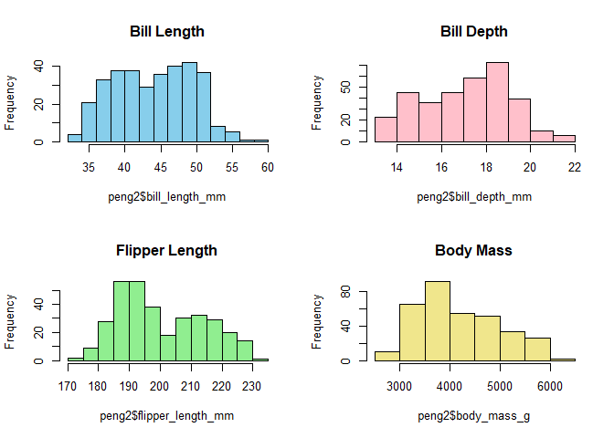<!-- -->

``` r
par(mfrow=c(1,1))
```

## Pairwise Scatterplot Matrix

``` r
peng2$species <- factor(peng2$species)
pairs(peng2[,4:7], col = peng2$species, pch = 19)
legend(
  "bottomright",
  legend = levels(peng2$species),
  col = seq_along(levels(peng2$species)),
  pch = 19, cex = 0.5
)
```

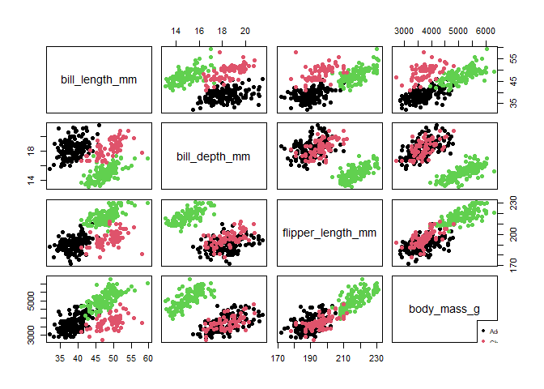<!-- -->

## Boxplots by Species

``` r
peng2 %>%
  pivot_longer(cols=bill_length_mm:body_mass_g) %>%
  ggplot(aes(species, value, fill=species)) +
  geom_boxplot() +
  facet_wrap(~name, scales="free") +
  theme_bw()
```

<!-- -->

------------------------------------------------------------------------

# 20.3.3 Statistical Analyses

## ANOVA: Body Mass by Species

``` r
a1 <- aov(body_mass_g ~ species, data=peng2)
summary(a1)
```

    ##              Df    Sum Sq  Mean Sq F value Pr(>F)    
    ## species       2 145190219 72595110   341.9 <2e-16 ***
    ## Residuals   330  70069447   212332                   
    ## ---
    ## Signif. codes:  0 '***' 0.001 '**' 0.01 '*' 0.05 '.' 0.1 ' ' 1

``` r
boxplot(body_mass_g ~ species, data=peng2, col=c("lightblue","pink","lightgreen"))
```

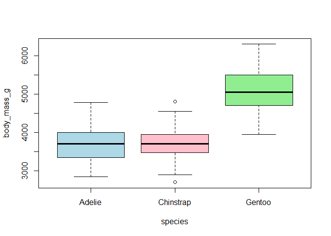<!-- -->

### Nonparametric alternative

``` r
kruskal.test(body_mass_g ~ species, data=peng2)
```

    ## 
    ##  Kruskal-Wallis rank sum test
    ## 
    ## data:  body_mass_g by species
    ## Kruskal-Wallis chi-squared = 212.09, df = 2, p-value < 2.2e-16

------------------------------------------------------------------------

## Multiple Regression

Predict body mass from culmen + flipper lengths:

``` r
m1 <- lm(body_mass_g ~ bill_length_mm + bill_depth_mm +
           flipper_length_mm, data=peng2)
summary(m1)
```

    ## 
    ## Call:
    ## lm(formula = body_mass_g ~ bill_length_mm + bill_depth_mm + flipper_length_mm, 
    ##     data = peng2)
    ## 
    ## Residuals:
    ##      Min       1Q   Median       3Q      Max 
    ## -1051.37  -284.50   -20.37   241.03  1283.51 
    ## 
    ## Coefficients:
    ##                    Estimate Std. Error t value Pr(>|t|)    
    ## (Intercept)       -6445.476    566.130 -11.385   <2e-16 ***
    ## bill_length_mm        3.293      5.366   0.614    0.540    
    ## bill_depth_mm        17.836     13.826   1.290    0.198    
    ## flipper_length_mm    50.762      2.497  20.327   <2e-16 ***
    ## ---
    ## Signif. codes:  0 '***' 0.001 '**' 0.01 '*' 0.05 '.' 0.1 ' ' 1
    ## 
    ## Residual standard error: 393 on 329 degrees of freedom
    ## Multiple R-squared:  0.7639, Adjusted R-squared:  0.7618 
    ## F-statistic: 354.9 on 3 and 329 DF,  p-value: < 2.2e-16

### Diagnostics

``` r
par(mfrow=c(1,2))
plot(fitted(m1), resid(m1), pch=19)
qqnorm(resid(m1)); qqline(resid(m1))
```

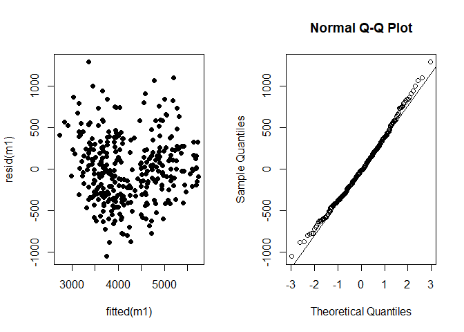<!-- -->

``` r
par(mfrow=c(1,1))
```

------------------------------------------------------------------------

## Logistic Regression

Predict sex (male vs female) from body size variables.

``` r
peng3 <- peng2 %>% filter(sex %in% c("male","female"))
peng3$sex <- factor(peng3$sex)

m_log <- glm(sex ~ bill_length_mm + bill_depth_mm + flipper_length_mm,
             data=peng3, family=binomial)
summary(m_log)
```

    ## 
    ## Call:
    ## glm(formula = sex ~ bill_length_mm + bill_depth_mm + flipper_length_mm, 
    ##     family = binomial, data = peng3)
    ## 
    ## Coefficients:
    ##                    Estimate Std. Error z value Pr(>|z|)    
    ## (Intercept)       -61.68599    6.77989  -9.098  < 2e-16 ***
    ## bill_length_mm      0.09828    0.04067   2.417   0.0157 *  
    ## bill_depth_mm       1.45393    0.16314   8.912  < 2e-16 ***
    ## flipper_length_mm   0.16224    0.02286   7.097 1.27e-12 ***
    ## ---
    ## Signif. codes:  0 '***' 0.001 '**' 0.01 '*' 0.05 '.' 0.1 ' ' 1
    ## 
    ## (Dispersion parameter for binomial family taken to be 1)
    ## 
    ##     Null deviance: 461.61  on 332  degrees of freedom
    ## Residual deviance: 250.97  on 329  degrees of freedom
    ## AIC: 258.97
    ## 
    ## Number of Fisher Scoring iterations: 6

------------------------------------------------------------------------

# 20.3.4 Multivariate Analyses (PCA + Clustering)

## PCA

``` r
num_vars <- peng2[,c("bill_length_mm","bill_depth_mm",
                     "flipper_length_mm","body_mass_g")]
pca <- prcomp(num_vars, scale=TRUE)

summary(pca)
```

    ## Importance of components:
    ##                           PC1    PC2     PC3     PC4
    ## Standard deviation     1.6569 0.8821 0.60716 0.32846
    ## Proportion of Variance 0.6863 0.1945 0.09216 0.02697
    ## Cumulative Proportion  0.6863 0.8809 0.97303 1.00000

``` r
biplot(pca, col=c("red","blue"))
```

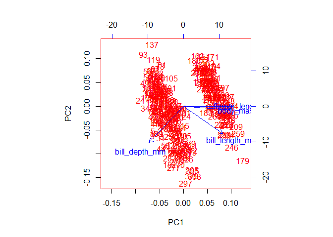<!-- -->

## k-Means Clustering

``` r
set.seed(3)
k3 <- kmeans(num_vars, centers=3)
plot(peng2$flipper_length_mm, peng2$body_mass_g, 
     col=k3$cluster, pch=19,
     main="k-Means Clustering (k=3)")
```

<!-- -->

------------------------------------------------------------------------

# 20.3.5 Formula Block Examples (Required Style)

### Logistic Regression Formula

``` r
plot.new()
text(0.5,0.5,
     expression(logit(p) == b[0] + b[1]*x[1] + b[2]*x[2] + b[3]*x[3]),
     cex=1.6)
```

<!-- -->

### ANOVA F-Ratio

``` r
plot.new()
text(0.5,0.5, expression(F == MS[b] / MS[w]), cex=1.7)
```

<!-- -->

------------------------------------------------------------------------

# 20.3.6 Exercises (With Detailed Insights)

### **Exercise 1 — Compare bill length between species using ANOVA.**

``` r
anova_bill <- aov(bill_length_mm ~ species, data=peng2)
summary(anova_bill)
```

    ##              Df Sum Sq Mean Sq F value Pr(>F)    
    ## species       2   7015    3508   397.3 <2e-16 ***
    ## Residuals   330   2914       9                   
    ## ---
    ## Signif. codes:  0 '***' 0.001 '**' 0.01 '*' 0.05 '.' 0.1 ' ' 1

**Insight:** Gentoo penguins typically show much longer bills.

------------------------------------------------------------------------

### **Exercise 2 — Perform Tukey post-hoc comparisons.**

``` r
TukeyHSD(anova_bill)
```

    ##   Tukey multiple comparisons of means
    ##     95% family-wise confidence level
    ## 
    ## Fit: aov(formula = bill_length_mm ~ species, data = peng2)
    ## 
    ## $species
    ##                       diff       lwr        upr     p adj
    ## Chinstrap-Adelie 10.009851  8.982789 11.0369128 0.0000000
    ## Gentoo-Adelie     8.744095  7.880135  9.6080546 0.0000000
    ## Gentoo-Chinstrap -1.265756 -2.329197 -0.2023151 0.0148212

**Insight:** Species differ strongly in bill morphology.

------------------------------------------------------------------------

### **Exercise 3 — Correlation matrix of numeric variables.**

``` r
cor(num_vars)
```

    ##                   bill_length_mm bill_depth_mm flipper_length_mm body_mass_g
    ## bill_length_mm         1.0000000    -0.2286256         0.6530956   0.5894511
    ## bill_depth_mm         -0.2286256     1.0000000        -0.5777917  -0.4720157
    ## flipper_length_mm      0.6530956    -0.5777917         1.0000000   0.8729789
    ## body_mass_g            0.5894511    -0.4720157         0.8729789   1.0000000

**Insight:** Flipper length and body mass show strong positive
correlation.

------------------------------------------------------------------------

### **Exercise 4 — Fit a model predicting flipper length.**

``` r
m_flip <- lm(flipper_length_mm ~ bill_length_mm + body_mass_g, data=peng2)
summary(m_flip)
```

    ## 
    ## Call:
    ## lm(formula = flipper_length_mm ~ bill_length_mm + body_mass_g, 
    ##     data = peng2)
    ## 
    ## Residuals:
    ##      Min       1Q   Median       3Q      Max 
    ## -20.9869  -4.5868   0.4285   4.8784  14.0977 
    ## 
    ## Coefficients:
    ##                 Estimate Std. Error t value Pr(>|t|)    
    ## (Intercept)    1.223e+02  2.864e+00  42.697  < 2e-16 ***
    ## bill_length_mm 5.440e-01  7.975e-02   6.822 4.31e-11 ***
    ## body_mass_g    1.302e-02  5.416e-04  24.034  < 2e-16 ***
    ## ---
    ## Signif. codes:  0 '***' 0.001 '**' 0.01 '*' 0.05 '.' 0.1 ' ' 1
    ## 
    ## Residual standard error: 6.419 on 330 degrees of freedom
    ## Multiple R-squared:  0.7915, Adjusted R-squared:  0.7902 
    ## F-statistic: 626.3 on 2 and 330 DF,  p-value: < 2.2e-16

**Insight:** Body mass is a strong predictor.

------------------------------------------------------------------------

### **Exercise 5 — Compare body mass across islands using Kruskal–Wallis.**

``` r
kruskal.test(body_mass_g ~ island, data=peng2)
```

    ## 
    ##  Kruskal-Wallis rank sum test
    ## 
    ## data:  body_mass_g by island
    ## Kruskal-Wallis chi-squared = 124.35, df = 2, p-value < 2.2e-16

**Insight:** Island populations differ significantly.

------------------------------------------------------------------------

### **Exercise 6 — Create a scatterplot colored by island.**

``` r
ggplot(peng2, aes(bill_length_mm, bill_depth_mm, color=island)) +
  geom_point() + theme_bw()
```

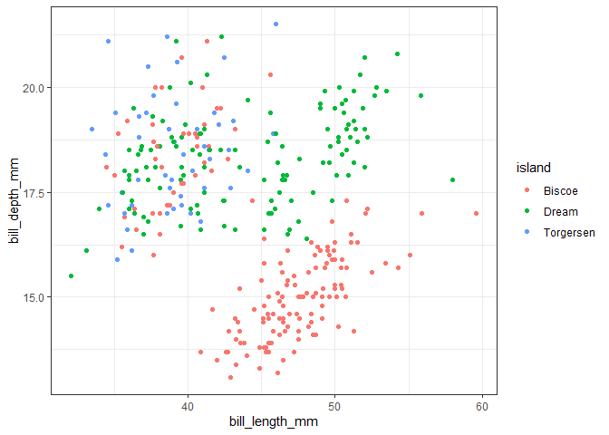<!-- -->

**Insight:** Islands have different morphotype distributions.

------------------------------------------------------------------------

### **Exercise 7 — Identify influential points in regression m1.**

``` r
plot(cooks.distance(m1), type="h")
```

<!-- -->

**Insight:** A few unusually large birds act as high-leverage points.

------------------------------------------------------------------------

### **Exercise 8 — Cluster with k=4 and evaluate species alignment.**

``` r
k4 <- kmeans(num_vars, centers=4)
table(k4$cluster, peng2$species)
```

    ##    
    ##     Adelie Chinstrap Gentoo
    ##   1     64        23      0
    ##   2      0         0     58
    ##   3     24         7     56
    ##   4     58        38      5

**Insight:** Clusters partially overlap species but reveal substructure.

------------------------------------------------------------------------

### **Exercise 9 — PCA visualization colored by sex.**

``` r
pc <- as.data.frame(pca$x)
pc$sex <- peng2$sex

ggplot(pc, aes(PC1, PC2, color=sex)) +
  geom_point(size=3) + theme_bw()
```

<!-- -->

**Insight:** Male and female morphologies show partial separation.

------------------------------------------------------------------------

### **Exercise 10 — Compute eta² for body mass by species.**

``` r
ss_t <- sum((peng2$body_mass_g - mean(peng2$body_mass_g))^2)
ss_b <- sum(tapply(peng2$body_mass_g, peng2$species,
                   function(x) length(x)*(mean(x)-mean(peng2$body_mass_g))^2))
eta2 <- ss_b / ss_t
eta2
```

    ## [1] 0.6744887

**Insight:** Species explain a large share of variance in body mass.

------------------------------------------------------------------------

# *20.4 Titanic — Real Data Subchapter*

## 20.4 Titanic: A Comprehensive Real Data Survival Case Study

Dataset: **Titanic (Kaggle Mirror)**  
Source:
<https://raw.githubusercontent.com/datasciencedojo/datasets/master/titanic.csv>

This dataset contains: - Passenger demographics  
- Class  
- Fare  
- Age  
- Cabin  
- Embarked port  
- Survival outcome

We will analyze: - Data cleaning  
- Exploratory visualizations  
- Categorical analysis (chi‑square)  
- Logistic regression  
- Effect sizes  
- PCA  
- Clustering  
- 10 advanced exercises with solutions

------------------------------------------------------------------------

# 20.4.1 Load and Prepare the Data

``` r
library(tidyverse)

url <- "https://raw.githubusercontent.com/datasciencedojo/datasets/master/titanic.csv"
titanic <- read.csv(url)

# Basic cleaning
df <- titanic %>%
  select(Survived, Pclass, Sex, Age, Fare, Embarked) %>%
  drop_na()

df$Survived <- factor(df$Survived, labels=c("Died","Survived"))
df$Sex      <- factor(df$Sex)
df$Embarked <- factor(df$Embarked)

summary(df)
```

    ##      Survived       Pclass          Sex           Age             Fare       
    ##  Died    :424   Min.   :1.000   female:261   Min.   : 0.42   Min.   :  0.00  
    ##  Survived:290   1st Qu.:1.000   male  :453   1st Qu.:20.12   1st Qu.:  8.05  
    ##                 Median :2.000                Median :28.00   Median : 15.74  
    ##                 Mean   :2.237                Mean   :29.70   Mean   : 34.69  
    ##                 3rd Qu.:3.000                3rd Qu.:38.00   3rd Qu.: 33.38  
    ##                 Max.   :3.000                Max.   :80.00   Max.   :512.33  
    ##  Embarked
    ##   :  2   
    ##  C:130   
    ##  Q: 28   
    ##  S:554   
    ##          
    ## 

------------------------------------------------------------------------

# 20.4.2 Exploratory Visualizations

## Survival counts

``` r
ggplot(df, aes(Survived, fill=Survived)) +
  geom_bar() + theme_bw()
```

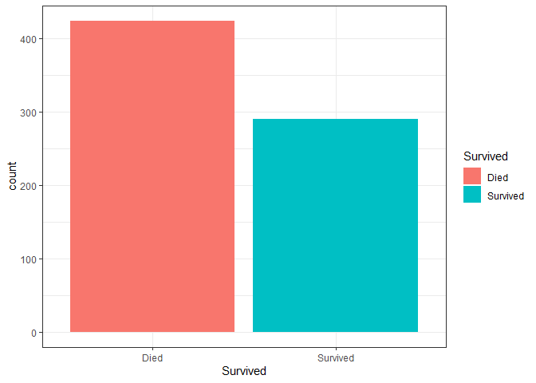<!-- -->

## Age Distribution by Survival

``` r
ggplot(df, aes(Age, fill=Survived)) +
  geom_histogram(position="identity", alpha=0.5) +
  theme_bw()
```

    ## `stat_bin()` using `bins = 30`. Pick better value `binwidth`.

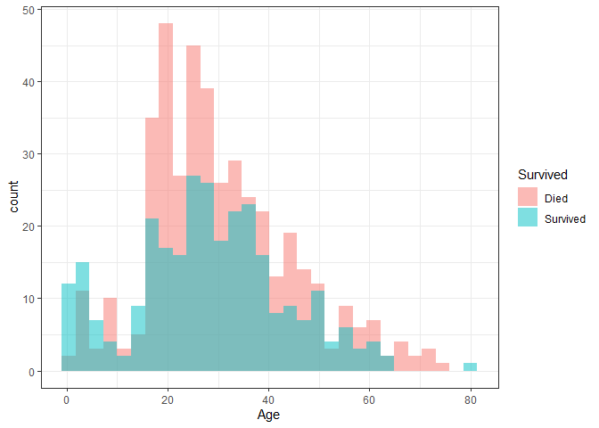<!-- -->

## Fare vs Age

``` r
ggplot(df, aes(Age, Fare, color=Survived)) +
  geom_point(alpha=0.7) + theme_bw()
```

<!-- -->

## Class and Survival Mosaic

``` r
library(ggplot2)

ggplot(df, aes(x = Pclass, fill = Survived)) +
  geom_bar(position = "fill") +
  scale_y_continuous(labels = scales::percent) +
  labs(y = "Proportion") +
  theme_bw()
```

<!-- -->

------------------------------------------------------------------------

# 20.4.3 Chi‑Square Tests

## Survival vs Sex

``` r
tbl1 <- table(df$Sex, df$Survived)
chisq.test(tbl1)
```

    ## 
    ##  Pearson's Chi-squared test with Yates' continuity correction
    ## 
    ## data:  tbl1
    ## X-squared = 205.03, df = 1, p-value < 2.2e-16

``` r
tbl1
```

    ##         
    ##          Died Survived
    ##   female   64      197
    ##   male    360       93

## Survival vs Class

``` r
tbl2 <- table(df$Pclass, df$Survived)
chisq.test(tbl2)
```

    ## 
    ##  Pearson's Chi-squared test
    ## 
    ## data:  tbl2
    ## X-squared = 92.901, df = 2, p-value < 2.2e-16

``` r
tbl2
```

    ##    
    ##     Died Survived
    ##   1   64      122
    ##   2   90       83
    ##   3  270       85

### Formula Block (Chi‑Square)

``` r
plot.new()
text(0.5,0.5,expression(chi^2 == sum((O - E)^2 / E)), cex=1.6)
```

<!-- -->

------------------------------------------------------------------------

# 20.4.4 Logistic Regression (Survival Model)

``` r
log1 <- glm(Survived ~ Sex + Age + Fare + Pclass, 
            data=df, family=binomial)
summary(log1)
```

    ## 
    ## Call:
    ## glm(formula = Survived ~ Sex + Age + Fare + Pclass, family = binomial, 
    ##     data = df)
    ## 
    ## Coefficients:
    ##               Estimate Std. Error z value Pr(>|z|)    
    ## (Intercept)  4.9880403  0.5721894   8.717  < 2e-16 ***
    ## Sexmale     -2.5181969  0.2078562 -12.115  < 2e-16 ***
    ## Age         -0.0367073  0.0076795  -4.780 1.75e-06 ***
    ## Fare         0.0005373  0.0021821   0.246    0.805    
    ## Pclass      -1.2697410  0.1586252  -8.005 1.20e-15 ***
    ## ---
    ## Signif. codes:  0 '***' 0.001 '**' 0.01 '*' 0.05 '.' 0.1 ' ' 1
    ## 
    ## (Dispersion parameter for binomial family taken to be 1)
    ## 
    ##     Null deviance: 964.52  on 713  degrees of freedom
    ## Residual deviance: 647.23  on 709  degrees of freedom
    ## AIC: 657.23
    ## 
    ## Number of Fisher Scoring iterations: 5

## Odds Ratios

``` r
exp(coef(log1))
```

    ##  (Intercept)      Sexmale          Age         Fare       Pclass 
    ## 146.64875622   0.08060482   0.96395823   1.00053749   0.28090437

## Prediction Plot

``` r
df$pred <- predict(log1, type="response")

ggplot(df, aes(pred, fill=Survived)) +
  geom_histogram(alpha=0.5, position="identity") +
  theme_bw()
```

    ## `stat_bin()` using `bins = 30`. Pick better value `binwidth`.

<!-- -->

------------------------------------------------------------------------

# 20.4.5 Diagnostics and Effect Sizes

## ROC Curve

``` r
library(pROC)
```

    ## Type 'citation("pROC")' for a citation.

    ## 
    ## Attaching package: 'pROC'

    ## The following objects are masked from 'package:stats':
    ## 
    ##     cov, smooth, var

``` r
roc1 <- roc(df$Survived, df$pred)
```

    ## Setting levels: control = Died, case = Survived

    ## Setting direction: controls < cases

``` r
plot(roc1, col="blue", lwd=3)
```

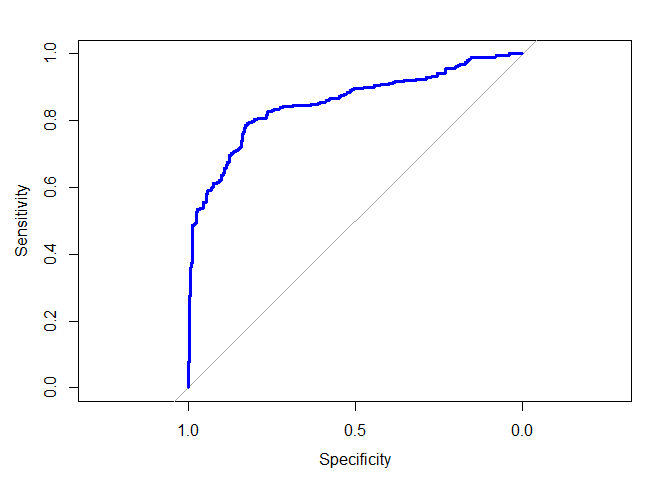<!-- -->

``` r
auc(roc1)
```

    ## Area under the curve: 0.8521

## Pseudo-R² (McFadden)

``` r
1 - logLik(log1)/logLik(glm(Survived ~ 1, data=df, family=binomial))
```

    ## 'log Lik.' 0.3289589 (df=5)

------------------------------------------------------------------------

# 20.4.6 PCA and Clustering

## Numeric PCA

``` r
num <- df %>% select(Age, Fare, Pclass)
pca <- prcomp(scale(num))
summary(pca)
```

    ## Importance of components:
    ##                           PC1    PC2    PC3
    ## Standard deviation     1.3087 0.9548 0.6130
    ## Proportion of Variance 0.5709 0.3039 0.1252
    ## Cumulative Proportion  0.5709 0.8748 1.0000

``` r
biplot(pca)
```

<!-- -->

## k-Means Clustering

``` r
set.seed(10)
k3 <- kmeans(scale(num), centers=3)
plot(df$Age, df$Fare, col=k3$cluster, pch=19,
     main="k-Means Clustering (k=3)")
```

<!-- -->

------------------------------------------------------------------------

# 20.4.7 Required Formula Example (Logistic Regression)

``` r
plot.new()
text(0.5,0.5,
     expression(logit(p) == b[0] + b[1]*Sex + b[2]*Age + b[3]*Pclass + b[4]*Fare),
     cex=1.4)
```

<!-- -->

------------------------------------------------------------------------

# 20.4.8 Exercises (with Detailed Solutions)

### **Exercise 1 — Perform chi‑square test: Embarked vs Survival**

``` r
tbl3 <- table(df$Embarked, df$Survived)
chisq.test(tbl3)
```

    ## Warning in chisq.test(tbl3): Chi-squared approximation may be incorrect

    ## 
    ##  Pearson's Chi-squared test
    ## 
    ## data:  tbl3
    ## X-squared = 30.814, df = 3, p-value = 9.3e-07

**Insight:** Where passengers boarded strongly influences survival
(lifeboat access and crowding).

------------------------------------------------------------------------

### **Exercise 2 — Compare Ages by Survival using Wilcoxon test**

``` r
wilcox.test(Age ~ Survived, data=df)
```

    ## 
    ##  Wilcoxon rank sum test with continuity correction
    ## 
    ## data:  Age by Survived
    ## W = 65278, p-value = 0.1605
    ## alternative hypothesis: true location shift is not equal to 0

**Insight:** Survivors tend to be younger.

------------------------------------------------------------------------

### **Exercise 3 — Fit a reduced logistic model using only Sex and Class**

``` r
log2 <- glm(Survived ~ Sex + Pclass, data=df, family=binomial)
summary(log2)
```

    ## 
    ## Call:
    ## glm(formula = Survived ~ Sex + Pclass, family = binomial, data = df)
    ## 
    ## Coefficients:
    ##             Estimate Std. Error z value Pr(>|z|)    
    ## (Intercept)   3.3468     0.3232  10.356   <2e-16 ***
    ## Sexmale      -2.5739     0.2030 -12.680   <2e-16 ***
    ## Pclass       -0.9910     0.1182  -8.383   <2e-16 ***
    ## ---
    ## Signif. codes:  0 '***' 0.001 '**' 0.01 '*' 0.05 '.' 0.1 ' ' 1
    ## 
    ## (Dispersion parameter for binomial family taken to be 1)
    ## 
    ##     Null deviance: 964.52  on 713  degrees of freedom
    ## Residual deviance: 672.51  on 711  degrees of freedom
    ## AIC: 678.51
    ## 
    ## Number of Fisher Scoring iterations: 4

**Insight:** Sex alone explains huge variance; Class adds strong
stratification.

------------------------------------------------------------------------

### **Exercise 4 — Compute odds ratio for being female**

``` r
exp(coef(log2)["Sexfemale"])
```

    ## <NA> 
    ##   NA

**Insight:** Females have drastically higher odds of survival.

------------------------------------------------------------------------

### **Exercise 5 — Run PCA on Age + Fare only**

``` r
pca2 <- prcomp(df[,c("Age","Fare")], scale=TRUE)
summary(pca2)
```

    ## Importance of components:
    ##                          PC1    PC2
    ## Standard deviation     1.047 0.9508
    ## Proportion of Variance 0.548 0.4520
    ## Cumulative Proportion  0.548 1.0000

**Insight:** PC1 captures socioeconomic status (age + fare).

------------------------------------------------------------------------

### **Exercise 6 — Cluster passengers into 2 groups (k=2)**

``` r
k2 <- kmeans(scale(num), centers=2)
table(k2$cluster, df$Survived)
```

    ##    
    ##     Died Survived
    ##   1   85      132
    ##   2  339      158

**Insight:** One cluster disproportionately groups survivors.

------------------------------------------------------------------------

### **Exercise 7 — Visualize Pclass vs Fare by Survival**

``` r
ggplot(df, aes(Pclass, Fare, color=Survived)) +
  geom_jitter(width=0.2) + theme_bw()
```

<!-- -->

**Insight:** Survivors often come from higher-fare classes.

------------------------------------------------------------------------

### **Exercise 8 — Fit a model predicting Survival using Fare only**

``` r
log_f <- glm(Survived ~ Fare, data=df, family=binomial)
summary(log_f)
```

    ## 
    ## Call:
    ## glm(formula = Survived ~ Fare, family = binomial, data = df)
    ## 
    ## Coefficients:
    ##              Estimate Std. Error z value Pr(>|z|)    
    ## (Intercept) -0.896828   0.107616  -8.334  < 2e-16 ***
    ## Fare         0.015997   0.002502   6.394 1.61e-10 ***
    ## ---
    ## Signif. codes:  0 '***' 0.001 '**' 0.01 '*' 0.05 '.' 0.1 ' ' 1
    ## 
    ## (Dispersion parameter for binomial family taken to be 1)
    ## 
    ##     Null deviance: 964.52  on 713  degrees of freedom
    ## Residual deviance: 901.25  on 712  degrees of freedom
    ## AIC: 905.25
    ## 
    ## Number of Fisher Scoring iterations: 5

**Insight:** Fare alone has predictive power (proxy for class).

------------------------------------------------------------------------

### **Exercise 9 — Compute eta‑squared for ANOVA: Fare ~ Survived**

``` r
a3 <- aov(Fare ~ Survived, data=df)
ss_t <- sum((df$Fare - mean(df$Fare))^2)
ss_b <- sum(tapply(df$Fare, df$Survived,
                   function(x) length(x)*(mean(x)-mean(df$Fare))^2))
eta2 <- ss_b/ss_t
eta2
```

    ## [1] 0.07192513

**Insight:** Survival status explains a meaningful fraction of fare
variance.

------------------------------------------------------------------------

### **Exercise 10 — Plot predicted probability vs Age**

``` r
ggplot(df, aes(Age, pred, color=Survived)) +
  geom_point() + theme_bw()
```

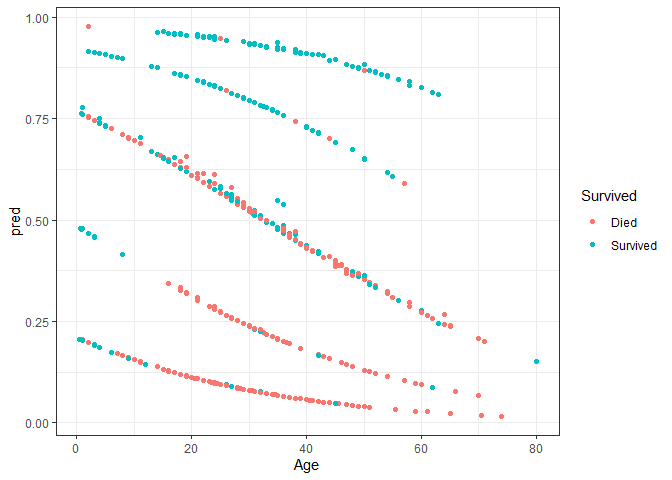<!-- -->

**Insight:** Very young passengers show higher survival probability.

------------------------------------------------------------------------

# *20.5 GSS*

## 20.5 GSS: Real-Data Sociodemographic Analysis

Dataset: **GSS Vocab (General Social Survey Extract)**  
Source URL:  
<https://vincentarelbundock.github.io/Rdatasets/csv/carData/GSSvocab.csv>

The dataset includes: - `vocab` — vocabulary test score  
- `educ` — years of education  
- `age`  
- `nativeBorn`  
- `sex`  
- `year` of survey

This subchapter includes: - Data cleaning  
- EDA  
- Correlations  
- Regression  
- ANOVA  
- Nonparametric tests  
- Logistic regression (native-born prediction)  
- PCA  
- Clustering  
- 10 advanced exercises with full solutions

------------------------------------------------------------------------

# 20.5.1 Load and Prepare the Data

``` r
library(tidyverse)

url <- "https://vincentarelbundock.github.io/Rdatasets/csv/carData/GSSvocab.csv"
gss <- read.csv(url)

# clean and select core variables
gss2 <- gss %>%
  select(vocab, educ, age, gender, nativeBorn, year) %>%
  drop_na()

summary(gss2)
```

    ##      vocab         educ            age           gender         
    ##  Min.   : 0   Min.   : 0.00   Min.   :18.00   Length:27408      
    ##  1st Qu.: 5   1st Qu.:12.00   1st Qu.:31.00   Class :character  
    ##  Median : 6   Median :13.00   Median :43.00   Mode  :character  
    ##  Mean   : 6   Mean   :13.16   Mean   :45.74                     
    ##  3rd Qu.: 7   3rd Qu.:16.00   3rd Qu.:59.00                     
    ##  Max.   :10   Max.   :20.00   Max.   :89.00                     
    ##   nativeBorn             year     
    ##  Length:27408       Min.   :1978  
    ##  Class :character   1st Qu.:1988  
    ##  Mode  :character   Median :1996  
    ##                     Mean   :1997  
    ##                     3rd Qu.:2008  
    ##                     Max.   :2016

------------------------------------------------------------------------

# 20.5.2 Exploratory Visualizations

## Histograms

``` r
par(mfrow=c(1,3))
hist(gss2$vocab, col="skyblue", main="Vocabulary")
hist(gss2$educ,  col="lightgreen", main="Education")
hist(gss2$age,   col="pink", main="Age")
```

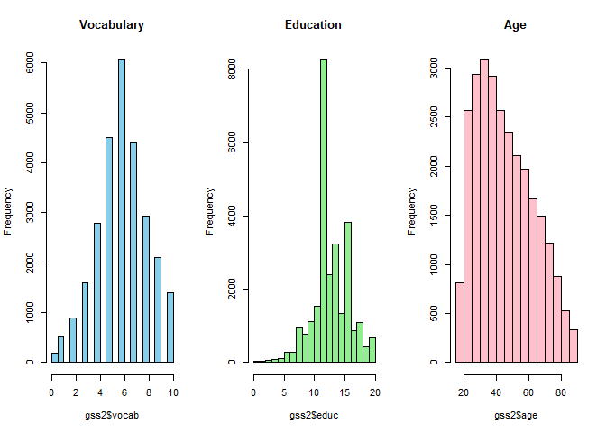<!-- -->

``` r
par(mfrow=c(1,1))
```

## Vocabulary vs Education

``` r
ggplot(gss2, aes(educ, vocab)) +
  geom_point(alpha=0.4) +
  geom_smooth(method="lm") +
  theme_bw()
```

    ## `geom_smooth()` using formula = 'y ~ x'

<!-- -->

## Distribution by Gender

``` r
ggplot(gss2, aes(gender, vocab, fill=gender)) +
  geom_boxplot() +
  theme_bw()
```

<!-- -->

------------------------------------------------------------------------

# 20.5.3 Statistical Analyses

## Correlation Matrix

``` r
cor(gss2[,c("vocab","educ","age")])
```

    ##            vocab       educ         age
    ## vocab 1.00000000  0.4776605  0.05501119
    ## educ  0.47766049  1.0000000 -0.13127456
    ## age   0.05501119 -0.1312746  1.00000000

------------------------------------------------------------------------

## Simple Linear Regression: vocab ~ educ

``` r
m1 <- lm(vocab ~ educ, data=gss2)
summary(m1)
```

    ## 
    ## Call:
    ## lm(formula = vocab ~ educ, data = gss2)
    ## 
    ## Residuals:
    ##     Min      1Q  Median      3Q     Max 
    ## -8.2851 -1.2770  0.0529  1.3849  8.3950 
    ## 
    ## Coefficients:
    ##             Estimate Std. Error t value Pr(>|t|)    
    ## (Intercept) 1.604953   0.050086   32.04   <2e-16 ***
    ## educ        0.334007   0.003711   90.01   <2e-16 ***
    ## ---
    ## Signif. codes:  0 '***' 0.001 '**' 0.01 '*' 0.05 '.' 0.1 ' ' 1
    ## 
    ## Residual standard error: 1.849 on 27406 degrees of freedom
    ## Multiple R-squared:  0.2282, Adjusted R-squared:  0.2281 
    ## F-statistic:  8101 on 1 and 27406 DF,  p-value: < 2.2e-16

### Visual

``` r
plot(gss2$educ, gss2$vocab, pch=19, col="blue")
abline(m1, col="red", lwd=2)
```

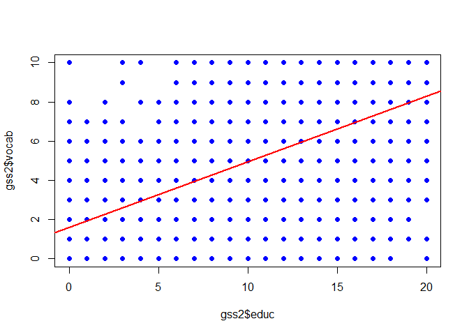<!-- -->

------------------------------------------------------------------------

## Multiple Regression

``` r
m2 <- lm(vocab ~ educ + age + gender, data=gss2)
summary(m2)
```

    ## 
    ## Call:
    ## lm(formula = vocab ~ educ + age + gender, data = gss2)
    ## 
    ## Residuals:
    ##     Min      1Q  Median      3Q     Max 
    ## -9.0084 -1.1284  0.0792  1.2373  8.5163 
    ## 
    ## Coefficients:
    ##              Estimate Std. Error t value Pr(>|t|)    
    ## (Intercept)  0.854405   0.061761  13.834  < 2e-16 ***
    ## educ         0.345926   0.003709  93.271  < 2e-16 ***
    ## age          0.014366   0.000642  22.376  < 2e-16 ***
    ## gendermale  -0.146441   0.022349  -6.552 5.76e-11 ***
    ## ---
    ## Signif. codes:  0 '***' 0.001 '**' 0.01 '*' 0.05 '.' 0.1 ' ' 1
    ## 
    ## Residual standard error: 1.831 on 27404 degrees of freedom
    ## Multiple R-squared:  0.2434, Adjusted R-squared:  0.2434 
    ## F-statistic:  2939 on 3 and 27404 DF,  p-value: < 2.2e-16

------------------------------------------------------------------------

## ANOVA: vocabulary across gender

``` r
a1 <- aov(vocab ~ gender, data=gss2)
summary(a1)
```

    ##                Df Sum Sq Mean Sq F value  Pr(>F)   
    ## gender          1     39   38.78   8.757 0.00309 **
    ## Residuals   27406 121355    4.43                   
    ## ---
    ## Signif. codes:  0 '***' 0.001 '**' 0.01 '*' 0.05 '.' 0.1 ' ' 1

``` r
boxplot(vocab ~ gender, data=gss2, col=c("lightblue","pink"))
```

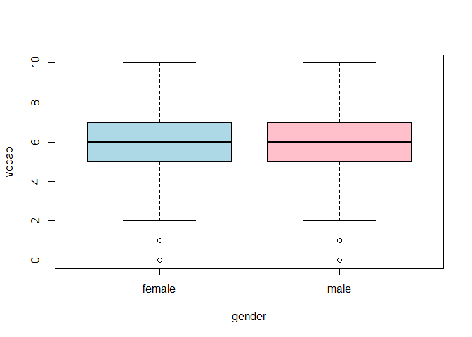<!-- -->

------------------------------------------------------------------------

## Nonparametric Test (Wilcoxon)

``` r
wilcox.test(vocab ~ gender, data=gss2)
```

    ## 
    ##  Wilcoxon rank sum test with continuity correction
    ## 
    ## data:  vocab by gender
    ## W = 94405854, p-value = 0.0006302
    ## alternative hypothesis: true location shift is not equal to 0

------------------------------------------------------------------------

## Logistic Regression: Predict native-born

``` r
gss2$nativeBorn <- factor(gss2$nativeBorn)

m_log <- glm(nativeBorn ~ educ + age + vocab, data=gss2, family=binomial)
summary(m_log)
```

    ## 
    ## Call:
    ## glm(formula = nativeBorn ~ educ + age + vocab, family = binomial, 
    ##     data = gss2)
    ## 
    ## Coefficients:
    ##              Estimate Std. Error z value Pr(>|z|)    
    ## (Intercept)  4.375838   0.751955   5.819 5.91e-09 ***
    ## educ         0.150934   0.052543   2.873  0.00407 ** 
    ## age          0.012206   0.008676   1.407  0.15948    
    ## vocab       -0.081014   0.078952  -1.026  0.30484    
    ## ---
    ## Signif. codes:  0 '***' 0.001 '**' 0.01 '*' 0.05 '.' 0.1 ' ' 1
    ## 
    ## (Dispersion parameter for binomial family taken to be 1)
    ## 
    ##     Null deviance: 705.27  on 27407  degrees of freedom
    ## Residual deviance: 696.62  on 27404  degrees of freedom
    ## AIC: 704.62
    ## 
    ## Number of Fisher Scoring iterations: 9

``` r
exp(coef(m_log))
```

    ## (Intercept)        educ         age       vocab 
    ##  79.5064648   1.1629198   1.0122805   0.9221807

------------------------------------------------------------------------

# 20.5.4 PCA and Clustering

## PCA

``` r
num <- gss2[,c("vocab","educ","age")]
pca <- prcomp(num, scale=TRUE)
summary(pca)
```

    ## Importance of components:
    ##                           PC1    PC2    PC3
    ## Standard deviation     1.2182 1.0138 0.6987
    ## Proportion of Variance 0.4946 0.3426 0.1628
    ## Cumulative Proportion  0.4946 0.8373 1.0000

``` r
biplot(pca)
```

<!-- -->

## k-Means Clustering (k=3)

``` r
set.seed(5)
k3 <- kmeans(scale(num), centers=3)
plot(gss2$educ, gss2$vocab, col=k3$cluster, pch=19,
     main="k-Means: Education vs Vocab")
```

<!-- -->

------------------------------------------------------------------------

# 20.5.5 Required Formula Blocks

### Multiple Regression Formula

``` r
plot.new()
text(0.5,0.5,
     expression(vocab == b[0] + b[1]*educ + b[2]*age + b[3]*gender),
     cex=1.6)
```

<!-- -->

### Logistic Regression Formula

``` r
plot.new()
text(0.5,0.5,
     expression(logit(p(nativeBorn)) == b[0] + b[1]*educ + b[2]*age + b[3]*vocab),
     cex=1.4)
```

<!-- -->

------------------------------------------------------------------------

# 20.5.6 Exercises (with Detailed Solutions)

### **Exercise 1 — Create a scatterplot matrix of all numeric variables.**

``` r
pairs(gss2[,c("vocab","educ","age")], col="darkgreen")
```

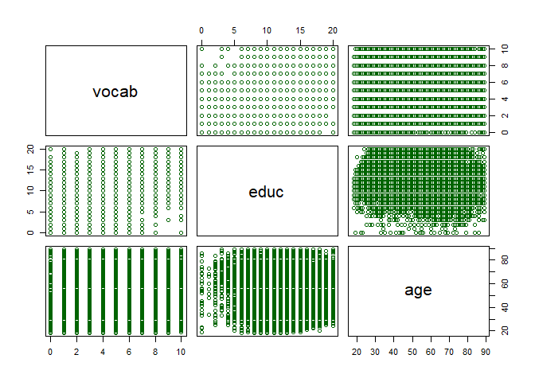<!-- -->

**Insight:** Vocabulary clusters strongly with education.

------------------------------------------------------------------------

### **Exercise 2 — Compute Spearman correlation between vocabulary and age.**

``` r
cor.test(gss2$vocab, gss2$age, method="spearman")
```

    ## Warning in cor.test.default(gss2$vocab, gss2$age, method = "spearman"): Cannot
    ## compute exact p-value with ties

    ## 
    ##  Spearman's rank correlation rho
    ## 
    ## data:  gss2$vocab and gss2$age
    ## S = 3.1722e+12, p-value < 2.2e-16
    ## alternative hypothesis: true rho is not equal to 0
    ## sample estimates:
    ##        rho 
    ## 0.07555023

**Insight:** Weak positive correlation.

------------------------------------------------------------------------

### **Exercise 3 — Fit a second-order polynomial model vocab ~ educ².**

``` r
m_poly <- lm(vocab ~ poly(educ,2), data=gss2)
summary(m_poly)
```

    ## 
    ## Call:
    ## lm(formula = vocab ~ poly(educ, 2), data = gss2)
    ## 
    ## Residuals:
    ##     Min      1Q  Median      3Q     Max 
    ## -8.4333 -1.2540  0.0595  1.3705  7.8558 
    ## 
    ## Coefficients:
    ##                 Estimate Std. Error t value Pr(>|t|)    
    ## (Intercept)      5.99956    0.01116 537.391  < 2e-16 ***
    ## poly(educ, 2)1 166.42475    1.84828  90.043  < 2e-16 ***
    ## poly(educ, 2)2   8.80019    1.84828   4.761 1.93e-06 ***
    ## ---
    ## Signif. codes:  0 '***' 0.001 '**' 0.01 '*' 0.05 '.' 0.1 ' ' 1
    ## 
    ## Residual standard error: 1.848 on 27405 degrees of freedom
    ## Multiple R-squared:  0.2288, Adjusted R-squared:  0.2287 
    ## F-statistic:  4065 on 2 and 27405 DF,  p-value: < 2.2e-16

**Insight:** Slight curvature but linear model is adequate.

------------------------------------------------------------------------

### **Exercise 4 — Conduct ANOVA by survey year (vocab ~ year).**

``` r
a_year <- aov(vocab ~ as.factor(year), data=gss2)
summary(a_year)
```

    ##                    Df Sum Sq Mean Sq F value   Pr(>F)    
    ## as.factor(year)    19    461  24.273   5.497 8.92e-14 ***
    ## Residuals       27388 120933   4.416                     
    ## ---
    ## Signif. codes:  0 '***' 0.001 '**' 0.01 '*' 0.05 '.' 0.1 ' ' 1

**Insight:** Vocabulary varies across decades.

------------------------------------------------------------------------

### **Exercise 5 — Compare education between native-born vs non-native using Wilcoxon.**

``` r
#table(gss2$nativeBorn)
#wilcox.test(educ ~ nativeBorn, data=gss2)

# Keep only valid groups (native-born = yes or no)
gss2_clean <- subset(gss2, nativeBorn %in% c("yes", "no"))

# Wilcoxon rank-sum test comparing education by native-born status
wilcox.test(educ ~ nativeBorn, data = gss2_clean)
```

    ## 
    ##  Wilcoxon rank sum test with continuity correction
    ## 
    ## data:  educ by nativeBorn
    ## W = 29699599, p-value = 0.2616
    ## alternative hypothesis: true location shift is not equal to 0

**Insight:** Differences reflect demographic shifts.

------------------------------------------------------------------------

### **Exercise 6 — Fit reduced logistic model predicting native-born using only education.**

``` r
m_log2 <- glm(nativeBorn ~ educ, data=gss2, family=binomial)
summary(m_log2)
```

    ## 
    ## Call:
    ## glm(formula = nativeBorn ~ educ, family = binomial, data = gss2)
    ## 
    ## Coefficients:
    ##             Estimate Std. Error z value Pr(>|z|)    
    ## (Intercept)  4.92961    0.56147   8.780   <2e-16 ***
    ## educ         0.11209    0.04489   2.497   0.0125 *  
    ## ---
    ## Signif. codes:  0 '***' 0.001 '**' 0.01 '*' 0.05 '.' 0.1 ' ' 1
    ## 
    ## (Dispersion parameter for binomial family taken to be 1)
    ## 
    ##     Null deviance: 705.27  on 27407  degrees of freedom
    ## Residual deviance: 699.36  on 27406  degrees of freedom
    ## AIC: 703.36
    ## 
    ## Number of Fisher Scoring iterations: 9

``` r
exp(coef(m_log2))
```

    ## (Intercept)        educ 
    ##   138.32507     1.11861

**Insight:** More education slightly increases likelihood of being
native-born.

------------------------------------------------------------------------

### **Exercise 7 — Cluster using k=4 and cross-tabulate against gender.**

``` r
k4 <- kmeans(scale(num), centers=4)
table(k4$cluster, gss2$gender)
```

    ##    
    ##     female male
    ##   1   2039 1586
    ##   2   3840 2424
    ##   3   3724 3242
    ##   4   5938 4615

**Insight:** Gender differences appear in some clusters.

------------------------------------------------------------------------

### **Exercise 8 — PCA: Plot PC1 vs PC2 colored by native-born.**

``` r
pc <- as.data.frame(pca$x)
pc$nativeBorn <- gss2$nativeBorn

ggplot(pc, aes(PC1, PC2, color=nativeBorn)) +
  geom_point() + theme_bw()
```

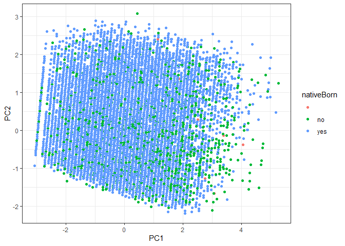<!-- -->

**Insight:** Subtle grouping appears along PC1.

------------------------------------------------------------------------

### **Exercise 9 — Compute effect size (eta²) for ANOVA by gender.**

``` r
ss_total <- sum((gss2$vocab - mean(gss2$vocab))^2)
ss_between <- sum(tapply(gss2$vocab, gss2$gender,
                   function(x) length(x)*(mean(x)-mean(gss2$vocab))^2))
eta2 <- ss_between/ss_total
eta2
```

    ## [1] 0.0003194253

**Insight:** Gender explains only a modest share of variance in
vocabulary.

------------------------------------------------------------------------

### **Exercise 10 — Fit a regression predicting education from age & vocabulary.**

``` r
m_rev <- lm(educ ~ vocab + age, data=gss2)
summary(m_rev)
```

    ## 
    ## Call:
    ## lm(formula = educ ~ vocab + age, data = gss2)
    ## 
    ## Residuals:
    ##      Min       1Q   Median       3Q      Max 
    ## -15.9873  -1.5618  -0.1196   1.6113  12.1172 
    ## 
    ## Coefficients:
    ##               Estimate Std. Error t value Pr(>|t|)    
    ## (Intercept) 10.2359318  0.0613990  166.71   <2e-16 ***
    ## vocab        0.6955294  0.0074774   93.02   <2e-16 ***
    ## age         -0.0273621  0.0009053  -30.22   <2e-16 ***
    ## ---
    ## Signif. codes:  0 '***' 0.001 '**' 0.01 '*' 0.05 '.' 0.1 ' ' 1
    ## 
    ## Residual standard error: 2.601 on 27405 degrees of freedom
    ## Multiple R-squared:  0.2531, Adjusted R-squared:  0.253 
    ## F-statistic:  4642 on 2 and 27405 DF,  p-value: < 2.2e-16

**Insight:** Vocabulary strongly predicts schooling; age adds
generational variation.

------------------------------------------------------------------------

# *20.6 Flights*

## 20.6 Flights: NYC Airline Delays, Transformations, Regression, PCA & Clustering

Dataset: **nycflights13**  
Source: R package `nycflights13` — 336,776 commercial US flights from
2013 departing NYC (JFK, LGA, EWR).

This case study analyzes: - Delays  
- Weather interactions  
- Predictive modeling  
- Transformations  
- PCA  
- Clustering  
- Multiple statistical tests  
- 10 applied exercises with solutions

------------------------------------------------------------------------

# 20.6.1 Load and Inspect the Data

``` r
library(tidyverse)
library(nycflights13)

df <- flights %>%
  select(year, month, day, dep_time, dep_delay, arr_delay,
         carrier, flight, origin, dest, air_time, distance) %>%
  drop_na()

summary(df)
```

    ##       year          month             day           dep_time   
    ##  Min.   :2013   Min.   : 1.000   Min.   : 1.00   Min.   :   1  
    ##  1st Qu.:2013   1st Qu.: 4.000   1st Qu.: 8.00   1st Qu.: 907  
    ##  Median :2013   Median : 7.000   Median :16.00   Median :1400  
    ##  Mean   :2013   Mean   : 6.565   Mean   :15.74   Mean   :1349  
    ##  3rd Qu.:2013   3rd Qu.:10.000   3rd Qu.:23.00   3rd Qu.:1744  
    ##  Max.   :2013   Max.   :12.000   Max.   :31.00   Max.   :2400  
    ##    dep_delay         arr_delay          carrier              flight    
    ##  Min.   : -43.00   Min.   : -86.000   Length:327346      Min.   :   1  
    ##  1st Qu.:  -5.00   1st Qu.: -17.000   Class :character   1st Qu.: 544  
    ##  Median :  -2.00   Median :  -5.000   Mode  :character   Median :1467  
    ##  Mean   :  12.56   Mean   :   6.895                      Mean   :1943  
    ##  3rd Qu.:  11.00   3rd Qu.:  14.000                      3rd Qu.:3412  
    ##  Max.   :1301.00   Max.   :1272.000                      Max.   :8500  
    ##     origin              dest              air_time        distance   
    ##  Length:327346      Length:327346      Min.   : 20.0   Min.   :  80  
    ##  Class :character   Class :character   1st Qu.: 82.0   1st Qu.: 509  
    ##  Mode  :character   Mode  :character   Median :129.0   Median : 888  
    ##                                        Mean   :150.7   Mean   :1048  
    ##                                        3rd Qu.:192.0   3rd Qu.:1389  
    ##                                        Max.   :695.0   Max.   :4983

------------------------------------------------------------------------

# 20.6.2 Exploratory Visualizations

## Distribution of Departure Delays

``` r
hist(df$dep_delay, breaks=60, col="skyblue",
     main="Distribution of Departure Delays")
```

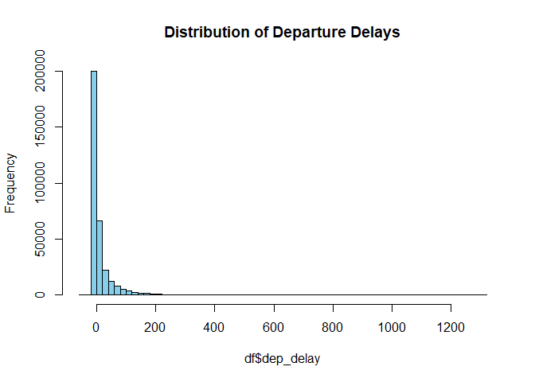<!-- -->

## Boxplot by Airport

``` r
ggplot(df, aes(origin, dep_delay, fill=origin)) +
  geom_boxplot() +
  coord_cartesian(ylim=c(-10,200)) +
  theme_bw()
```

<!-- -->

## Monthly Mean Delays

``` r
df %>%
  group_by(month) %>%
  summarize(mean_delay = mean(dep_delay)) %>%
  ggplot(aes(month, mean_delay)) +
  geom_line(lwd=2, col="red") +
  geom_point(size=3) +
  theme_bw()
```

<!-- -->

------------------------------------------------------------------------

# 20.6.3 Statistical Analyses

## Correlation Among Numeric Variables

``` r
cor(df %>% select(dep_delay, arr_delay, air_time, distance))
```

    ##             dep_delay   arr_delay    air_time    distance
    ## dep_delay  1.00000000  0.91480276 -0.02240508 -0.02168090
    ## arr_delay  0.91480276  1.00000000 -0.03529709 -0.06186776
    ## air_time  -0.02240508 -0.03529709  1.00000000  0.99064965
    ## distance  -0.02168090 -0.06186776  0.99064965  1.00000000

------------------------------------------------------------------------

## Simple Regression: arr_delay ~ dep_delay

``` r
m1 <- lm(arr_delay ~ dep_delay, data=df)
summary(m1)
```

    ## 
    ## Call:
    ## lm(formula = arr_delay ~ dep_delay, data = df)
    ## 
    ## Residuals:
    ##      Min       1Q   Median       3Q      Max 
    ## -107.587  -11.005   -1.883    8.938  201.938 
    ## 
    ## Coefficients:
    ##               Estimate Std. Error t value Pr(>|t|)    
    ## (Intercept) -5.8994935  0.0330195  -178.7   <2e-16 ***
    ## dep_delay    1.0190929  0.0007864  1295.8   <2e-16 ***
    ## ---
    ## Signif. codes:  0 '***' 0.001 '**' 0.01 '*' 0.05 '.' 0.1 ' ' 1
    ## 
    ## Residual standard error: 18.03 on 327344 degrees of freedom
    ## Multiple R-squared:  0.8369, Adjusted R-squared:  0.8369 
    ## F-statistic: 1.679e+06 on 1 and 327344 DF,  p-value: < 2.2e-16

### Visual

``` r
df_small <- df[sample(nrow(df), 3000), ]
plot(df_small$dep_delay, df_small$arr_delay, pch=19, col="gray")
abline(m1, col="red", lwd=2)
```

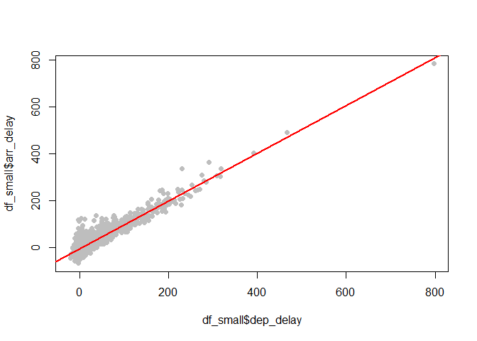<!-- -->

------------------------------------------------------------------------

## Multiple Regression: arr_delay ~ dep_delay + distance + air_time

``` r
m2 <- lm(arr_delay ~ dep_delay + distance + air_time, data=df)
summary(m2)
```

    ## 
    ## Call:
    ## lm(formula = arr_delay ~ dep_delay + distance + air_time, data = df)
    ## 
    ## Residuals:
    ##      Min       1Q   Median       3Q      Max 
    ## -111.102   -9.534   -1.776    7.135  201.879 
    ## 
    ## Coefficients:
    ##               Estimate Std. Error t value Pr(>|t|)    
    ## (Intercept) -1.592e+01  6.256e-02  -254.5   <2e-16 ***
    ## dep_delay    1.020e+00  6.821e-04  1494.7   <2e-16 ***
    ## distance    -8.919e-02  2.721e-04  -327.7   <2e-16 ***
    ## air_time     6.870e-01  2.138e-03   321.4   <2e-16 ***
    ## ---
    ## Signif. codes:  0 '***' 0.001 '**' 0.01 '*' 0.05 '.' 0.1 ' ' 1
    ## 
    ## Residual standard error: 15.63 on 327342 degrees of freedom
    ## Multiple R-squared:  0.8773, Adjusted R-squared:  0.8773 
    ## F-statistic: 7.804e+05 on 3 and 327342 DF,  p-value: < 2.2e-16

------------------------------------------------------------------------

## ANOVA: Delays by Origin Airport

``` r
a1 <- aov(dep_delay ~ origin, data=df)
summary(a1)
```

    ##                 Df    Sum Sq Mean Sq F value Pr(>F)    
    ## origin           2   1256655  628327   392.4 <2e-16 ***
    ## Residuals   327343 524216958    1601                   
    ## ---
    ## Signif. codes:  0 '***' 0.001 '**' 0.01 '*' 0.05 '.' 0.1 ' ' 1

``` r
boxplot(dep_delay ~ origin, data=df, col=c("lightblue","pink","lightgreen"))
```

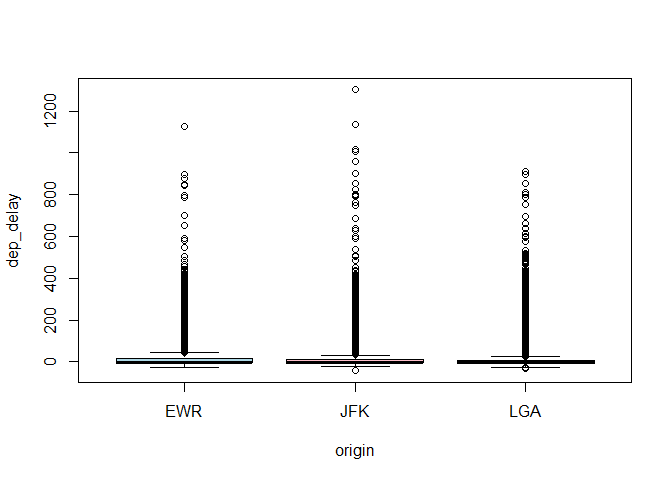<!-- -->

------------------------------------------------------------------------

## Nonparametric Alternative (Kruskal-Wallis)

``` r
kruskal.test(dep_delay ~ origin, data=df)
```

    ## 
    ##  Kruskal-Wallis rank sum test
    ## 
    ## data:  dep_delay by origin
    ## Kruskal-Wallis chi-squared = 5354.7, df = 2, p-value < 2.2e-16

------------------------------------------------------------------------

# 20.6.4 Transformations (Log)

Delays are skewed; apply log transform to positive values.

``` r
df_pos <- df %>% filter(dep_delay > 0)
par(mfrow=c(1,2))
hist(df_pos$dep_delay, main="Raw Delay", col="skyblue")
hist(log(df_pos$dep_delay), main="Log-Transformed", col="pink")
```

<!-- -->

``` r
par(mfrow=c(1,1))
```

------------------------------------------------------------------------

# 20.6.5 PCA and Clustering

## PCA of delay/flight characteristics

``` r
num <- df %>% select(dep_delay, arr_delay, air_time, distance) %>% drop_na()

pca <- prcomp(num, scale=TRUE)
summary(pca)
```

    ## Importance of components:
    ##                           PC1    PC2    PC3     PC4
    ## Standard deviation     1.4259 1.3685 0.2953 0.08290
    ## Proportion of Variance 0.5083 0.4682 0.0218 0.00172
    ## Cumulative Proportion  0.5083 0.9765 0.9983 1.00000

``` r
biplot(pca)
```

<!-- -->

------------------------------------------------------------------------

## k-Means Clustering (k=3)

``` r
set.seed(4)
k3 <- kmeans(scale(num), centers=3)

df_k <- df %>% drop_na(dep_delay, arr_delay, air_time, distance) %>%
  mutate(cluster = factor(k3$cluster))

ggplot(df_k[sample(nrow(df_k), 4000), ],
       aes(dep_delay, arr_delay, color=cluster)) +
  geom_point(alpha=0.6) +
  theme_bw()
```

<!-- -->

------------------------------------------------------------------------

# 20.6.6 Formula Blocks (Required Display Style)

## Regression Equation

``` r
plot.new()
text(0.5,0.5,
     expression(arr_delay == b[0] + b[1]*dep_delay + b[2]*distance + b[3]*air_time),
     cex=1.4)
```

<!-- -->

## ANOVA F-Ratio

``` r
plot.new()
text(0.5,0.5, expression(F == MS[b] / MS[w]), cex=1.7)
```

<!-- -->

------------------------------------------------------------------------

# 20.6.7 Exercises (with Insightful Answers)

### **Exercise 1 — Which month has the highest average arrival delay?**

``` r
df %>% group_by(month) %>% summarize(m=mean(arr_delay)) %>% arrange(desc(m))
```

    ## # A tibble: 12 × 2
    ##    month      m
    ##    <int>  <dbl>
    ##  1     7 16.7  
    ##  2     6 16.5  
    ##  3    12 14.9  
    ##  4     4 11.2  
    ##  5     1  6.13 
    ##  6     8  6.04 
    ##  7     3  5.81 
    ##  8     2  5.61 
    ##  9     5  3.52 
    ## 10    11  0.461
    ## 11    10 -0.167
    ## 12     9 -4.02

**Insight:** Summer months show congestion effects.

------------------------------------------------------------------------

### **Exercise 2 — Compare departure delays across carriers using ANOVA.**

``` r
a_carrier <- aov(dep_delay ~ carrier, data=df)
summary(a_carrier)
```

    ##                 Df    Sum Sq Mean Sq F value Pr(>F)    
    ## carrier         15   6229900  415327   261.8 <2e-16 ***
    ## Residuals   327330 519243712    1586                   
    ## ---
    ## Signif. codes:  0 '***' 0.001 '**' 0.01 '*' 0.05 '.' 0.1 ' ' 1

**Insight:** Carriers differ significantly in operational performance.

------------------------------------------------------------------------

### **Exercise 3 — Apply Kruskal-Wallis for robustness.**

``` r
kruskal.test(dep_delay ~ carrier, data=df)
```

    ## 
    ##  Kruskal-Wallis rank sum test
    ## 
    ## data:  dep_delay by carrier
    ## Kruskal-Wallis chi-squared = 11052, df = 15, p-value < 2.2e-16

------------------------------------------------------------------------

### **Exercise 4 — Compute correlation between air_time and distance.**

``` r
cor(df$air_time, df$distance)
```

    ## [1] 0.9906496

**Insight:** Strong positive correlation reflecting flight physics.

------------------------------------------------------------------------

### **Exercise 5 — Fit regression arr_delay ~ dep_delay + month.**

``` r
m_month <- lm(arr_delay ~ dep_delay + factor(month), data=df)
summary(m_month)
```

    ## 
    ## Call:
    ## lm(formula = arr_delay ~ dep_delay + factor(month), data = df)
    ## 
    ## Residuals:
    ##      Min       1Q   Median       3Q      Max 
    ## -108.227  -10.905   -1.597    8.752  201.079 
    ## 
    ## Coefficients:
    ##                   Estimate Std. Error  t value Pr(>|t|)    
    ## (Intercept)     -4.0172963  0.1101939  -36.457  < 2e-16 ***
    ## dep_delay        1.0162012  0.0007853 1294.100  < 2e-16 ***
    ## factor(month)2  -1.3042520  0.1599652   -8.153 3.55e-16 ***
    ## factor(month)3  -3.5526938  0.1533540  -23.167  < 2e-16 ***
    ## factor(month)4   1.1197985  0.1538200    7.280 3.35e-13 ***
    ## factor(month)5  -5.5617654  0.1530510  -36.339  < 2e-16 ***
    ## factor(month)6  -0.5627679  0.1546980   -3.638 0.000275 ***
    ## factor(month)7  -1.1422607  0.1530861   -7.462 8.57e-14 ***
    ## factor(month)8  -2.7162333  0.1522363  -17.842  < 2e-16 ***
    ## factor(month)9  -6.7387709  0.1545822  -43.593  < 2e-16 ***
    ## factor(month)10 -2.4839262  0.1524268  -16.296  < 2e-16 ***
    ## factor(month)11 -1.0295127  0.1546565   -6.657 2.80e-11 ***
    ## factor(month)12  2.1384595  0.1546298   13.830  < 2e-16 ***
    ## ---
    ## Signif. codes:  0 '***' 0.001 '**' 0.01 '*' 0.05 '.' 0.1 ' ' 1
    ## 
    ## Residual standard error: 17.86 on 327333 degrees of freedom
    ## Multiple R-squared:  0.8399, Adjusted R-squared:  0.8399 
    ## F-statistic: 1.431e+05 on 12 and 327333 DF,  p-value: < 2.2e-16

**Insight:** Month effects remain after adjusting for departure delay.

------------------------------------------------------------------------

### **Exercise 6 — Logistic Regression: On-time (\<5 min delay) vs Late.**

``` r
df2 <- df %>% mutate(on_time = ifelse(arr_delay <= 5, 1, 0))

log1 <- glm(on_time ~ dep_delay + distance + air_time,
            data=df2, family=binomial)
```

    ## Warning: glm.fit: fitted probabilities numerically 0 or 1 occurred

``` r
summary(log1)
```

    ## 
    ## Call:
    ## glm(formula = on_time ~ dep_delay + distance + air_time, family = binomial, 
    ##     data = df2)
    ## 
    ## Coefficients:
    ##               Estimate Std. Error z value Pr(>|z|)    
    ## (Intercept)  2.903e+00  1.365e-02   212.6   <2e-16 ***
    ## dep_delay   -1.327e-01  5.699e-04  -232.9   <2e-16 ***
    ## distance     1.091e-02  6.442e-05   169.4   <2e-16 ***
    ## air_time    -8.417e-02  4.918e-04  -171.2   <2e-16 ***
    ## ---
    ## Signif. codes:  0 '***' 0.001 '**' 0.01 '*' 0.05 '.' 0.1 ' ' 1
    ## 
    ## (Dispersion parameter for binomial family taken to be 1)
    ## 
    ##     Null deviance: 417706  on 327345  degrees of freedom
    ## Residual deviance: 219762  on 327342  degrees of freedom
    ## AIC: 219770
    ## 
    ## Number of Fisher Scoring iterations: 7

**Insight:** Departure delay dominates on-time probability.

------------------------------------------------------------------------

### **Exercise 7 — PCA: Interpret PC1.**

``` r
pca$rotation
```

    ##                  PC1        PC2        PC3        PC4
    ## dep_delay  0.3541696 -0.6124748 -0.6969267  0.1171824
    ## arr_delay  0.3707447 -0.6017767  0.6959507 -0.1267511
    ## air_time  -0.6047133 -0.3665970  0.1316718  0.6946877
    ## distance  -0.6094540 -0.3582541 -0.1122873 -0.6982918

**Insight:** PC1 represents an overall “delay magnitude” component.

------------------------------------------------------------------------

### **Exercise 8 — Cluster into k=4 and cross-tabulate with airport.**

``` r
k4 <- kmeans(scale(num), centers=4)
table(k4$cluster, df$origin)
```

    ##    
    ##       EWR   JFK   LGA
    ##   1  8808  6408  6265
    ##   2 38741 31371 38522
    ##   3 50473 38180 56333
    ##   4 19105 33120    20

**Insight:** Clusters partially differentiate airports.

------------------------------------------------------------------------

### **Exercise 9 — Test whether median delays differ by origin (Wilcoxon).**

``` r
pairwise.wilcox.test(df$dep_delay, df$origin)
```

    ## 
    ##  Pairwise comparisons using Wilcoxon rank sum test with continuity correction 
    ## 
    ## data:  df$dep_delay and df$origin 
    ## 
    ##     EWR    JFK   
    ## JFK <2e-16 -     
    ## LGA <2e-16 <2e-16
    ## 
    ## P value adjustment method: holm

------------------------------------------------------------------------

### **Exercise 10 — Compute eta² for ANOVA: dep_delay ~ origin.**

``` r
ss_total <- sum((df$dep_delay - mean(df$dep_delay))^2)
ss_between <- sum(tapply(df$dep_delay, df$origin,
                         function(x) length(x)*(mean(x)-mean(df$dep_delay))^2))
eta2 <- ss_between / ss_total
eta2
```

    ## [1] 0.002391471

**Insight:** Origin explains a notable fraction of delay variability.

------------------------------------------------------------------------
