# Chapter 1: Introduction

## What Are Statistics

Statistics is the science of **collecting, organizing, analyzing, and
interpreting data**.  
It helps us make sense of information and draw conclusions in the
presence of uncertainty.

- **Plain Language:** Statistics is about turning numbers into
  knowledge.
- **Real-World Example:** Businesses use statistics to understand
  customers; doctors use it to evaluate treatments.

------------------------------------------------------------------------

## Importance of Statistics

Statistics is everywhere:

- In **healthcare**, to test new drugs.
- In **sports**, to analyze performance.
- In **business**, to forecast sales.

**Why learn statistics?**

- To **interpret data critically**
- To **avoid misleading conclusions**
- To **make informed decisions**

------------------------------------------------------------------------

## Descriptive Statistics

Descriptive statistics summarize data using:

- Measures of **central tendency** (mean, median, mode)
- Measures of **variability** (range, variance, SD)
- **Graphs** (histograms, boxplots)

### Example in R

``` r
# Simulate a small dataset
set.seed(123)
data <- c(5, 7, 8, 6, 9, 10)

# Compute descriptive statistics
mean(data)      # Average
```

    ## [1] 7.5

``` r
median(data)    # Middle value
```

    ## [1] 7.5

``` r
sd(data)        # Standard deviation
```

    ## [1] 1.870829

**Interpretation:**

- Mean: The average score
- Median: The middle score
- SD: How spread out the scores are

------------------------------------------------------------------------

## Inferential Statistics

Inferential statistics allow us to **generalize** from a sample to a
population.

**Example:**  
Testing whether a new teaching method improves exam scores by studying a
sample of students.

------------------------------------------------------------------------

## Variables

A **variable** is any characteristic that can vary.

- **Qualitative (categorical):** Gender, color
- **Quantitative (numerical):** Height, weight

### Example in R

``` r
# Qualitative and quantitative variables
gender <- c("Male", "Female", "Female", "Male")
height <- c(170, 165, 160, 175)

table(gender)   # Frequency of categories
```

    ## gender
    ## Female   Male 
    ##      2      2

``` r
mean(height)    # Average height
```

    ## [1] 167.5

------------------------------------------------------------------------

## Percentiles

Percentiles describe the **position** of a value in a dataset.

### Example in R

``` r
quantile(height, probs = c(0.25, 0.5, 0.75))
```

    ##    25%    50%    75% 
    ## 163.75 167.50 171.25

------------------------------------------------------------------------

## Levels of Measurement

- **Nominal:** Categories (colors)
- **Ordinal:** Ordered categories (rankings)
- **Interval:** Equal intervals, no true zero (°C)
- **Ratio:** Equal intervals with true zero (weight)

------------------------------------------------------------------------

## Distributions

A **distribution** shows how values are spread.

### Example in R

``` r
hist(height,
     main = "Height Distribution",
     xlab = "Height (cm)",
     col = "lightblue")
```

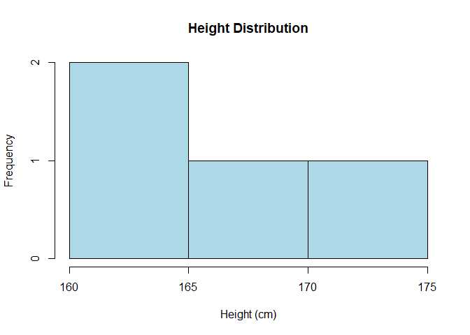<!-- -->

------------------------------------------------------------------------

## Summation Notation

The summation symbol:

``` r
plot.new()
text(0.5, 0.5, expression(sum(x[i], i==1, n)), cex=1.6)
```

<!-- -->

$$
\sum_{i=1}^{n} x_i
$$

In R:

``` r
sum(height)
```

    ## [1] 670

------------------------------------------------------------------------

## Linear Transformations

Adding or multiplying by a constant changes the **scale** but not the
**shape**.

### Example in R

``` r
height_m <- height / 100
height_m
```

    ## [1] 1.70 1.65 1.60 1.75

------------------------------------------------------------------------

## Logarithms

Log transformations help handle **skewed** data.

### Example in R

``` r
log_height <- log(height)
log_height
```

    ## [1] 5.135798 5.105945 5.075174 5.164786

------------------------------------------------------------------------

## Statistical Literacy

- Understand **what numbers represent**
- Question **how data was collected**
- Recognize **bias and uncertainty**

------------------------------------------------------------------------

# Exercises

Below are the exercises **and their solutions**.

------------------------------------------------------------------------

## **Exercise 1: Difference between descriptive and inferential statistics**

**Answer:**  
Descriptive statistics summarize and describe data (e.g., mean,
histogram).  
Inferential statistics use sample data to make generalizations or
predictions about a population.

------------------------------------------------------------------------

## **Exercise 2: Create a vector of 10 random numbers and compute mean, median, SD**

``` r
set.seed(111)
x <- rnorm(10)
x
```

    ##  [1]  0.2352207 -0.3307359 -0.3116238 -2.3023457 -0.1708760  0.1402782
    ##  [7] -1.4974267 -1.0101884 -0.9484756 -0.4939622

``` r
mean(x)
```

    ## [1] -0.6690135

``` r
median(x)
```

    ## [1] -0.412349

``` r
sd(x)
```

    ## [1] 0.7847206

------------------------------------------------------------------------

## **Exercise 3: Plot a histogram of your simulated data**

``` r
hist(x,
     main = "Histogram of Simulated Data",
     xlab = "Value",
     col = "lightgreen")
```

<!-- -->

------------------------------------------------------------------------

## **Exercise 4: Identify levels of measurement**

- Temperature in Celsius → **Interval**
- Number of siblings → **Ratio**
- Favorite color → **Nominal**

------------------------------------------------------------------------

## **Exercise 5: Compute percentiles for your data**

``` r
quantile(x, probs = c(0.25, 0.5, 0.75))
```

    ##        25%        50%        75% 
    ## -0.9947602 -0.4123490 -0.2060630

------------------------------------------------------------------------

# Chapter 2: Graphing Distributions

## Why Graph Data?

Graphs provide a **visual summary** of data, making patterns and trends
easier to understand. They help answer questions like:

- Is the data **symmetrical or skewed**?
- Are there **outliers**?
- How do **categories compare**?

------------------------------------------------------------------------

## Graphing Qualitative Variables

Qualitative (categorical) variables represent **categories** (e.g.,
gender, color).

### Common Graphs:

- **Bar Charts**
- **Pie Charts** (less preferred)

### Example in R

``` r
# Qualitative data: Favorite color
colors <- c("Red", "Blue", "Blue", "Green", "Red", "Blue", "Green", "Red")

# Frequency table
table(colors)
```

    ## colors
    ##  Blue Green   Red 
    ##     3     2     3

``` r
# Bar chart
barplot(table(colors), main = "Favorite Colors",
        col = c("red", "blue", "green"))
```

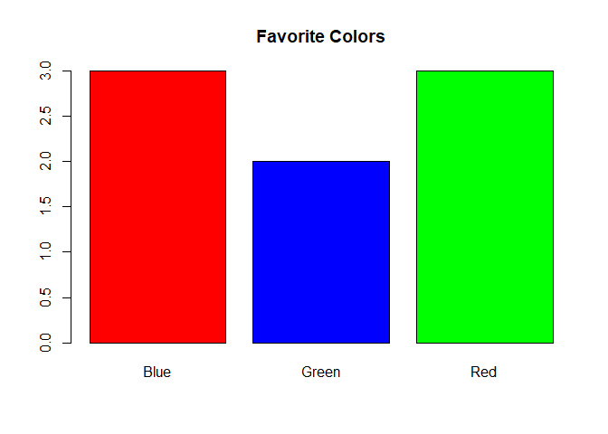<!-- -->

**Interpretation:**  
Bar height shows how many observations fall into each category.

------------------------------------------------------------------------

## Graphing Quantitative Variables

Quantitative variables are **numeric** (e.g., height, weight).

### Common Graphs:

- **Histograms**
- **Boxplots**
- **Dot plots**

------------------------------------------------------------------------

## Stem and Leaf Displays

A **stem-and-leaf plot** shows the distribution while preserving actual
data values.

### Example in R

``` r
scores <- c(45, 47, 50, 52, 53, 55, 57, 60)
stem(scores)
```

    ## 
    ##   The decimal point is 1 digit(s) to the right of the |
    ## 
    ##   4 | 57
    ##   5 | 023
    ##   5 | 57
    ##   6 | 0

**Interpretation:**  
The stem represents tens, and the leaves represent ones.

------------------------------------------------------------------------

## Histograms

Histograms group data into **bins** and show frequency.

``` r
set.seed(123)
data <- rnorm(100, mean = 50, sd = 10)

hist(data,
     main = "Histogram of Data",
     xlab = "Value",
     col = "lightblue",
     border = "white")
```

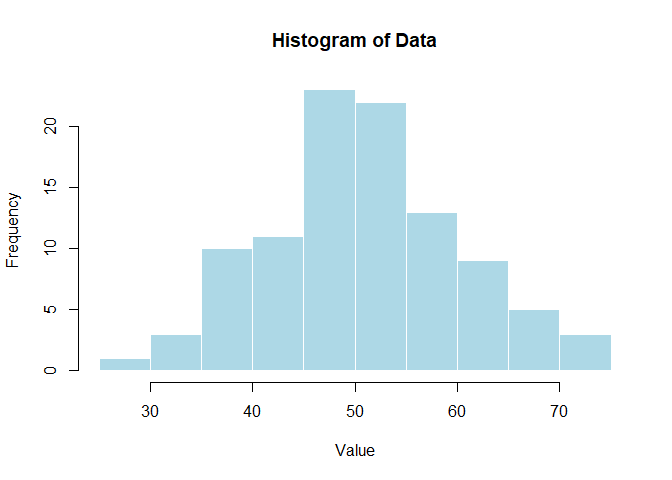<!-- -->

------------------------------------------------------------------------

## Frequency Polygons

A frequency polygon connects midpoints of histogram bars.

``` r
hist_data <- hist(data, plot = FALSE)

plot(hist_data$mids, hist_data$counts, type = "b",
     main = "Frequency Polygon",
     xlab = "Value", ylab = "Frequency")
```

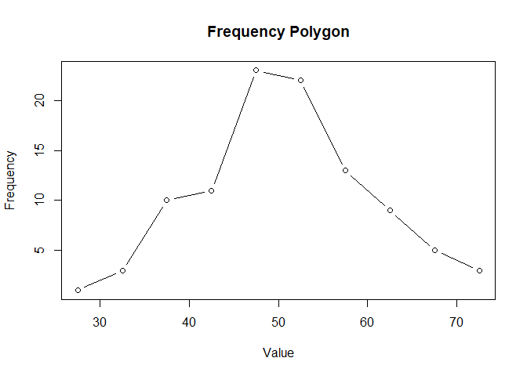<!-- -->

------------------------------------------------------------------------

## Box Plots

Boxplots summarize data using **quartiles** and highlight outliers.

``` r
boxplot(data,
        main = "Boxplot of Data",
        horizontal = TRUE)
```

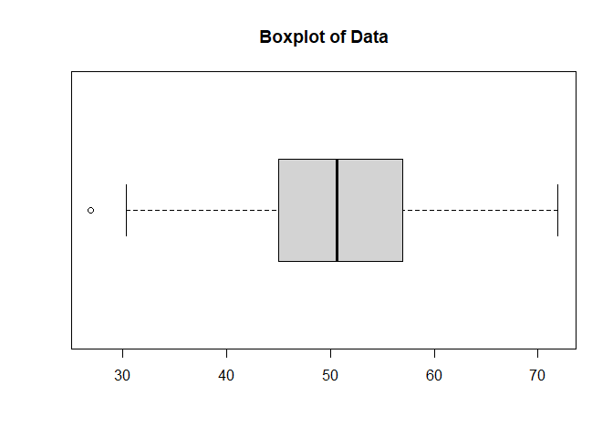<!-- -->

------------------------------------------------------------------------

## Bar Charts (again)

Used for **categorical** comparisons.

``` r
barplot(table(colors),
        main = "Bar Chart Example",
        col = c("red", "blue", "green"))
```

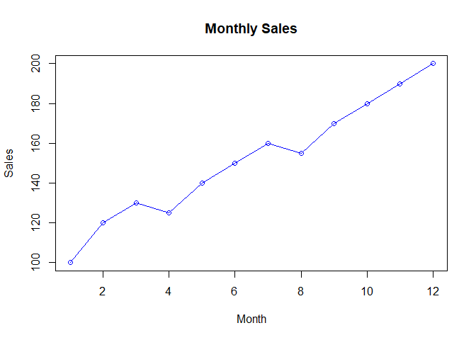<!-- -->

------------------------------------------------------------------------

## Line Graphs

Line graphs show **trends over time**.

``` r
time <- 1:12
sales <- c(100,120,130,125,140,150,160,155,170,180,190,200)

plot(time, sales, type = "o",
     main = "Monthly Sales",
     xlab = "Month", ylab = "Sales",
     col = "blue")
```

<!-- -->

------------------------------------------------------------------------

## Dot Plots

``` r
stripchart(data,
           method = "stack",
           main = "Dot Plot",
           xlab = "Value",
           col = "darkgreen")
```

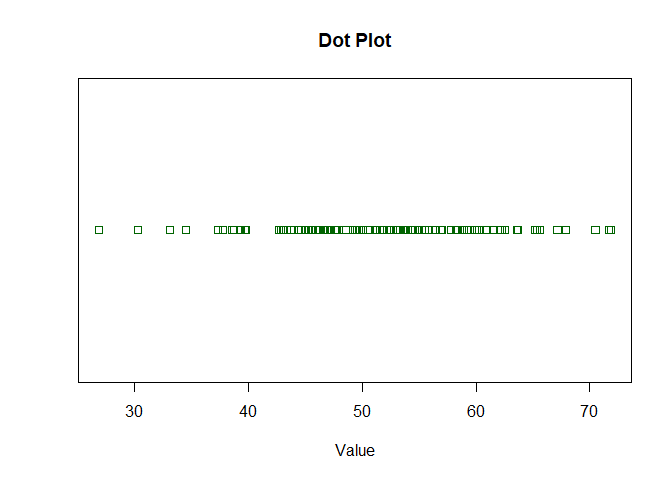<!-- -->

------------------------------------------------------------------------

## Statistical Literacy

- Graphs can **mislead** if axes are manipulated.
- Always check **labels** and **scales**.
- Avoid **pie charts** for complex comparisons.

------------------------------------------------------------------------

# Exercises — With Code and Answers

## Exercise 1: Create a bar chart for a categorical variable

``` r
colors <- c("Red", "Blue", "Blue", "Green", "Red", "Blue", "Green", "Red")
table(colors)
```

    ## colors
    ##  Blue Green   Red 
    ##     3     2     3

``` r
barplot(table(colors), main = "Favorite Colors",
        col = c("red", "blue", "green"))
```

<!-- -->

------------------------------------------------------------------------

## Exercise 2: Simulate 50 random numbers and plot a histogram

``` r
set.seed(123)
data <- rnorm(50, mean = 50, sd = 10)

hist(data,
     main = "Histogram of Simulated Data",
     xlab = "Value",
     col = "lightblue")
```

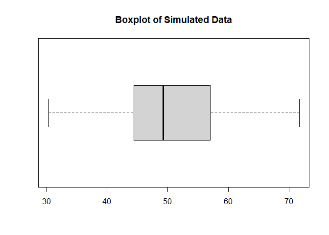<!-- -->

------------------------------------------------------------------------

## Exercise 3: Boxplot + interpretation

``` r
boxplot(data,
        main = "Boxplot of Simulated Data",
        horizontal = TRUE)
```

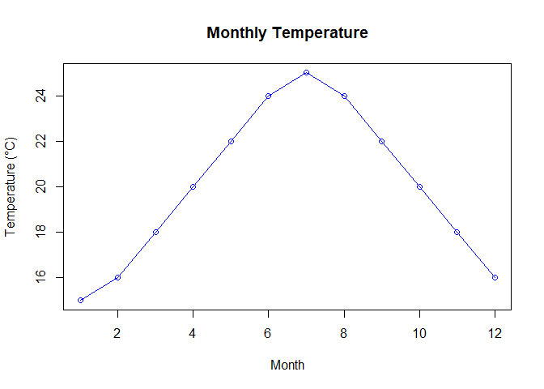<!-- -->

``` r
summary(data)
```

    ##    Min. 1st Qu.  Median    Mean 3rd Qu.    Max. 
    ##   30.33   44.41   49.27   50.34   56.98   71.69

**Interpretation:**  
Data appears roughly symmetric with no extreme outliers.

------------------------------------------------------------------------

## Exercise 4: Why are pie charts less preferred?

**Answer:**  
Pie charts make it difficult to compare category sizes accurately.  
Bar charts make comparisons easier because they use aligned lengths and
a consistent baseline.

------------------------------------------------------------------------

## Exercise 5: Line graph of monthly temperature

``` r
months <- 1:12
temp <- c(15,16,18,20,22,24,25,24,22,20,18,16)

plot(months, temp, type = "o",
     main = "Monthly Temperature",
     xlab = "Month",
     ylab = "Temperature (°C)",
     col = "blue")
```

<!-- -->

------------------------------------------------------------------------

# Chapter 3: Summarizing Distributions

## What is Central Tendency?

Central tendency refers to a **single value that represents the center
of a dataset**. It answers:

- What is a “typical” value?
- Where does the data cluster?

Common measures:

- **Mean** (average)  
- **Median** (middle)  
- **Mode** (most frequent)

------------------------------------------------------------------------

## Measures of Central Tendency

### Mean

The arithmetic average:

``` r
plot.new()
text(0.5, 0.5, expression(bar(x) == sum(x[i], i==1, n) / n), cex=1.6)
```

<!-- -->

$$
\bar{x} = \frac{\sum x_i}{n}
$$

### Median

The middle value when data is ordered.

### Mode

The value that appears most often.

------------------------------------------------------------------------

### Example in R

``` r
# Simulate data
set.seed(123)
data <- c(5, 7, 8, 6, 9, 10, 12)

mean(data)     # Mean
```

    ## [1] 8.142857

``` r
median(data)   # Median
```

    ## [1] 8

``` r
# Compute mode manually
mode_val <- names(sort(table(data), decreasing = TRUE))[1]
mode_val
```

    ## [1] "5"

**Interpretation:**

- Mean: Sensitive to outliers
- Median: Robust to outliers
- Mode: Best for categorical data

------------------------------------------------------------------------

## Median and Mean

When data is **skewed**, the median is often a better measure than the
mean.

### Example in R

``` r
# Skewed data
skewed <- c(2, 3, 3, 4, 4, 5, 100)

mean(skewed)
```

    ## [1] 17.28571

``` r
median(skewed)
```

    ## [1] 4

**Interpretation:**  
The extreme value (100) pulls the mean upward, while the median remains
stable.

------------------------------------------------------------------------

## Additional Measures of Central Tendency

### Trimmed Mean

Removes extreme values before averaging.

``` r
mean(skewed, trim = 0.1)
```

    ## [1] 17.28571

------------------------------------------------------------------------

## Comparing Measures of Central Tendency

- Use **mean** for symmetric distributions.
- Use **median** for skewed distributions.
- Use **mode** for categorical data.

------------------------------------------------------------------------

## Measures of Variability

Variability describes **how spread out** data is.

Common measures:

- **Range:** max − min

``` r
plot.new()
text(0.5, 0.5, expression(Range == max(x) - min(x)), cex=1.6)
```

<!-- -->

- **Variance:** average squared deviation

``` r
plot.new()
text(0.5, 0.5, expression(sigma^2 == sum((x[i] - bar(x))^2, i==1, n)/n), cex=1.6)
```

<!-- -->

- **Standard deviation (SD):** square root of variance

``` r
plot.new()
text(0.5, 0.5, expression(sigma == sqrt(sigma^2)), cex=1.6)
```

<!-- -->

### Example in R

``` r
range(data)       # Range
```

    ## [1]  5 12

``` r
var(data)         # Variance
```

    ## [1] 5.809524

``` r
sd(data)          # Standard deviation
```

    ## [1] 2.410295

------------------------------------------------------------------------

## Shapes of Distributions

- **Symmetrical:** Mean ≈ Median
- **Skewed:** Mean and median differ
- **Normal:** Bell-shaped

------------------------------------------------------------------------

## Effects of Linear Transformations

Adding or multiplying by a constant changes the **scale**, not the
**shape**.

### Example in R

``` r
data_plus10 <- data + 10
mean(data_plus10)
```

    ## [1] 18.14286

``` r
sd(data_plus10)
```

    ## [1] 2.410295

------------------------------------------------------------------------

## Variance Sum Law I

For independent variables:

``` r
plot.new()
text(0.5, 0.5,
     expression(Var(X + Y) == Var(X) + Var(Y)),
     cex = 1.6)
```

<!-- -->

$$
\text{Var}(X + Y) = \text{Var}(X) + \text{Var}(Y)
$$

------------------------------------------------------------------------

## Statistical Literacy

- Understand **spread** alongside the center.
- Don’t rely only on the mean.
- Always check for **outliers** and **skewness**.

------------------------------------------------------------------------

# Exercises — With Code and Answers

------------------------------------------------------------------------

## Exercise 1: Compute mean, median, mode

``` r
data <- c(5, 7, 8, 6, 9, 10, 12)

mean(data)
```

    ## [1] 8.142857

``` r
median(data)
```

    ## [1] 8

``` r
mode_val <- names(sort(table(data), decreasing = TRUE))[1]
mode_val
```

    ## [1] "5"

------------------------------------------------------------------------

## Exercise 2: Simulate 100 random numbers and calculate SD

``` r
set.seed(123)
nums <- rnorm(100, mean = 50, sd = 10)

sd(nums)
```

    ## [1] 9.128159

------------------------------------------------------------------------

## Exercise 3: Compare mean and median for skewed data

``` r
skewed <- c(2, 3, 3, 4, 4, 5, 100)

mean(skewed)
```

    ## [1] 17.28571

``` r
median(skewed)
```

    ## [1] 4

**Interpretation:**  
The mean is far larger due to the extreme value, while the median
reflects the “typical” central value.

------------------------------------------------------------------------

## Exercise 4: Why is SD preferred over range?

**Answer:**  
Range uses only the minimum and maximum values, ignoring all other
data.  
Standard deviation incorporates **every observation**, giving a better
measure of overall spread.

------------------------------------------------------------------------

## Exercise 5: Apply a linear transformation and observe changes

``` r
data_plus10 <- data + 10

mean(data_plus10)
```

    ## [1] 18.14286

``` r
sd(data_plus10)
```

    ## [1] 2.410295

**Interpretation:**  
Adding 10 increases the mean by 10 but **does not change** the SD.

------------------------------------------------------------------------

# Chapter 4: Describing Bivariate Data

## Introduction to Bivariate Data

**Bivariate data** involves two variables measured on the same
subjects.  
Examples include:

- Height and weight  
- Study time and exam score

**Goal:** Understand the **relationship** between two variables.

------------------------------------------------------------------------

## Values of the Pearson Correlation

The **Pearson correlation coefficient (r)** measures the strength and
direction of a linear relationship:

- $r \in [-1, 1]$
- **r \> 0:** Positive relationship  
- **r \< 0:** Negative relationship  
- **r = 0:** No linear relationship

------------------------------------------------------------------------

## Properties of Pearson’s r

- **Unit-free:** Independent of measurement scale.  
- **Sensitive to outliers:** One extreme value can change r
  drastically.  
- **Measures linear relationships only:** Fails with curved patterns.

------------------------------------------------------------------------

## Computing Pearson’s r

The formula is:

``` r
plot.new()
text(0.5, 0.5,
     expression(
       r ==
       frac(sum((x[i] - bar(x))*(y[i] - bar(y))), 
       sqrt(sum((x[i]-bar(x))^2) * sum((y[i]-bar(y))^2)))
     ), cex=1.4)
```

<!-- -->

$$
r = \frac{\sum (x_i - \bar{x})(y_i - \bar{y})}{\sqrt{\sum (x_i - \bar{x})^2 \sum (y_i - \bar{y})^2}}
$$

### Example in R

``` r
set.seed(123)
study_time <- c(2, 3, 4, 5, 6, 7, 8)
exam_score <- c(50, 55, 60, 65, 70, 75, 80)

cor(study_time, exam_score)
```

    ## [1] 1

**Interpretation:**  
r = 1 indicates a **perfect positive** linear relationship.

------------------------------------------------------------------------

## Scatterplots

Scatterplots visually represent relationships between two variables.

### Example in R

``` r
plot(study_time, exam_score,
     main = "Study Time vs Exam Score",
     xlab = "Study Time (hours)",
     ylab = "Exam Score",
     pch = 19, col = "blue")
```

<!-- -->

**Interpretation:**  
A clear upward trend indicates a strong positive association.

------------------------------------------------------------------------

## Variance Sum Law II

For two variables $$X$$ and $$Y$$:

``` r
plot.new()
text(0.5, 0.5,
     expression(Var(X + Y) ==
                Var(X) + Var(Y) + 2*Cov(X, Y)),
     cex = 1.6)
```

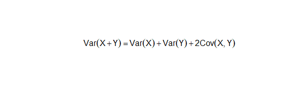<!-- -->

$$
\text{Var}(X + Y) = \text{Var}(X) + \text{Var}(Y) + 2\text{Cov}(X,Y)
$$

Where **covariance** describes how variables change together.

``` r
plot.new()
text(0.5, 0.5,
     expression(
       Cov(X, Y) == sum((x[i]-bar(x))*(y[i]-bar(y))) / (n-1)
     ), cex=1.6)
```

<!-- -->

### Example in R

``` r
cov(study_time, exam_score)
```

    ## [1] 23.33333

------------------------------------------------------------------------

## Statistical Literacy

- **Correlation ≠ Causation:** Even a strong r does not imply
  cause–effect.
- Look for **lurking variables**.
- Use scatterplots to check for **non-linearity** or outliers.

------------------------------------------------------------------------

# Exercises — With Code and Answers

------------------------------------------------------------------------

## Exercise 1: Compute Pearson’s r

``` r
study_time <- c(2, 3, 4, 5, 6, 7, 8)
exam_score <- c(50, 55, 60, 65, 70, 75, 80)

cor(study_time, exam_score)
```

    ## [1] 1

------------------------------------------------------------------------

## Exercise 2: Create a scatterplot

``` r
plot(study_time, exam_score,
     main = "Study Time vs Exam Score",
     xlab = "Study Time",
     ylab = "Exam Score",
     pch = 19, col = "blue")
```

<!-- -->

------------------------------------------------------------------------

## Exercise 3: Why does correlation ≠ causation?

**Answer:**  
Correlation measures association, not cause–effect.  
A third variable could influence both, or the relationship could be
coincidental.

------------------------------------------------------------------------

## Exercise 4: Simulate two uncorrelated variables

``` r
set.seed(123)
x <- rnorm(50)
y <- rnorm(50)

cor(x, y)
```

    ## [1] -0.03586983

------------------------------------------------------------------------

## Exercise 5: Compute covariance

``` r
cov(study_time, exam_score)
```

    ## [1] 23.33333

**Interpretation:**  
Positive covariance indicates that the variables increase together.

------------------------------------------------------------------------

# Chapter 5: Probability

## Remarks on the Concept of “Probability”

Probability measures **uncertainty**. It answers:

- What is the chance of an event happening?
- Expressed between **0 and 1** (or 0% to 100%).

**Examples:**

- Probability of flipping heads = 0.5  
- Probability of rolling a 6 on a die = $\frac{1}{6} \approx 0.167$

------------------------------------------------------------------------

## Basic Concepts

- **Experiment:** A process that produces an outcome  
- **Sample Space (S):** All possible outcomes  
- **Event:** A subset of the sample space

### Rules

``` r
plot.new()
text(0.5, 0.5,
     expression(P(E) ==
                frac("Favorable outcomes", "Total outcomes")),
     cex=1.4)
```

<!-- -->

$$
P(E) = \frac{\text{Number of favorable outcomes}}{\text{Total outcomes}}
$$

$$
0 \le P(E) \le 1
$$

### Example in R

``` r
# Probability of rolling a 6
favorable <- 1
total <- 6
prob <- favorable / total
prob
```

    ## [1] 0.1666667

------------------------------------------------------------------------

## Permutations and Combinations

### Permutation (order matters)

$$
P(n,r) = \frac{n!}{(n-r)!}
$$

### Combination (order does not matter)

$$
C(n,r) = \frac{n!}{r!(n-r)!}
$$

### Example in R

``` r
# Number of ways to choose 2 out of 5
choose(5, 2)
```

    ## [1] 10

------------------------------------------------------------------------

## Binomial Distribution

A binomial distribution applies when:

- Fixed number of trials
- Only two outcomes (success/failure)
- Constant probability of success

$$
P(X = k) = \binom{n}{k} p^k (1-p)^{n-k}
$$

### Example in R

``` r
dbinom(3, size = 10, prob = 0.5)
```

    ## [1] 0.1171875

------------------------------------------------------------------------

## Poisson Distribution

Models **rare events**:

$$
P(X = k) = \frac{\lambda^k e^{-\lambda}}{k!}
$$

### Example in R

``` r
dpois(2, lambda = 4)
```

    ## [1] 0.1465251

------------------------------------------------------------------------

## Multinomial Distribution

Generalization of the binomial when there are **more than two
categories**.

------------------------------------------------------------------------

## Hypergeometric Distribution

Used when sampling **without replacement**.

### Example in R

``` r
dhyper(2, m = 5, n = 5, k = 3)
```

    ## [1] 0.4166667

------------------------------------------------------------------------

## Base Rates

Always consider **prior probabilities** before drawing conclusions about
conditional probabilities.

------------------------------------------------------------------------

## Statistical Literacy

- Probability describes long-run tendencies, not certainties.
- Beware of **base rate neglect**.
- Understand model assumptions such as independence.

------------------------------------------------------------------------

# Exercises — With Code and Answers

------------------------------------------------------------------------

## Exercise 1: Probability of rolling an even number

``` r
favorable <- 3  # (2, 4, 6)
total <- 6
prob_even <- favorable / total
prob_even
```

    ## [1] 0.5

------------------------------------------------------------------------

## Exercise 2: Combinations for choosing 3 items from 8

``` r
choose(8, 3)
```

    ## [1] 56

------------------------------------------------------------------------

## Exercise 3: Binomial probability

Compute $$P(X = 4)$$ for $$n = 12, p = 0.3$$

``` r
dbinom(4, size = 12, prob = 0.3)
```

    ## [1] 0.2311397

------------------------------------------------------------------------

## Exercise 4: Poisson probability

Find $$P(X = 5)$$ for $$\lambda = 3$$

``` r
dpois(5, lambda = 3)
```

    ## [1] 0.1008188

------------------------------------------------------------------------

## Exercise 5: Hypergeometric probability

1 red ball from 4 red, 6 blue, sample size 3

``` r
dhyper(1, m = 4, n = 6, k = 3)
```

    ## [1] 0.5

------------------------------------------------------------------------

# Chapter 6: Research Design

## Scientific Method

The **scientific method** is the foundation of research:

1.  Ask a question  
2.  Formulate a hypothesis  
3.  Collect data  
4.  Analyze data  
5.  Draw conclusions

**Goal:** Ensure findings are **objective, reproducible, and valid**.

------------------------------------------------------------------------

## Measurement

Measurement assigns **numbers or labels** to characteristics according
to rules.

- **Reliability:** Consistency of measurement  
- **Validity:** Accuracy of measurement

**Example:**  
A calibrated scale measures weight with both high reliability and high
validity.

------------------------------------------------------------------------

## Basics of Data Collection

- **Population:** Full group of interest  
- **Sample:** Subset of the population

### Sampling Methods

- **Random sampling:** Every member has an equal chance  
- **Stratified sampling:** Divide population into subgroups (strata) and
  sample each  
- **Convenience sampling:** Easy to reach but prone to bias

### Example in R — Simple Random Sample

``` r
set.seed(123)
population <- 1:100
sample(population, size = 10)
```

    ##  [1] 31 79 51 14 67 42 50 43 97 25

------------------------------------------------------------------------

## Sampling Bias

Sampling bias occurs when the sample **does not represent the
population**.

**Examples:**

- Surveying only college students to represent the whole country
- Voluntary response surveys (only highly motivated people respond)

------------------------------------------------------------------------

## Experimental Designs

- **Observational study:** No manipulation, only observation
- **Experiment:** Researcher manipulates variables
- **Randomized Controlled Trial (RCT):** Gold standard for causal
  inference

### Key Concepts

- **Independent variable (IV):** Manipulated factor
- **Dependent variable (DV):** Measured outcome
- **Control group:** No treatment
- **Random assignment:** Reduces systematic bias

------------------------------------------------------------------------

## Causation

Correlation ≠ causation.

To infer causation:

- Manipulate the IV
- Randomly assign participants
- Control confounding variables

------------------------------------------------------------------------

## Statistical Literacy

- Understand **sampling bias** and how it distorts findings
- Recognize **confounding variables**
- Be skeptical of causal claims without proper design

------------------------------------------------------------------------

# Exercises — With Code and Answers

------------------------------------------------------------------------

## Exercise 1: Simple random sample of 15 numbers from 1 to 200

``` r
set.seed(456)
population <- 1:200
sample(population, size = 15)
```

    ##  [1] 163  38  27  25 159 122  79  90  83 171   8 126 142  13 180

------------------------------------------------------------------------

## Exercise 2: Create a stratified sample from two groups

``` r
groupA <- 1:50
groupB <- 51:100

sampleA <- sample(groupA, size = 5)
sampleB <- sample(groupB, size = 5)

c(sampleA, sampleB)
```

    ##  [1] 30 47 25 38 40 87 91 84 77 54

------------------------------------------------------------------------

## Exercise 3: Why does convenience sampling lead to bias?

**Answer:**  
Convenience sampling systematically excludes parts of the population,
leading to **non‑representative samples** and biased conclusions.

------------------------------------------------------------------------

## Exercise 4: Simulate random assignment of 20 participants into 2 groups

``` r
participants <- 1:20

group_assignment <- sample(rep(c("Treatment", "Control"), each = 10))

data.frame(Participant = participants,
           Group = group_assignment)
```

    ##    Participant     Group
    ## 1            1 Treatment
    ## 2            2 Treatment
    ## 3            3   Control
    ## 4            4   Control
    ## 5            5 Treatment
    ## 6            6   Control
    ## 7            7   Control
    ## 8            8 Treatment
    ## 9            9 Treatment
    ## 10          10 Treatment
    ## 11          11 Treatment
    ## 12          12   Control
    ## 13          13   Control
    ## 14          14   Control
    ## 15          15 Treatment
    ## 16          16   Control
    ## 17          17   Control
    ## 18          18 Treatment
    ## 19          19 Treatment
    ## 20          20   Control

------------------------------------------------------------------------

## Exercise 5: Identify IV and DV in a drug study

**Answer:**

- **IV:** Drug treatment (new drug vs placebo)
- **DV:** Health outcome (e.g., blood pressure reduction)

------------------------------------------------------------------------

# Chapter 7: Normal Distributions

## Introduction to Normal Distributions

The **normal distribution** is one of the most important concepts in
statistics:

- Bell-shaped curve  
- Symmetrical around the mean  
- Defined by **mean (μ)** and **standard deviation (σ)**

**Why is it important?**

- Many natural phenomena approximate normality (e.g., height, test
  scores)  
- It forms the basis for many inferential statistical procedures

------------------------------------------------------------------------

## History of the Normal Distribution

- Introduced by **Carl Friedrich Gauss** in the early 19th century  
- Used first for modeling astronomical measurement errors  
- Also known as the **Gaussian distribution**

------------------------------------------------------------------------

## Areas Under Normal Distributions

According to the **Empirical Rule**:

- ~68% of data lie within 1 SD of the mean  
- ~95% within 2 SD  
- ~99.7% within 3 SD

------------------------------------------------------------------------

### Example in R: Plot Normal Curve

``` r
x <- seq(-4, 4, length = 100)
y <- dnorm(x, mean = 0, sd = 1)

plot(
  x, y, type = "l",
  main = "Standard Normal Curve",
  xlab = "Z",
  ylab = "Density"
)
```

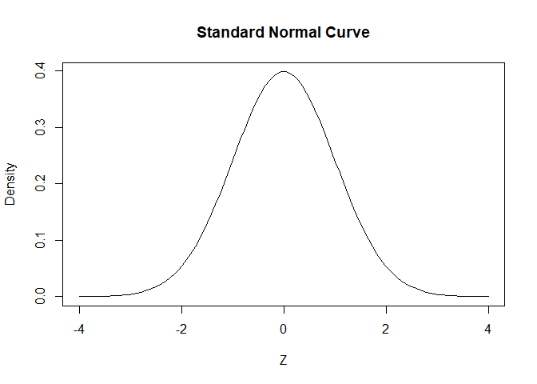<!-- -->

------------------------------------------------------------------------

## Standard Normal Distribution

A normal distribution with:

- Mean = 0
- SD = 1

``` r
plot.new()
text(0.5, 0.5,
     expression(phi(x) ==
                frac(1, sqrt(2*pi)) * e^(-x^2/2)),
     cex=1.4)
```

<!-- -->

Values can be converted to **z‑scores**:

``` r
plot.new()
text(0.5, 0.5,
     expression(z == frac(x - mu, sigma)),
     cex=1.6)
```

<!-- -->

$$
z = \frac{x - \mu}{\sigma}
$$

### Example in R

``` r
x <- 70
mu <- 60
sigma <- 10

z <- (x - mu) / sigma
z
```

    ## [1] 1

------------------------------------------------------------------------

## Normal Approximation to the Binomial

When $$n$$ is large and $$p$$ not extreme:

``` r
plot.new()
text(0.5, 0.5,
     expression(mu == n*p ~~ "~" ~~ sigma == sqrt(n*p*(1-p))),
     cex=1.4)
```

<!-- -->

$$
\mu = np,\qquad \sigma = \sqrt{np(1-p)}
$$

### Example in R

``` r
n <- 100
p <- 0.5

mu <- n * p
sigma <- sqrt(n * p * (1 - p))

mu
```

    ## [1] 50

``` r
sigma
```

    ## [1] 5

------------------------------------------------------------------------

## Statistical Literacy

- Many statistical tests assume **normality**
- Always **check the distribution** before using parametric methods
- Tools to check normality: **histograms**, **Q-Q plots**

------------------------------------------------------------------------

# Exercises — With Code and Answers

------------------------------------------------------------------------

## Exercise 1: Plot a normal curve with mean = 50, sd = 10

``` r
x <- seq(20, 80, length = 100)
y <- dnorm(x, mean = 50, sd = 10)

plot(
  x, y, type = "l",
  main = "Normal Curve (μ = 50, σ = 10)",
  xlab = "Value",
  ylab = "Density"
)
```

<!-- -->

------------------------------------------------------------------------

## Exercise 2: Compute z‑score for x = 85, mean = 70, sd = 12

``` r
x <- 85
mu <- 70
sigma <- 12

z <- (x - mu) / sigma
z
```

    ## [1] 1.25

------------------------------------------------------------------------

## Exercise 3: Probability that Z \< 1.96

``` r
pnorm(1.96)
```

    ## [1] 0.9750021

------------------------------------------------------------------------

## Exercise 4: Probability that Z \> 2.33

``` r
1 - pnorm(2.33)
```

    ## [1] 0.009903076

------------------------------------------------------------------------

## Exercise 5: Simulate 1000 normal values and check mean and sd

``` r
set.seed(123)
sim_data <- rnorm(1000, mean = 50, sd = 10)

mean(sim_data)
```

    ## [1] 50.16128

``` r
sd(sim_data)
```

    ## [1] 9.91695

**Interpretation:**  
Simulated data should be close to mean = 50 and sd = 10.

------------------------------------------------------------------------

# Chapter 8: Advanced Graphs

## Why Advanced Graphs?

Basic graphs (histograms, bar charts) are great for simple data.  
**Advanced graphs** help visualize:

- Distributional comparisons  
- Multivariate relationships  
- Model diagnostics

------------------------------------------------------------------------

## Quantile–Quantile (Q–Q) Plots

Q–Q plots compare the distribution of your data to a theoretical
distribution (usually normal).

**Purpose:** Check normality assumptions.

### Example in R

``` r
set.seed(123)
data <- rnorm(100, mean = 50, sd = 10)

qqnorm(data)
qqline(data, col = "red")
```

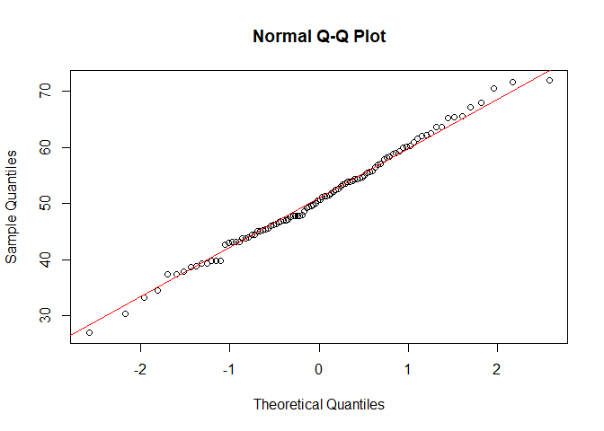<!-- -->

**Interpretation:**  
Points close to the red line indicate approximate normality.

------------------------------------------------------------------------

## Contour Plots

Contour plots display **density levels** of two continuous variables.

### Example in R

``` r
library(MASS)

set.seed(123)
data2 <- mvrnorm(
  n = 200,
  mu = c(0, 0),
  Sigma = matrix(c(1, 0.5, 0.5, 1), 2, 2)
)

x <- data2[, 1]
y <- data2[, 2]

kde <- kde2d(x, y, n = 50)

contour(kde, main = "Contour Plot")
```

<!-- -->

**Interpretation:**  
Each contour line represents an area of equal density.

------------------------------------------------------------------------

## 3D Plots

3D plots show density surfaces or multivariate relationships in three
dimensions.

### Example in R

``` r
persp(
  kde$x, kde$y, kde$z,
  theta = 30, phi = 20,
  expand = 0.5,
  col = "lightblue",
  xlab = "X", ylab = "Y", zlab = "Density"
)
```

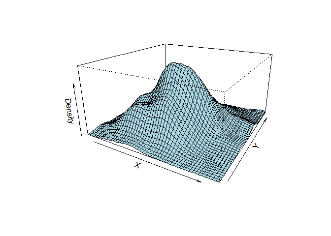<!-- -->

**Interpretation:**  
Peaks represent areas of higher density.

------------------------------------------------------------------------

## Statistical Literacy

- Advanced graphs reveal **non-linear patterns**, **clusters**, and
  **outliers**.
- More complex visuals must be interpreted carefully to avoid misreading
  patterns.

------------------------------------------------------------------------

# Exercises — With Code and Answers

## Exercise 1: Create a Q–Q plot for 100 simulated normal values

``` r
set.seed(456)
data <- rnorm(100)

qqnorm(data)
qqline(data, col = "blue")
```

<!-- -->

------------------------------------------------------------------------

## Exercise 2: Generate a Q–Q plot for skewed data

``` r
skewed <- rexp(100, rate = 1)

qqnorm(skewed)
qqline(skewed, col = "red")
```

<!-- -->

**Interpretation:**  
Curvature in the plot shows deviation from normality.

------------------------------------------------------------------------

## Exercise 3: Create a contour plot for bivariate normal data

``` r
library(MASS)

set.seed(789)
data2 <- mvrnorm(
  n = 300,
  mu = c(0, 0),
  Sigma = matrix(c(1, 0.7, 0.7, 1), 2, 2)
)

x <- data2[, 1]
y <- data2[, 2]

kde <- kde2d(x, y, n = 50)

contour(kde, main = "Contour Plot Example")
```

<!-- -->

------------------------------------------------------------------------

## Exercise 4: Create a 3D surface plot for the same data

``` r
persp(
  kde$x, kde$y, kde$z,
  theta = 40, phi = 30,
  expand = 0.5,
  col = "lightgreen",
  xlab = "X", ylab = "Y", zlab = "Density"
)
```

<!-- -->

------------------------------------------------------------------------

## Exercise 5: Why are Q–Q plots useful before parametric tests?

**Answer:**  
Parametric tests (t‑tests, ANOVA) assume normality.  
Q–Q plots provide a fast visual check of whether this assumption is
reasonable.  
If data strongly deviates from the line, transformations or
non-parametric alternatives may be needed.

------------------------------------------------------------------------

# Chapter 9: Sampling Distributions

## Introduction to Sampling Distributions

A **sampling distribution** is the probability distribution of a
statistic  
(e.g., the sample mean) that would be obtained from taking many
samples  
of the same size from a population.

**Why important?**

- Sampling distributions form the basis for **inferential
  statistics**.  
- They describe the **variability** of a statistic across repeated
  samples.

------------------------------------------------------------------------

## Sampling Distribution of the Mean

If we take many samples and compute their means:

- The distribution of those means becomes **approximately normal**  
  (Central Limit Theorem).  
- The mean of the sampling distribution equals the **population mean**
  $\mu$.  
- The **standard error (SE)** is:

``` r
plot.new()
text(0.5, 0.5,
     expression(SE == frac(sigma, sqrt(n))),
     cex=1.6)
```

<!-- -->

$$
SE = \frac{\sigma}{\sqrt{n}}
$$

### Example in R

``` r
set.seed(123)

population <- rnorm(10000, mean = 50, sd = 10)

sample_means <- replicate(
  1000,
  mean(sample(population, size = 30))
)

hist(sample_means,
     main = "Sampling Distribution of the Mean",
     col = "lightblue")
```

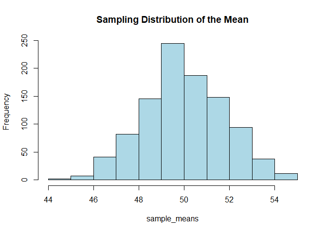<!-- -->

``` r
mean(sample_means)
```

    ## [1] 50.0051

``` r
sd(sample_means)
```

    ## [1] 1.794127

------------------------------------------------------------------------

## Sampling Distribution of Difference Between Means

For two independent samples:

``` r
plot.new()
text(0.5, 0.5,
     expression(
       SE == sqrt( sigma[1]^2 / n[1] + sigma[2]^2 / n[2] )
     ),
     cex = 1.6)
```

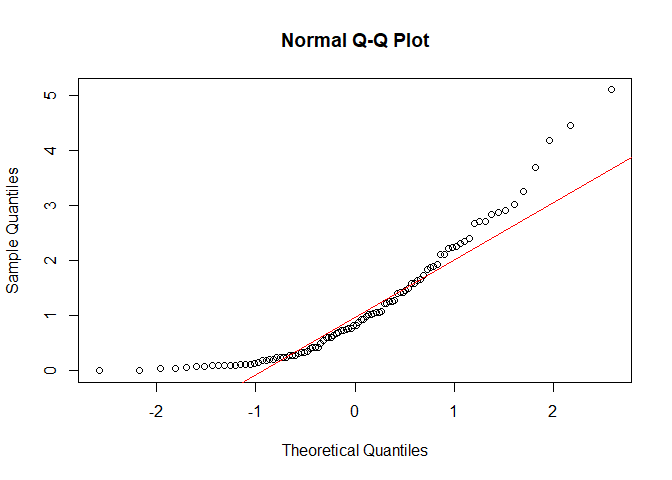<!-- -->

$$
SE = \sqrt{ \frac{\sigma_1^2}{n_1} + \frac{\sigma_2^2}{n_2} }
$$

------------------------------------------------------------------------

## Sampling Distribution of Pearson’s r

The correlation coefficient also has a sampling distribution.  
For large $$n$$, the sampling distribution of $$r$$ becomes
approximately normal.

------------------------------------------------------------------------

## Sampling Distribution of p (Proportion)

For a proportion $$p$$:

``` r
plot.new()
text(0.5, 0.5,
     expression(SE == sqrt(p*(1-p)/n)),
     cex=1.6)
```

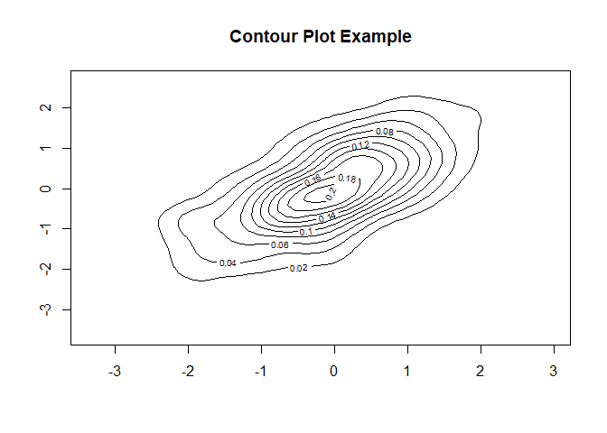<!-- -->

$$
SE = \sqrt{\frac{p(1 - p)}{n}}
$$

------------------------------------------------------------------------

## Statistical Literacy

- Larger samples → **smaller standard error** → more precise estimates.
- The standard error measures **uncertainty** in estimates.
- The **Central Limit Theorem** is fundamental to hypothesis testing  
  and confidence intervals.

------------------------------------------------------------------------

# Exercises — With Code and Answers

------------------------------------------------------------------------

## Exercise 1: Sampling distribution of the mean (n = 50)

``` r
set.seed(456)

population <- rnorm(10000, mean = 100, sd = 15)

sample_means <- replicate(
  1000,
  mean(sample(population, size = 50))
)

mean(sample_means)
```

    ## [1] 100.2198

``` r
sd(sample_means)
```

    ## [1] 2.164207

------------------------------------------------------------------------

## Exercise 2: Plot histogram of the sample means

``` r
hist(sample_means,
     main = "Sampling Distribution (n = 50)",
     col = "lightgreen")
```

<!-- -->

------------------------------------------------------------------------

## Exercise 3: Compute standard error for n = 100

``` r
sigma <- 15
n <- 100

SE <- sigma / sqrt(n)
SE
```

    ## [1] 1.5

------------------------------------------------------------------------

## Exercise 4: Sampling distribution of a proportion (p = 0.4, n = 200)

``` r
set.seed(789)

p <- 0.4
n <- 200

sample_props <- replicate(
  1000,
  mean(rbinom(n, size = 1, prob = p))
)

mean(sample_props)
```

    ## [1] 0.402225

``` r
sd(sample_props)
```

    ## [1] 0.0350707

------------------------------------------------------------------------

## Exercise 5: Why do sampling distributions matter?

**Answer:**  
Sampling distributions allow us to:

- quantify uncertainty in sample statistics
- compute confidence intervals
- perform hypothesis tests
- understand how statistics vary across repeated samples

They are the foundation of inferential statistics.

------------------------------------------------------------------------

# Chapter 10: Estimation

## Introduction to Estimation

Estimation uses sample data to **infer population parameters**.

Two main types:

- **Point estimate:** A single value (e.g., sample mean)  
- **Interval estimate:** A range of plausible values (e.g., confidence
  interval)

**Goal:** Quantify uncertainty in sample-based estimates.

------------------------------------------------------------------------

## Degrees of Freedom

Degrees of freedom (df) represent the number of independent pieces of
information.

For sample variance:

``` r
plot.new()
text(0.5, 0.5, expression(df == n - 1), cex=1.6)
```

<!-- -->

$$
df = n - 1
$$

------------------------------------------------------------------------

## Characteristics of Estimators

- **Unbiased:** Expected value equals the true parameter  
- **Consistent:** Becomes more accurate as sample size increases  
- **Efficient:** Has the smallest variance among unbiased estimators

------------------------------------------------------------------------

## Confidence Intervals

A confidence interval provides a **range of plausible values** for a
parameter:

``` r
plot.new()
text(0.5, 0.5,
     expression(CI == "Point Estimate" %+-% "Margin of Error"),
     cex=1.4)
```

<!-- -->

$$
CI = \text{Point Estimate} \pm \text{Margin of Error}
$$

------------------------------------------------------------------------

## Introduction to Confidence Intervals

For a mean:

Using known population SD:

$$
CI = \bar{x} \pm z^* \frac{\sigma}{\sqrt{n}}
$$

Using sample SD (t‑distribution):

$$
CI = \bar{x} \pm t^* \frac{s}{\sqrt{n}}
$$

------------------------------------------------------------------------

### Example in R: CI for a Mean

``` r
set.seed(123)

data <- rnorm(30, mean = 50, sd = 10)

xbar <- mean(data)
s <- sd(data)
n <- length(data)

alpha <- 0.05
t_crit <- qt(1 - alpha/2, df = n - 1)

margin <- t_crit * s / sqrt(n)

CI <- c(xbar - margin, xbar + margin)
CI
```

    ## [1] 45.86573 53.19219

------------------------------------------------------------------------

## t Distribution

Used when:

- Population SD is unknown
- Sample size is small (n \< 30)

------------------------------------------------------------------------

## Confidence Interval for the Mean

- Use **z** when σ is known and n large
- Use **t** when σ is unknown or n small

------------------------------------------------------------------------

## Difference Between Means

For two independent samples:

$$
CI = (\bar{x}_1 - \bar{x}_2) \pm t^* \sqrt{\frac{s_1^2}{n_1} + \frac{s_2^2}{n_2}}
$$

------------------------------------------------------------------------

## Correlation

Confidence intervals for correlation typically use **Fisher’s z
transformation**.

------------------------------------------------------------------------

## Proportion

Confidence interval for a proportion:

$$
\hat{p} \pm z^* \sqrt{ \frac{ \hat{p}(1 - \hat{p}) }{n} }
$$

------------------------------------------------------------------------

## Statistical Literacy

- A 95% CI does **not** mean “95% chance the true value is inside this
  interval.”
- It means **95% of intervals constructed this way will contain the true
  parameter**.
- Wider intervals indicate **greater uncertainty**.

------------------------------------------------------------------------

# Exercises — With Code and Answers

------------------------------------------------------------------------

## Exercise 1: 95% CI for mean of simulated data

``` r
set.seed(456)

data <- rnorm(40, mean = 100, sd = 15)

xbar <- mean(data)
s <- sd(data)
n <- length(data)

alpha <- 0.05
t_crit <- qt(1 - alpha/2, df = n - 1)

margin <- t_crit * s / sqrt(n)

CI <- c(xbar - margin, xbar + margin)
CI
```

    ## [1]  96.4703 107.1669

------------------------------------------------------------------------

## Exercise 2: CI for difference between two means

``` r
group1 <- rnorm(30, mean = 50, sd = 10)
group2 <- rnorm(30, mean = 55, sd = 10)

mean_diff <- mean(group1) - mean(group2)

s1 <- sd(group1)
s2 <- sd(group2)

n1 <- length(group1)
n2 <- length(group2)

SE <- sqrt(s1^2/n1 + s2^2/n2)

t_crit <- qt(0.975, df = n1 + n2 - 2)

CI_diff <- c(mean_diff - t_crit * SE,
             mean_diff + t_crit * SE)

CI_diff
```

    ## [1] -9.1274207  0.5427001

------------------------------------------------------------------------

## Exercise 3: CI for a proportion (p = 0.4, n = 200)

``` r
p_hat <- 0.4
n <- 200

z_crit <- qnorm(0.975)

margin <- z_crit * sqrt(p_hat * (1 - p_hat) / n)

CI_prop <- c(p_hat - margin, p_hat + margin)
CI_prop
```

    ## [1] 0.3321049 0.4678951

------------------------------------------------------------------------

## Exercise 4: Why use t-distribution for small samples?

**Answer:**  
Because the **population SD is unknown**, and the t-distribution
correctly accounts for the extra uncertainty in estimating σ from small
samples.

------------------------------------------------------------------------

## Exercise 5: Simulate 1000 sample means and compute average CI width

``` r
set.seed(789)

widths <- replicate(1000, {
  data <- rnorm(30, mean = 50, sd = 10)

  xbar <- mean(data)
  s <- sd(data)
  n <- length(data)

  t_crit <- qt(0.975, df = n - 1)
  margin <- t_crit * s / sqrt(n)

  2 * margin
})

mean(widths)
```

    ## [1] 7.337961

------------------------------------------------------------------------
